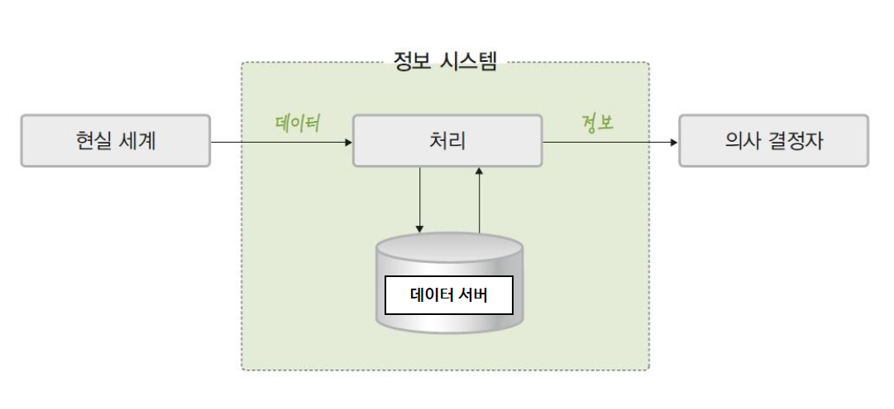

# DB

---

**Reference**

1. Database [ CSE3010, 23606 ]
    1. 2019-2, ICT융합학부, 고민삼 교수님

---

# 0. Database System

## Database

- 조직에 필요한 정보 얻기 위해 논리적으로 연관된 데이터를 모아 구조적으로 통합 놓은 것

## Data in Database

- 통합된 데이터(integrated data)
    - 데이터를 통합하는 개념으로 , 각자 사용하던 데이터의 중복을 최소화하여 중복으로 인한 데이터 불일치 현상을 제거
- 저장된 데이터(stored data)
    - 문서로 보관된 데이터가 아니라 컴퓨터 저장장치에 저장된 데이터를 의미
- 운영 데이터(operational data)
    - 조직의 목적을 위해 사용되는 데이터 , 즉 업무를 위한 검색을 할 목적으로 저장된 데이터
- 공용 데이터(shared data)
    - 한 사람 또는 한 업무를 위해 사용되는 데이터가 아니라 공동으로 사용되는 데이터를 의미

## Characteristics of Database

- 실시간 접근성(real time accessibility)
    - 데이터베이스는 실시간으로 서비스됨 (사용자가 요청하면 즉각 반응)
- 계속적인 변화(continuous change)
    - 데이터베이스에 저장된 내용은 어느 한 순간의 상태를 나타내지만, 데이터 값은 시간에 따라 항상 바뀜
    - 데이터베이스는 삽입 , 삭제 , 수정 등의 작업을 통하여 바뀐 데이터 값을 저장
- 동시 공유(concurrent sharing)
    - 데이터베이스는 서로 다른 업무 또는 여러 사용자에게 동시에 공유
    - 동시는 병행이라고도 하며 , 데이터베이스에 접근하는 프로그램이 여러 개 존재
- 내용에 따른 참조(reference by content)
    - 데이터베이스에 저장된 데이터는 데이터의 물리적인 위치가 아니라 데이터 값에 따라 참조

## Information System

- 조직 운영에 필요한 데이터를 수집하여 저장해 두었다가 필요할 때 유용한 정보를 만들어 주는 수단

- 정보 시스템의 발전 : File System
    - 데이터를 파일로 관리하기 위해 파일을 생성, 삭제, 수정, 검색하는 기능을 제공하는 소프트웨어
    - 응용 프로그램마다 필요한 데이터를 별도의 파일로 관리
    - Limitation of File System
        - 같은 내용의 데이터가 여러 파일에 중복 저장
            - 저장 공간의 낭비
            - 데이터 일관성과 데이터 무결성 유지 어려움
        - 응용 프로그램이 데이터 파일에 종속적
            - 사용하는 파일의 구조를 변경하면 응용 프로그램도 함께 변경해야 함
        - 테이터 파일에 대한 동시 공유, 보안, 회복 기능이 부족
        - 응용 프로그램 개발 어려움

## Database System

- DBMS(Database Management System)를 도입하여 데이터를 통합 관리하는 시스템
- DBMS가 설치되어 데이터를 가진 쪽을 서버(Server), 외부에서 데이터를 요청하는 쪽을 클라이언트(Client)라고 함
- DBMS 서버가 파일을 다루며 데이터 일관성 유지, 복구, 동시 접근 제어 등을 수행
- 데이터의 중복을 줄이고 데이터를 표준화하며 무결성을 유지
- Examples
    - Web Database System
        - 데이터베이스를 웹 브라우저에서 사용할 수 있도록 서비스하는 시스템
        - 불특정 다수 고객을 상대로 하는 온라인 상거래나 공공 민원 서비스 등에 사용됨
    - Distributed Database System
        - 여러 곳에 분산된 DBMS 서버를 연결하여 운영하는 시스템
        - 대규모 응용 시스템에 사용됨

- 구성
    1. 사용자
    2. 데이터 언어
    3. 데이터베이스 관리 시스템
    4. 테이터베이스

## Architectures of Database (구성-4)

- ANSI/SPARC

---

- 3단계로 Database를 구조화
    - 내부 단계(Internal Level)
        - 물리적인 저장 장치의 관점
    - 개념 단계(Conceptual Level)
        - 조직 전체의 관점
    - 외부 단계(External Level)
        - 개별 사용자 관점

- 각 단계 별로 다른 추상화(abstraction) 제공
    - 내부 단계에서 외부 단계로 갈수록 추상화 레벨이 높아짐
- 데이터베이스에 저장되는 데이터 구조와 제약조건을 정의한 것을 스키마(Schema)라 부
    - 각 단계마다 스키마 존재
- 이와 대비되는 개념으로, 스키마에 따라 데이터베이스에 실제로 저장된 값을 인스턴스(Instance)라 부름

---

- External Schema
    - 외부 단계에서 사용자에게 필요한 데이터베이스를 정의한 것
    - 각 사용자가 생각하는 데이터베이스의 모습, 즉 논리적 구조로 사용자마다 다름
    - Sub Schema라고도 부름
    - 하나의 데이터베이스에 여러 External Schema 존재 가능
- Conceptual Schema
    - 개념 단계에서 데이터베이스 전체의 논리적 구조를 정의한 것
    - 조직 전체의 관점에서 생각하는 데이터베이스의 모습
    - 전체 데이터베이스에 어떤 데이터가 저장되는지, 데이터들 간 어떤 관계가 존재하고 어떤 제약조건이 존재하는지에 대한 정의
    - 데이터에 대한 보안 정책이나 접근 권한에 대한 정의도 포함
    - 데이터베이스 하나에 Conceptual Schema가 하나만 존재함
- Internal Schema
    - 전체 데이터베이스가 저장 장치에 실제로 저장되는 방법을 정의
    - 구조, 크기, 접근 경로 등 물리적 저장 구조를 정의
    - 데이터베이스 하나에 Internal Schema가 하나만 존재함

---

- 3단계 데이터베이스 구조에서 각 단계는 서로 연결됨
    - 데이터 종속성(Data Dependency) 문제 발생
        - 만약 어떤 하나의 구조가 변경되면, 그것을 참조하고 있던 상/하위 단계의 구조가 영향을 받게 됨
        - 이를 해결하기 위해 사상(Mapping) 기법을 적용
            - 단계와 단계 사이에 중간 Interface를 만들어 놓음

---

- Mapping
    - 단계별 Schema 사이의 대응 관계를 정의함으로써 데이터 독립성을 확보
        - External-Conceptual Mapping
            - Application Interface
        - Conceptual-Internal Mapping
            - Storage Interface

- Data Independency
    - 하위 Schema를 변경하더라도 상위 Schema가 영향을 받지 않는 특성을 일컫는 말
        - External-Conceptual Mapping → Logical Data Independency
            - Conceptual Schema가 변경돼도 External Schema는 영향 받지 않음
            - Conceputal Schema가 변경되면 관련된 External-Conceptual Mapping만 정확하게 수정하면 됨
        - Conceptual-Internal Mapping → Physical Data Independency
            - Internal Schema가 변경돼도 Conceptual Schema는 영향 받지 않음
            - Internal Schema가 변경되면 관련된 Conceptual-Internal만 정확하게 수정하면 됨

## Database Management System ; DBMS (구성-3)

- 파일 시스템의 문제를 해결하기 위해 제시된 소프트웨어
- 조직에 필요한 테이터를 데이터베이스에 통합하여 저장하고 관리

- Key Functions of DBMS

- Pros and Cons of DBMS

---

- Data Model
    - 데이터베이스 시스템에서 현실 세계를 표현한 결과물
        - 계층 데이터 모델(hierarchical data model)
        - 네트워크 데이터 모델(network data model)
        - 객체 데이터 모델(object data model)
        - 관계 데이터 모델(relational data model) : 가장 많이 사용하는 모델
        - 객체 관계 데이터 모델(object relational data model)
    - 1st Generation of Data Model
        - Network DBMS : 그래프 형태로 구성
            - Ex> IDS(Integrated Data Store)
        - Hierarchical DBMS : 트리 형태로 구성
            - Ex> IMS
        
        
        
        
        
        
        
    - 2nd Generation of Data Model
        - Relational DBMS : 데이터베이스를 테이블 형태로 구성
            - Ex> Oracle, MS SQL 서버, Access, Informix, MySQL
        
        
        
        
        
        Relational DBMS
        
        
        
        Object Relational DBMS
        
        
        

## Database Users, Data Language (구성-1, 2)

- Database Users
    - 데이터베이스를 이용하기 위해 접근하는 모든 사람
        - 데이터베이스 관리자(DBA, Database Administrator)
            - 데이터베이스 시스템을 운영하고 관리
            - 데이터베이스 운영 조직의 데이터베이스 시스템을 총괄하는 사람
            - 데이터 설계, 구현, 유지보수의 전 과정을 담당
            - 데이터베이스 사용자 통제, 보안, 성능 모니터링, 데이터 전체 파악 및 관리, 데이터 이동 및 복사 등 제반 업무를
        - 최종 사용자(일반 사용자)
            - 데이터베이스에 접근하여 데이터를 조작
            - 데이터를 다루는 업무를 하는 사람
            - 프로그래머가 개발한 프로그램을 이용하여 데이터베이스에 접근
        - 응용 프로그래머
            - 데이터 언어를 삽입하여 응용 프로그램을 작성
            - 일반 사용자가 사용할 수 있도록 프로그램을 만드는 사람
            - JAVA, C, JSP 등 프로그래밍 언어와 SQL을 사용하여 일반 사용자를 위한 UI와 데이터를 관리하는 응용 로직을 개발
        - SQL 사용자
            - SQL을 사용하여 업무를 처리하는 사람
            - 응용 프로그램으로 구현되어 있지 않은 업무를 SQL을 사용하여 처리
- Data Language
    - 사용자와 데이터베이스 관리 시스템 간의 통신 수단
        - 데이터 정의어(DDL) : 스키마를 정의하거나, 수정 또는 삭제하기 위해서 사용
        - 데이터 조작어(DML) : 데이터의 삽입, 삭제, 수정, 검색 등의 처리를 요구하기 위해서 사용
        - 데이터 제어어(DCL) : 내부적으로 필요한 규칙이나 기법을 정의하기 위해서 사용

# 1. Database Design

## Design Steps for Database

1. 요구 사항 분석
    1. 데이터베이스의 용도 파악
    2. 결과물 : 요구 사항 명세서
2. 개념적 설계
    1. DBMS에 독립적인 개념적 구조 설계
    2. 결과물 : 개념적 스키마(E-R 다이어그램)
3. 논리적 설계
    1. DBMS에 적합한 논리적 구조 설계
    2. 결과물 : 논리적 스키마(릴레이션 스키마)
4. 물리적 설계
    1. DBMS로 구현 가능한 물리적 구조 설계
    2. 결과물 : 물리적 스키마
5. 구현
    1. SQL 문을 작성한 후 이를 DBMS에서 실행하여 데이터베이스 생성
- 2, 3 단계가 데이터베이스 설계에 핵심적인 과정
    - 데이터 모델링

## Data Modeling

- 데이터 모델링은 현실 세계에 존재하는 데이터를 컴퓨터 세계의 데이터베이스로 옮기는 변환 과정을 말함
    - 추상화(Abstraction)

- Conceptual Modeling
    - 현실 세계의 중요 데이터를 추출하여 개념 세계로 옮기는 작업
- Logical Modeling
    - 개념 세계의 데이터를 데이터베이스에 맞는 구조로 표현하는 작업

## Data Model

- 데이터 모델링의 결과물을 일컫는 말로 데이터를 표현하는 일종의 ‘틀’

- Conceptual Model
    - Conceptual Modeling의 결과로 생성
    - 사람의 머리로 이해할 수 있도록 현실 세계를 개념적 모델링하여 데이터베이스의 개념적 구조로 표현
        - Ex> Entity-Relationship Model
- Logical Model
    - Logical Modeling 결과로 생성
    - 개념적 구조를 논리적 모델링하여 데이터베이스의 논리적 구조로 표현
        - Relational Model

## 1. 요구 사항 분석 (Design Steps for DB-1)

- 목적
    - 사용자의 요구 사항을 수집하고 분석하여 개발할 데이터베이스의 용도를 파악
    - 업무에 필요한 데이터가 무엇인지, 그 데이터에 어떤 처리가 필요한지 등을 고려
- 결과물
    - 요구 사항 명세서
- 주요 작업
    - 데이터베이스를 실제로 사용할 주요 사용자의 범위를 결정
    - 사용자가 조직에서 수행하는 업무를 분석
    - 면담, 설문 조사, 업무 관련 문서 분석 등의 방법을 이용해 요구 사항 수집
    - 수집된 요구 사항에 대한 분석 결과를 요구 사항 명세서로 작성

## 2.1. 개념적 설계 : ER-Modeling (Design Steps for DB-2)

- Entity-Relationship model(ER model)
    - Peter Chen이 제안한 Conceputal Model
    - 개체와 개체 간의 관계로 현실 세계의 개념 구조를 표현
    - 핵심 요소 : 개체(Entity), 속성(Attribute), 관계(Relationship)
    - Entity-Relationship Diagram(ER Diagram)
        - 개체 - 관계 모델을 이용해 현실 세계를 개념적으로 모델링한 결과물을 그림으로 표현한 것

### ER Model : Entity ; 개체 (ER-Modeling-1)

- 현실 세계에서 조직을 운영하는 데 꼭 필요한 사람, 개념, 사물과 같이 구별되는 모든 것
- 다른 개체와 구별되는 이름을 가지고 있음
- 각 개체만의 고유한 특성이나 상태, 즉 속성을 하나 이상 보유
    - Ex> 서점에 필요한 개체 : 고객 , 책
    - Ex> 학교에 필요한 개체 : 학과 , 과목
- E-R 다이어그램에서 사각형으로 표현하고 사각형 안에 이름을 표기

### ER Model : Attribute ; 속성 (ER-Modeling-2)

- 개체나 관계가 가지고 있는 고유의 특성
- 의미 있는 데이터의 가장 작은 논리적 단위
- E-R 다이어그램에서 타원으로 표현하고 그 안에 이름 표기

- 단일 값 속성(single-valued attribute)
    - 값을 하나만 가질 수 있는 속성
        - Ex> 고객 개체의 이름, 적립금 속성
- 다중 값 속성(multi valued attribute)
    
    
    
    - 값을 여러 개 가질 수 있는 속성
        - Ex> 고객 개체의 연락처 속성
        - Ex> 책 개체의 저자 속성
    - 다중 값 속성은 ER 다이어그램에서 이중 타원으로 표현
- 단순 속성(simple attribute)
    - 의미를 더는 분해할 수 없는 속성
        - Ex> 책 개체의 이름, ISBN, 가격 속성
- 복합 속성(composite attribute)
    
    
    
    - 의미를 분해할 수 있는 속성
        - Ex> 고객 개체의 주소 속성 : 도, 시, 동, 우편번호 등으로 의미를 세분화 가능
        - Ex> 고객 개체의 생년월일 속성 : 연, 월, 일로 의미를 세분화 가능
    - ER 다이어그램에서 복합 속성은 해당 속성 아래 여러 개 타원으로 표현
- 유도 속성(derived attribute)
    
    
    
    - 기존의 다른 속성의 값에서 유도되어 결정되는 속성
    - 값이 별도로 저장되지 않음
        - Ex> 책 개체의 가격과 할인율 속성으로 계산되는 판매가격 속성
        - Ex> 고객 개체의 출생연도 속성으로 계산되는 나이 속성
    - ER 다이어그램에서 점선 타원으로 표현
- Null Attribute
    - Null 값이 허용되는 속성
    - Null 값
        - 아직 결정되지 않거나 모르는 값 또는 존재하지 않는 값
        - 공백이나 0 과는 의미가 다름
            - Ex> 등급 속성이 널 값 → 등급이 아직 결정되지 않았음을 의미
- 키 속성(key attribute)
    
    
    
    - 각 개체 인스턴스를 식별하는 데 사용되는 속성
    - 모든 개체 인스턴스의 키 속성 값이 다름
        - Ex> 고객 개체의 고객아이디 속성
    - 둘 이상의 속성들로 구성되기도 함
    - ER 다이어그램에서 밑줄로 표현

### ER Model : Relationship ; 관계 (ER-Modeling-3)

- 개체와 개체가 맺고 있는 의미 있는 연관성
- 개체 집합들 사이의 대응 관계(mapping)을 의미
    - Ex> 고객 개체와 책 개체 간의 구매 관계 : “고객은 책을 구매한다”
- ER 다이어그램에서 마름모로 표현
- 기준에 따라 관계를 다양한 유형으로 나눠 볼 수 있음
    - 관계에 참여하는 개체 타입의 수 기준
        - 이항 관계 : 개체 타입 두 개가 맺는 관계
        - 삼항 관계 : 개체 타입 세 개가 맺는 관계
        - 순환 관계 : 개체 타입 하나가 자기 자신과 맺는 관계
    - Mapping Cardinality 기준
        - 관계를 맺는 두 개체 집합에서, 각 개체 인스턴스가 연관성을 맺고 있는 상대 개체 집합의 인스턴스 개수
        - 일대일(1:1) 관계
            - 개체 A의 각 개체 인스턴스가 개체 B 의 개체 인스턴스 하나와 관계를 맺을 수 있고, 개체 B의 각 개체 인스턴스도 개체 A 의 개체 인스턴스 하나와 관계를 맺을 수 있음
        - 일대다(1:n) 관계
            - 개체 A의 각 개체 인스턴스가 개체 B의 개체 인스턴스 여러 개와 관계를 맺을 수 있지만, 개체 B의 각 개체 인스턴스는 개체 A의 개체 인스턴스 하나와 관계를 맺을 수 있음
        - 다대다(n:m) 관계
            - 개체 A의 각 개체 인스턴스가 개체 B의 개체 인스턴스 여러 개와 관계를 맺을 수 있고, 개체 B의 각 개체 인스턴스도 개체 A의 개체 인스턴스 여러 개와 관계를 맺을 수 있음
    - 참여 특성
        - 필수적 참여(전체 참여)
            
            
            
            - 모든 개체 인스턴스가 관계에 반드시 참여해야 하는 것을 의미
                - Ex> 고객 개체가 책 개체와의 구매 관계에 필수적으로 참여 : 모든 고객은 책을 반드시 하나라도 구매해야 함(고객 = 구매자로 생각)
            - E-R 다이어그램에서 이중선으로 표현
        - 선택적 참여(부분 참여)
            - 개체 인스턴스 중 일부만 관계에 참여해도 되는 것을 의미
                - Ex> 책 개체가 고객 개체와의 구매 관계에 선택적으로 참여 : 고객이 구매하지 않은 책이 존재할 수 있음
    - 개체 특성
        
        
        
        - E-R 다이어그램에서 약한 개체는 이중 사각형으로 표현하고 약한 개체가 오너 개체와 맺는 관계는 이중 마름모로 표현
        - 약한 개체(weak entity)
            - 다른 개체의 존재 여부에 의존적인 개체
        - 오너 개체(owner entity)
            - 다른 개체의 존재 여부를 결정하는 개체

## 2.2. 개념적 설계 : ER-Modeling 과정 (Design Steps for DB-2)

1. 개체 추출 , 각 개체의 주요 속성과 키 속성 선별
2. 개체 간의 관계 결정
3. E-R 다이어그램으로 표현

### 개체 추출 (ER-Modeling 과정-1)

- 개체 : 저장할 만한 가치가 있는 중요 데이터를 가진 사람이나 사물 등
    - Ex> 병원 데이터베이스 개발에 필요한 개체
        - 병원 운영에 필요한 사람 : 환자, 의사, 간호사 등
        - 병원 운영에 필요한 사물 : 병실, 수술실, 의료 장비 등
- 개체 추출 방법
    - 요구 사항 문장에서 업무와 관련이 깊은 의미 있는 명사를 선택
        - 업무와 관련이 적은 일반적이고 광범위한 의미의 명사는 제외
        - 의미가 같은 명사가 여러 개일 경우는 대표 명사 하나만 선택
    - 찾아낸 명사를 개체와 속성으로 분류

- 한빛 마트는 일반적이고 광범위한 의미의 명사이므로 제외
- 회원아이디, 비밀번호, 이름, 나이, 직업, 등급, 적립금은 회원의 속성으로 분류
- 회원아이디 는 키 속성으로 분류

- [추출 결과]
    - 개체 : 회원
    - 회원 개체의 속성 : 회원 아이디, 비밀번호, 이름, 나이, 직업, 등급, 적립금
    - 회원 개체의 키 속성 : 회원 아이디

- [추출 결과]
    - 개체 : 회원, 상품
    - 속성 : 주문번호, 주문수량, 배송지, 주문일자
- 회원이 상품을 주문을 해야 생기는 중요한 정보이기 때문에 회원이나 상품 개체의 속성으로 보기는 어렵고 이후 추출할 특정 관계의 속성일 가능성이 높음

### 관계 추출 (ER-Modeling 과정-2)

- 관계 : 개체 간의 의미 있는 연관성
- 관계 추출 방법
    - 요구 사항 문장에서 개체 간 연관성을 의미 있게 표현한 동사 선택
        - 의미가 같은 동사가 여러 개일 경우는 대표 명사 하나만 선택
    - 찾아낸 관계에 대해 Mapping Cardinality 와 참여 특성을 결정
        - Mapping Cardinality : 일대일(1:1), 일대다(1:n), 다대다(n:m)
        - 참여 특성 : 필수적 참여 / 선택적 참여

- 입력해야 한다는 개체와 개체의 관계를 표현하는 동사로 볼 수 없으므로 제외
- 부여된다는 개체와 개체의 관계를 표현하는 동사로 볼 수 없으므로 제외
- 식별한다는 개체와 개체의 관계를 표현하는 동사로 볼 수 없으므로 제외

- [추출 결과]
    - 관계 : 주문
    - 회원 개체와 “ 개체가 맺는 관계 , 다대다(n:m) 관계
    - 회원 개체는 관계에 선택적으로 참여 / 상품 개체는 관계에 선택적으로 참여
    - 주문 관계의 속성 : 주문번호 , 주문수량 , 배송지 , 주문일자

- [추출 결과]
    - 관계 : 공급
    - 상품 개체와 제조업체 개체가 맺는 관계, 일대다(1:n) 관계
    - 상품 개체는 관계에 필수적으로 참여 / 제조업체 개체는 관계에 선택적으로 참여
    - 공급 관계의 속성 : 공급일자, 공급량

### ER-Diagramming (ER-Modeling 과정-3)

## 3.1. 논리적 설계 : Relational Modeling (Design Steps for DB-3)

- 논리적 모델의 개념과 특성
    - E-R 다이어그램으로 표현된 개념적 구조를 데이터베이스에 저장할 형태로 표현한 논리적 구조
        - Ex> 데이터베이스의 논리적 구조 = 데이터베이스 스키마(schema)
    - 계층 데이터 모델 , 네트워크 데이터 모델 , 관계 데이터 모델 등이 있음

### Hierarchical Data Model

- 데이터베이스의 논리적 구조가 트리(tree) 형태 임
    - 루트 역할을 하는 개체가 존재하고 사이클이 존재하지 않음
    - 두 개체 사이에 하나의 관계만 정의할 수 있음
- 개체 간에 상하 관계가 성립
    - 부모 개체 / 자식 개체
    - 부모와 자식 개체는 일대다(1:n) 관계만 허용됨
- 제약 사항
    - 다대다(n:m) 관계를 직접 표현할 수 없음
    - 개념적 구조를 모델링하기 어려워 구조가 복잡해질 수 있음
    - 데이터의 삽입, 삭제, 수정, 검색이 쉽지 않음

### Network Data Model

- 데이터베이스의 논리적 구조가 네트워크, 즉 그래프 형태임
    - 두 개체 사이에 여러 관계를 정의할 수 있어 이름으로 구별함
- 개체 간에는 일대다(1:n) 관계만 허용됨
- 제약 사항
    - 다대다(n:m) 관계를 직접 표현할 수 없음
    - 구조가 복잡하고 데이터의 삽입, 삭제, 수정, 검색이 쉽지 않음

### Relational Data Model

- 일반적으로 많이 사용되는 논리적 데이터 모델
- 하나의 개체에 대한 데이터를 하나의 Relation(혹은 Table)에 저장

고객 릴레이션의 Degree는 6, Cardinality는 4

- Relation
    - 하나의 개체에 관한 데이터를 2차원 테이블의 구조로 저장한 것
    - 파일 관리 시스템 관점에서 파일(file)에 대응
- Attribute
    - Relation의 열, Attribute
    - 파일 관리 시스템 관점에서 필드(field)에 대응
- Tuple
    - Relation의 행
    - 파일 관리 시스템 관점에서 레코드(record)에 대응
- Domain
    - 하나의 속성이 가질 수 있는 모든 값의 집합
    - 속성 값을 입력 및 수정할 때 적합성의 판단 기준이 됨
    - 일반적으로 속성의 특성을 고려한 데이터 타입으로 정의
- Null
    - 속성 값을 아직 모르거나 해당되는 값이 없음을 표현
- Degree
    - 하나의 Relation 에서 속성의 전체 개수
- Cardinality
    - 하나의 Relation 에서 Tuple 의 전체 개수

### Relation

- Relation Schema(or Relation Intension)
    - 논리적 구조
    - Relation 이름과 Relation에 포함된 모든 속성 이름으로 정의
        - Ex> 고객(고객아이디, 고객이름, 나이, 등급, 직업, 적립금)
- Relation Instance(or Relation Extension)
    - 어느 한 시점에 Relation에 존재하는 Tuple들의 집합

- Relation의 특성
    - Tuple 의 유일성
        - 하나의 Relation 에는 동일한 Tuple 이 존재 불가
    - Tuple 의 무순서
        - 하나의 Relation 에서 Tuple 사이의 순서는 무의미
    - Attribute 의 무순서
        - 하나의 Relation 에서 Attribute 사이의 순서는 무의미
    - Attribute 의 원자성
        - Attribute 값으로 원자 값만 사용 가능 배열 등의 여러 값 사용 X)

- **Σ**Relation == DB
    
    
    
    - Database Schema
        - 데이터베이스의 전체 구조
        - 데이터베이스를 구성하는 Relation Schema 의 모음
    - Database Instance
        - 데이터베이스를 구성하는 Relation Instance 의 모음
    

### Key in Relation

- Relation에서 Tuple들을 유일하게 구별하는 속성의 집합

- 키의 특성
    - 유일성(uniqueness)
        - 하나의 Relation에서 모든 Tuple은 서로 다른 키 값을 가져야 함
    - 최소성(minimality)
        - 꼭 필요한 최소한의 Attribute들로만 키를 구성

- Key의 종류
    
    
    
    - Super key : 유일성을 만족하는 속성(들)
        - Ex> 고객 릴레이션의 슈퍼키 : 고객아이디, (고객아이디 , 고객이름), (고객이름, 주소 ) 등
    - Candidate key : 유일성과 최소성을 만족하는 속성(들)
        - Ex> 고객 릴레이션의 후보키 : 고객아이디, (고객이름, 주소) 등
    - Primary key : 후보키 중에서 기본적으로 사용하기 위해 선택한 키
        - Ex> 고객 릴레이션의 기본키 : 고객아이디
        
        
        
    - Foreign key : 다른 Relation의 Primary Key를 참조하는 속성(들)
        
        
        
        
        
        - Relation 들 간의 관계를 표현
        - 참조하는 Relation : Foreign Key를 가진 Relation
        - 참조되는 Relation : Foreign Key가 참조하는 Primary Key를 가진 Relation
        - Foreign Key의 Attribute과 그것이 참조하는 Primary Key의 Attribute의 이름은 달라도 되지만 Domain은 같아야 함
        - 하나의 Relation에는 Foreign Key가 여러 개 존재 할 수도 있고 Foreign Key를 Primary Key로 사용 할 수도 있음
        - 같은 Relation의 Primary Key 를 참조하는 Foreign Key도 정의할 수 있으며, Foreign Key 의 Attribute 은 Null 값을 가질 수도 있음

### Constraint

- Integrity Constraint
    - 데이터의 무결성을 보장하여 일관된 상태로 유지하기 위한 규칙
        - 무결성 : 데이터를 결함이 없는 상태 , 즉 정확하고 유효하게 유지하는 것
    - 개체 무결성 제약조건
        - 기본키를 구성하는 모든 속성은 널 값을 가질 수 없다.
    - 참조 무결성 제약조건
        - 외래키는 참조할 수 없는 값을 가질 수 없다.
        - 외래키의 속성이 널 값을 가진다고 해서 참조 무결성 제약조건을 위반한 것은 아

## 3.2. 논리적 설계 : Relational Modeling 과정 (Design Steps for DB-3)

- Rules for Relational Model
    - E-R 다이어그램을 Relation 스키마로 변환하는 규칙
        1. 모든 개체는 Relation 으로 변환
        2. 다대다(n:m) 관계는 Relation으로 변환
        3. 일대다(1:n) 관계는 Foreign Key로 표현
        4. 일대일(1:1) 관계는 Foreign Key로 표현
        5. 다중 값 속성은 Relation 으로 변환
    - 변환 규칙을 순서대로 적용하되, 해당되지 않는 규칙은 제외함

### 모든 개체는 Relation으로 변환 (Relational Modeling 과정-1)

- 개체의 이름 → Relation 이름
- 개체의 속성 → Relation 의 속성
- 개체의 키 속성 → Relation의 Primary Key
- 개체의 속성이 복합 속성인 경우에는
    - 복합 속성을 구성하고 있는 단순 속성만 Relation의 속성으로 변환
    - 혹은 데이터 활용성을 고려해 복합속성을 Relation의 한 속성으로 변환

### 다대다(n:m) 관계는 Relation으로 변환 (Relational Modeling 과정-2)

- 관계의 이름 → Relation 이름
- 관계의 속성 → Relation 의 속성
- 관계에 참여하는 개체를 규칙 1에 따라 Relation으로 변환한 후
    - 이 Relation의 Primary Key를 관계 Relation에 포함시켜 Foreign Key로 지정
    - 마지막으로 모든 Foreign Key들을 조합하여 관계 Relation의 Primary Key로 지정

### 일대다(1:n) 관계는 Foreign Key로 표현 (Relational Modeling 과정-3)

- 일대다(1:n) 관계에서 1측 개체 Relation의 기본키를 n측 개체 Relation에 포함시켜 Foreign Key로 지정
- 관계의 속성들도 n측 개체 Relation에 포함시킴

- 일대다(1:n) 관계에서 1측 개체 Relation의 기본키를 n측 개체 Relation에 포함시켜 Foreign Key로 지정
- 관계의 속성들도 n측 개체 Relation에 포함시킴
- n측 개체 Relation 은 외래키를 포함하여 기본키를 지정함
    - 약한 개체는 오너 개체에 따라 존재 여부가 결정되므로 오너 개체의 기본키를 이용해 식별

### 일대일(1:1) 관계는 Foreign Key로 표현 (Relational Modeling 과정-4)

- 일반적인 일대일 관계는 FK를 서로 주고 받음
    
    
    
    - 관계의 속성들도 모든 개체 Relation 에 포함시킴
    - 불필요한 데이터 중복이 발생할 수 있음
- 필수적으로 참여하는 개체의 Relation만 FK 받음
    
    
    
    - 관계의 속성들은 관계에 필수적으로 참여하는 개체 Relation에 포함시킴
- 모든 개체가 필수적으로 참여하면 Relation 을 하나로 통합
    
    
    
    - 관계의 이름을 Relation 이름으로 사용하고 관계에 참여하는 두 개체의 속성들을 관계 Relation에 모두 포함시킴
    - 두 개체 Relation의 키 속성을 조합하여 관계 Relation의 Primary Key로 지정

### 다중 값 속성은 Relation 으로 변환 (Relational Modeling 과정-5)

- 다중 값 속성과 함께 그 속성을 가지고 있던 개체 Relation의 PK를 FK로 가져와 새로운 Relation에 포함시킴
- 새로운 Relation의 PK는 다중 값 속성과 FK를 조합해 지정
- 만약 다중값 속성을 그대로 개체 Relation에 포함한다면 다중 값을 저장할 수 없는 Relation 특성을 위반
- 그렇다고 개체 Relation에 다중 값 속성 하나 하나를 Tuple로 저장하면 불필요한 데이터 중복 문제 발생
- 별도 Relation으로 만들어 관리하면 데이터 중복 문제 방지 가능

다중 값을 저장할 수 없는 Relation 특성 위반

데이터 중복 문제 발생

별도의 Relation

### 그밖에 규칙들 (Relational Modeling 과정-ETC)

- 모든 관계를 독립적인 Relation으로 변환 가능
    
    
    
    - 속성이 많은 관계는 유형에 상관없이 릴레이션으로의 변환을 고려할 수 있음
- 개체가 자기 자신과 관계를 맺는 순환 관계의 경우
    
    
    

## 4. 물리적 설계 (Design Steps for DB-4)

- 하드웨어나 운영체제의 특성을 고려하여 필요한 인덱스 구조나 내부 저장 구조 등에 대한 물리적 구조를 설계

## 5. 구현 (Design Steps for DB-5)

- SQL 로 작성한 명령문을 DBMS에서 실행하여 데이터베이스를 실제로 생성

# 2. Normalization

## 이상 현상(Anomaly)

- 불필요한 데이터 중복으로 인해 Relation에 대한 데이터 삽입, 수정, 삭제 연산을 수행할 때 발생할 수 있는 부작용

- 이상 현상의 종류
    - 삽입 이상 : 새 데이터를 삽입하기 위해 불필요한 데이터도 함께 삽입해야 하는 문제
    - 갱신 이상 : 중복 투플 중 일부만 변경하여 데이터가 불일치하게 되는 모순의 문제
    - 삭제 이상 : 투플을 삭제하면 꼭 필요한 데이터까지 함께 삭제되는 데이터 손실의 문제

### 삽입 이상(Insertion Anomaly)

- Relation에 새 데이터를 삽입하려면 불필요한 데이터도 함께 삽입해야 하는 문제
    
    
    
    - 만약 이벤트에는 아직 참여하지 않은 신규 고객을 이 Relation에 저장하고자 한다면?
        - 이벤트번호는 PK 속성이므로 NULL값을 가지는 것이 불가

### 갱신 이상(Update Anomaly)

- Relation의 중복된 Tuple들 중 일부만 수정하여 데이터가 불일치 되는 모순이 발생하는 문제
    
    
    
    - 고객 아이디가 ‘apple’인 고객의 등급이 ‘vip’로 변경되었을 떄
        - 일부 Tuple만 수정할 경우 데이터 불일치 문제가 발생

### 삭제 이상(Delete Anomaly)

- Relation에서 Tuple을 삭제하면 꼭 필요한 데이터까지 손실되는 연쇄 삭제 현상이 발생하는 문제
    
    
    
    - 고객 아이디가 ‘orange’인 고객이 이벤트 참여를 취소해 Tuple을 삭제해야 하는 경우
        - 이벤트 참여와 관련없는 고객아이디, 고객이름, 등급 데이터도 함께 손실

## 정규화(Normalization)

- 이상 현상을 제거하면서 데이터베이스 구조를 올바르게 설계해 나가는 과정
    - 함수적 종속 관계에 있는 속성들을 분리
- 핵심 아이디어는 관련 있는 속성들로만 한 Relation에 있도록, Relation을 여러 Relation으로 분해(decomposition)하는 것
    
    → 관련 있는 속성인지를 판단하는 기준 “함수의 종속성”
    
- 단, 정규화를 통해 얻은 Relation은 무손실 분해(nonloss decomposition)이어야 함
    - Relation은 의미적으로 동등한 Relation들로 분해되어야 하고 분해로 인한 정보의 손실이 발생하지 않아야 함
    - 분해된 Relation들을 자연 조인하면 분해 전의 Relation으로 복원 가능해야 함

### 함수의 종속성(Functional Dependency)

- 두 속성이 함수적 종속 관계에 있음을 아래와 같이 표현
    
    
    
    - X와 Y는 하나의 Relation을 구성하는 속성들의 부분 집합
    - “Y가 X에 함수적으로 종속되어 있다”와 같은 의미
    - Relation 내의 모든 Tuple을 대상으로 하나의 X값에 대한 Y값이 항상 하나
    - X → Y로 표현(X는 결정자, Y는 종속자)

- 함수 종속 관계 판단 예
    
    
    
    
    
    고객 릴레이션의 함수 종속 다이어그램
    
    - 각 고객아이디 속성 값에 대응되는 고객이름 속성과 등급 속성 값이 단 하나임
    - 고객 릴레이션에 존재하는 함수 종속 관계
        1. 고객아이디 → 고객이름, 고객아이디 → 등급 또는,
        2. 고객아이디 → (고객이름, 등급)
- 함수 종속 관계 판단 예 : 부분 함수 종속
    
    
    
    
    
    이벤트참여 릴레이션의 함수 종속 다이어그램
    
    - 이벤트참여 릴레이션에 존재하는 함수 종속 관계
        - 고객아이디 → 고객이름
        - { 고객아이디, 이벤트번호 } → 당첨여부
        - { 고객아이디, 이벤트번호 } → 고객이름
    - 고객이름은 { 고객아이디, 이벤트번호 } 의 일부분인 고객아이디에 종속
        - 고객이름은 { 고객아이디, 이벤트번호 } 에 부분 함수 종속

- 완전 함수 종속
    - Relation에서 속성 집합 Y가 속성 집합 X에 함수적으로 종속 되어 있지만, 속성 집합 X의 전체가 아닌 일부분에는 종속되지 않음을 의미
    - 일반적으로 함수 종속은 완전 함수 종속을 의미함
        - Ex> “Y : 당첨여부”는 “X : { 고객아이디, 이벤트번호 }”에 완전 함수 종속
- 부분 함수 종속
    - Relation에서 속성 집합 Y가 속성 집합 X의 전체가 아닌 일부분에도 함수적으로 종속
        - Ex> “Y : 고객이름”은 “X : { 고객아이디, 이벤트번호 }”에 부분 함수 종속

- 함수 종속 관계 판단 시 유의 사항
    - 속성 값은 계속 변할 수 있으므로 현재 Relation에 포함된 속성 값만으로 판단하면 안됨
    - PK와 CK는 Relation의 다른 모든 속성들에 대해 결정자가 되지만(PK와 CK는 각 행을 Unique하게 구분), PK나 CK가 아닌 속성들도 다른 속성 값을 유일하게 결정하는 속성이라면 결정자가 될 수 있음
    - 결정자와 종속자가 같거나, 결정자가 종속자를 포함하는 것처럼 당연한 함수 종속 관계는 고려하지 않음

- 이행적 함수 종속(Transitive Functional Dependency)
    
    
    
    - Relation을 구성하는 세 개의 속성 집합 X, Y, Z에 대해
    - 함수 종속 관계 X → Y와 Y → Z가 존재하면
    - 논리적으로 X → Z가 성립되는데, 이것을 Z가 X에 이행적으로 함수 종속되었다고 함

## 정규형(Normal Form)

- Relation 이 정규화 된 정도
- 각 정규형마다 제약조건이 존재
- 정규형의 차수가 높아질수록 요구되는 제약조건이 많아지고 엄격해 짐
- Relation 의 특성을 고려하여 적합한 정규형을 선택

### 제1정규형 (First Normal Form ; 1NF) → 2NF : 부분 함수 종속 제거

이벤트번호, 당첨여부는 원자 값을 가지지 않음

- Relation의 모든 속성이 더는 분해되지 않는 원자 값 (atomic value)만 가지면 제 1 정규형을 만족함
- 제1정규형을 만족해야 관계 데이터베이스의 Relation이 될 자격이 있음

제1정규형을 만족해도, 이상 현상 발생 가능

- 제1정규형에서 이상 현상의 발생 이유
    - PK에 완전 함수 종속되지 못한 ‘등급’과 ‘할인율’때문
        
        
        
        이벤트참여 릴레이션의 함수 종속 다이어그램
        
        - 고객아이디 → 등급
        - 고객아이디 → 할인율
        - 등급 → 할인율
        - { 고객아이디, 이벤트번호 } → 당첨여부
- 문제 해결 방법
    - 부분 함수 종속이 제거되도록 이벤트참여 Relation을 분해
        
        → 분해된 Relation은 제2정규형에 속하게 됨
        

### 제2정규형 (Second Normal Form ; 2NF) → 3NF : 이행적 함수 종속 제거

- Relation이 제1정규형에 속하고, PK가 아닌 모든 속성이 PK에 완전 함수 종속되면 제2정규형을 만족함

- 제2정규형은 만족하지만, 여전히 이상 현상 발생 가능
    
    
    
    - 등급에 따라 할인율이 결정되는 상황
        - 이행적 함수 종속이 존재하기 때문

### 제3정규형 (Third Normal Form ; 2NF) → BCNF : 후보키가 아닌 결정자 제거

- 제3정규형은 만족하지만, 이상 현상이 발생하는 경우
    - Ex> 강사 당 한 강좌만 개설하는 상황
        
        
        
        
        
        - 함수 종속 관계에서 모든 결정자가 Candidate Key가 아니기 때문
        - 담당강사번호가 Candidate Key가 아님에도 인터넷강좌 속성을 결정하고 있음

### 보이스/코드 정규형 (Boyce/Codd Normal Form ; BCNF)

- 강한 제 3 정규형 (strong 3NF)
- 후보키를 여러 개 가지고 있는 Relation에 발생할 수 있는 이상 현상을 해결하기 위해 제3정규형보다 좀 더 엄격한 제약조건을 제시
- 보이스 코드 정규형에 속하는 모든 Relation은 제3정규형에 속하지만 , 제3정규형에 속하는 모든 Relation이 보이스 코드 정규형에 속하는 것은 아님

### 정규화 과정 정리

- 모든 Relation이 제5정규형에 속해야만 바람직한 것은 아님
- 일반적으로 제3정규형이나 보이스/코드 정규형에 속하도록 Relation을 분해하여 데이터 중복을 줄이고 이상 현상을 해결하는 경우가 많음

### 제4정규형 (Forth Normal Form ; 4NF)

- Relation이 보이스 코드 정규형을 만족하면서, 함수 종속이 아닌 다치 종속(MVD; MultiValued Dependency)를 제거하면 제4정규형

| 담당과목 | 교강사 | 강의실 |
| --- | --- | --- |
| 전산통계학 | 김도일 김도이 김도삼 | 507 508 |
| 데이터베이스 | 김도이 김도삼 | 505 510 |
- 다치 종속 : X, Y, Z 세개의 속성을 가진 Relation에서 (X, Z)에 대응되는 Y값의 ‘집합’이 X값에만 종속되고 Z값에는 독립
- 다치종속이 있으면 데이터 중복이 빈번히 발생 가능
    - 교강사는 담당과목을 결정 (담당과목은 교강사에 종속)
    - 교강사는 강의실을 결정하지 않음 (강의실과 교강사는 독립)

| 담당과목 | 교강사 | 강의실 |
| --- | --- | --- |
| 전산통계학 | 김도일 | 507 |
| 전산통계학 | 김도일 | 508 |
| 전산통계학 | 김도이 | 507 |
| 전산통계학 | 김도이 | 508 |
| 전산통계학 | 김도삼 | 507 |
| 전산통계학 | 김도삼 | 508 |
| 데이터베이스 | 김도이 | 505 |
| 데이터베이스 | 김도이 | 505 |
| 데이터베이스 | 김도삼 | 510 |
| 데이터베이스 | 김도삼 | 510 |
- 다치종속을 제거한 제4정규형

| 담당과목 | 교강사 |
| --- | --- |
| 전산통계학 | 김도일 |
| 전산통계학 | 김도이 |
| 전산통계학 | 김도삼 |

| 담당과목 | 강의실 |
| --- | --- |
| 전산통계학 | 507 |
| 전산통계학 | 508 |
| 데이터베이스 | 505 |
| 데이터베이스 | 510 |

### 제5정규형 (Fifth Normal Form ; 5NF)

- 제4정규형을 만족하면서, CK를 통해서만 조인 종속이 만족되는 Relation
    - 조인 종속 : 한 Relation을 여러 Relation으로 분해했을 때, 분해된 Relation들로 자연 조인을 하면 원래 Relation을 만들 수 있는 상

# 3. Database Maintenance

## Transaction

- 하나의 작업을 수행하기 위해 필요한 데이터베이스 연산들을 모아 놓은 것
    
    → 작업 수행에 필요한 SQL 문들
    
- 특징 : ACID
    - 원자성(Atomicity)
        - 트랜잭션의 연산들이 모두 정상적으로 실행되거나 하나도 실행되지 않아야 하는 all or nothing 방식을 의미
    - 일관성(Consistency)
        - 트랜잭션이 성공적으로 수행된 후에도 데이터베이스가 일관성 있는 상태를 유지해야 함을 의미
    - 격리성(Isolation)
        - 수행 중인 트랜잭션이 완료될 때까지 다른 트랜잭션들이 중간 연산 결과에 접근할 수 없음을 의미
    - 지속성(Durability)
        - 트랜잭션이 성공적으로 완료된 후 데이터베이스에 반영한 수행 결과는 영구적이어야 함을 의미
- 연산
    - commit 연산
        - 트랜잭션이 성공적으로 수행되었음을 선언(작업 완료)
    - rollback 연산
        - 트랜잭션이 수행을 실패했음을 선언(작업 취소)

## Database Failures

- 시스템이 제대로 동작하지 않는 상태
    
    
    

## Recovery

- Failure 발생했을 때 데이터베이스를 발생하기 전의 일관된 상태로 복구 시키는 것
    
    
    

### 즉시 갱신 회복 기법 ; Immediate Update (Recovery-1)

- Transaction 수행 중에 데이터 변경 연산의 결과를 데이터베이스에 즉시 반영
- Failure 발생에 대비하기 위해 데이터 변경에 관한 내용을 로그 파일에 기록
- 데이터 변경 연산이 실행되면 로그 파일에 로그 레코드를 먼저 기록한 다음 데이터베이스에 변경 연산을 반영
- Failure 발생 시점에 따라 redo나 undo 연산을 실행해 데이터베이스를 복구

### 지연 갱신 회복 기법 ; Deferred Update (Recovery-2)

- Transaction 수행 중에 데이터 변경 연산의 결과를 로그에만 기록해두고, Transaction이 부분 완료된 후에 로그에 기록된 내용을 이용해 데이터베이스에 한번에 반영
- Transaction 수행 중에 장애가 발생하면 로그에 기록된 내용을 버리기만 하면 데이터베이스가 원래 상태를 그대로 유지하게 됨
- undo 연산은 필요 없고 redo 연산만 사용

### 검사 시점 회복 기법 ; Checkpoint (Recovery-3)

- 로그 기록을 이용하되, 일정 시간 간격으로 검사 시점(checkpoint)를 만듦
    - 모든 로그 레코드를 로그 파일에 기록
- Failure 발생 시 가장 최근 검사 시점 이후의 Transaction에만 회복 작업 수행

### 미디어 시점 회복 기법 (Recovery-4)

- 디스크에 발생할 수 있는 Failure에 대비한 회복 기법
- 덤프(복사본) 이용
    - 전체 데이터베이스의 내용을 일정 주기마다 다른 안전한 저장 장치에 복사

## Concurrency Control

- 병행 수행(Concurrency)
    - 여러 사용자가 데이터베이스를 동시 공유할 수 있도록 여러 개의 Transaction을 동시에 수행하는 것을 의미
    - 여러 Transaction들이 차례로 번갈아 수행(interleaving)
- 병행 제어(Concurrency Control)
    - 병행 수행 시 같은 데이터에 접근하여 연산을 실행해도 문제가 발생하지 않고 정확한 수행 결과를 얻을 수 있도록 Transaction 수행을 제어하는 것을 의미

### Locking

- Concurrency 수행 시 발생 가능한 문제를 회피하기 위한 기법
- 기본 원리
    - 한 Transaction이 먼저 접근한 데이터에 대한 연산을 끝낼 때까지는 다른 Transaction이 그 데이터에 접근하지 못하도록 상호 배제(mutual exclusion) 함
- 방법
    - 병행 수행되는 Transaction들이 같은 데이터에 동시에 접근하지 못하도록 lock과 unlock 연산을 이용해 제어
        - lock : Transaction 이 데이터에 대한 독점권을 요청하는 연산
        - unlock : Transaction 이 데이터에 대한 독점권을 반환하는 연산

### Deadlock

- Transaction들이 상대가 독점하고 있는 데이터에 unlock 연산이 실행되기를 서로 기다리면서 Transaction의 수행을 중단하고 있는 상태
- 처음부터 Deadlock이 발생하지 않도록 예방하거나, 발생 시 빨리 탐지하여 필요한 조치를 취해야 함

## Possible Problems due to Concurrency

### 갱신 분실 (lost update)

- 하나의 Transaction이 수행한 데이터 변경 연산의 결과를 다른 Transaction이 덮어써 변경 연산이 무효화되는 것

- T1 결과가 T2 결과에 의해 덮어짐

### 모순성 (inconsistency)

- 하나의 Transaction이 여러 개 데이터 변경 연산을 실행할 때 일관성 없는 상태의 데이터베이스에서 데이터를 가져와 연산함으로써 모순된 결과가 발생

- 다른 Transaction 실행 전 데이터 vs 다른 Transaction 실행 후 데이터

### 연쇄 복귀 (cascading rollback)

- Transaction이 완료되기 전 Failure가 발생하여 rollback 연산을 수행하면, Failure 발생 전에 이 Transaction이 수행한 변경 연산에 영향을 받는 다른 Transaction에 대해서도 연쇄적으로 rollback 연산을 수행해야 함

- Rollback 연산 시 중간에 수행 완료된 Transaction은 회복 불가
    
    → T1입장에서 처음 실행 상황과 rollback 후 복귀 상황이 다름
    

## Security

<aside>
💡 관련 SQL문은 따로 다루기로 한다.

</aside>

- 목표
    - 조직에서 허가한 사용자만 데이터베이스에 접근할 수 있도록 통제하여 보안을 유지하는 것
- 종류
    - 물리적 환경에 대한 보안
        - 자연 재해처럼 데이터베이스에 물리적 손실을 발생시키는 위험으로부터 데이터베이스를 보호
    - 권한 관리를 통한 보안
        - 접근이 허락된 사용자만 권한 내에서 데이터베이스를 사용하도록 보호
        - 계정이 발급된 사용자만 데이터베이스에 접근할 수 있도록 통제하고 각 사용자마다 사용 범위와 수행 가능한 작업 내용을 제한
    - 운영 관리를 통한 보안
        - 접근이 허락된 사용자가 부여된 권한 내에서 데이터베이스를 사용하는 동안 데이터 무결성을 유지하도록 제약조건을 정의하고 위반하지 않도록 통제

### Privilege

- 접근 제어 (access control)
    - 계정이 발급된 사용자가 로그인에 성공했을 때만 데이터베이스에 접근 허용
    - 사용자 계정 관리는 데이터베이스 관리자가 담당
- 각 사용자는 허용된 권한 내에서만 데이터베이스를 사용
    - 로그인에 성공한 사용자도 데이터베이스 사용 범위와 수행 가능한 작업 제한
    - 보안을 위한 데이터 단위는 데이터베이스 전체부터 특정 테이블의 특정 행과 열 위치에 있는 특정 데이터 값까지 다양함
- 데이터베이스의 모든 객체는 객체를 생성한 사용자만 사용 권한을 가짐
    - 데이터베이스 객체의 소유자 는 필요에 따라 SQL 문을 이용해 다른 사용자에게 사용 권한을 부여하거나 취소할 수 있음

### Role

- 여러 권한들을 그룹으로 묶어 놓은 것
    - 역할을 이용하면 권한 관련 작업을 수월하게 할 수 있음