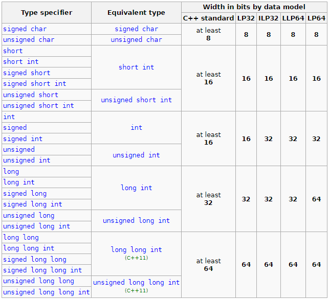

# The Fundamental Data Types

[CPP Reference: types](https://en.cppreference.com/w/cpp/language/types)

- Literals
    - [CPP Reference: integer literal](https://en.cppreference.com/w/cpp/language/integer_literal)
    - [CPP Reference: character literal](https://en.cppreference.com/w/cpp/language/character_literal)
    - [CPP Reference: floating literal](https://en.cppreference.com/w/cpp/language/floating_literal)
    - [CPP Reference: string literal](https://en.cppreference.com/w/cpp/language/string_literal)
    - [CPP Reference: bool literal](https://en.cppreference.com/w/cpp/language/bool_literal)

## Data Models

- Four data models found wide acceptance:
    - 32 bit systems:
        - LP32 or 2/4/4 (int is 16-bit, long and pointer are 32-bit)
            - Win16 API
        - ILP32 or 4/4/4 (int, long, and pointer are 32-bit);
            - Win32 API
            - Unix and Unix-like systems (Linux, macOS)
    - 64 bit systems:
        - LLP64 or 4/4/8 (int and long are 32-bit, pointer is 64-bit)
            - Win32 API (also called the Windows API) with compilation target 64-bit ARM (AArch64) or x86-64 (a.k.a. x64)
        - LP64 or 4/8/8 (int is 32-bit, long and pointer are 64-bit)
            - Unix and Unix-like systems (Linux, macOS)

Other models are very rare. For example, ILP64 (8/8/8: int, long, and pointer are 64-bit) only appeared in some early 64-bit Unix systems (e.g. UNICOS on Cray).

## Integer Types

- 이진수
    - 컴퓨터에서 signed는 2의 보수 방식을 채택
    - `01001011`
        - `10110100` : 1의 보수 (비트 반전)
        - `10110101` : `1의보수 + 1` → 2의 보수
        - 2의 보수에서는 가장 높은 자리에서 자리 올림이 발생시 무시

## Floating-point Types

[IEEE754](https://en.wikipedia.org/wiki/IEEE_754)

- 부동 소수점
    
    
    
    - 실수를 표현할 때 소수점의 위치를 고정시키 않고 지수부(exponent)와 가수부(mantissa)를 나타내어 표현
        - 부호: -
        - 가수부: 110110101
        - 지수부: 10^6
    - 메모리 표현
        
        
        
        - 부호: 음수 → 1bit
        - 가수부: 최상위 비트 부터 채움, 나머지는 0으로 채움
        - 지수부: 지수부가 6승 이지만 `0000 0110` 이 아님, 음의 승수도 표현해야하기 때문에 127을 0으로 보고 `127 + 6 = 133` → `1000 0101` 이 6의 승수 표현
    - 정밀도를 요구하는 연산에서는 부동 소수점을 쓰지말고, 고정 소수점이나 정밀한 연산을 위한 라이브러리를 사용할 것을 권장

- float Exponent encoding
    
    
    | Exponent | mantissa == 0 | mantissa != 0 | Equation |
    | --- | --- | --- | --- |
    | 0000 0000 | +- zero | subnormal value | (-1)^sign * 2^-126 * 0.mantissa |
    | 0000 0001 ~ 1111 1110 | normal value | normal value | (-1)^sign * 2^(exp-127) * 1.mantissa |
    | 1111 1111 | +- inf | +- NaN |  |

## Character & String Types

- char
    - 문자를 표현 하는 타입
    - 내부적으로는 정수
    - 1 byte
- ASCII
    - American Standard Code for Information Interchange
    - 7 비트로 표현 가능한 문자표
    - 제어 문자표와 출력 가능한 문자표로 구성
    - Escape Sequence
        - 문자 또는 문자열에 리터럴로 표현할 수 없는 것들을 정의

## Boolean Types

- bool
    - true, false를 표현하는 타입
    - 1 byte(usually)