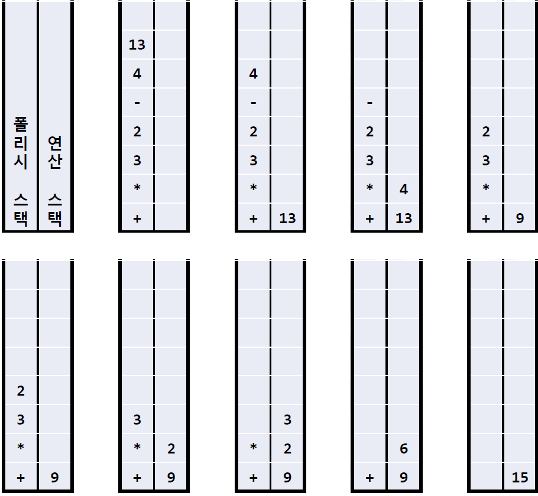

# Stack

## Definition of Stack

- Object : 선형리스트(linear list)
    - 쌓아 놓은 더미
    - 후입선출(LIFO : Last-In First-Out)
- Operatation
    - 스택에 데이터를 추가
    - 스택을 생성
    - 스택이 공백상태인지 검사
    - 스택이 포화상태인지 검사
    - 요소를 스택에서 완전히 삭제하면서 가져옴
    - 요소를 스택에서 삭제하지 않고 보기만 하는 연산

## Stack ADT

- Object
    - n개의 element형의 요소들의 선형리스트
- Operation
    - create() ::= 스택을 생성
    - is_empty(s) ::= 스택이 비어있는지를 검사
    - is_full(s) ::= 스택이 가득 찼는가를 검사
    - push(s,e) ::= 스택의 맨 위에 요소 e를 추가
    - pop(s) ::= 스택의 맨 위에 있는 요소를 반환한 다음 삭제
    - peek(s) ::= 스택의 맨 위에 있는 요소를 삭제하지 않고 반환

## Usage of the stack

- 자료의 출력 순서가 입력 순서의 역순으로 이뤄져야 할 때
    - 입력 : (A,B,C,D,E) → 출력 : (E,D,C,B,A)
- 되돌리기(undo) 기능
    - 최근 수행한 명령어들 중에서 가장 최근에 수행한 것부터 되돌리기
- 함수 호출에서 복귀주소(PC : Program Counter) 기억
    - 시스템 스택 : 컴퓨터 OS만 사용함, 사용자는 접근 안됨
    - 시스템 스택에는 함수가 호출될 때마다 활성화 레코드(activation record)가 만들어지고, 여기에 복귀주소가 기록됨

## Stack Implementation

- 배열을 이용하는 방법
    - 1차원 배열 stack[MAX_STACK_SIZE]
    - top 변수 : 스택에서 가장 최근에 입력되었던 자료를 가리킴
        - 가장 먼저 들어온 요소는 stack[0]에, 가장 최근에 들어온 요소는 stack[top]에 저장
        - 스택이 공백상태이면 top은 -1
- 연결리스트를 이용하는 방법
    - 연결된스택(linked stack): 연결리스트를이용하여구현한스택
    - 장점 : 크기가 제한되지 않음
    - 단점 : 구현이 복잡하고 삽입이나 삭제 시간이 오래 걸림
        - 동적 메모리 할당 및 해제 때문

## Polish Notation and Stack Evaluation

- 수식 표기법
    - 중위 표기법
        - 3 + 7
    - 전위 표기법
        - +, 3, 7
    - 후위 표기법(폴리시 표기법, polish notation)
        - 3, 7, +
- 중위 수식을 후위 수식으로 만드는 방법
    1. 중위 수식을 연산자의 우선순위에 따라 완전한 괄호 표현으로 변환
        - 1 + 3 * 4 → (1 + (3 * 4))
    2. 각 연산자를 그 연산자를 포함하는 괄호 중 제일 가까운 닫는 괄호 뒤로 보냄
        - (1 + (3 * 4)) → (1 (3, 4) * ) +
    3. 괄호 제거
        - 1, 3, 4, *, +
- 폴리시 수식 계산
    - 수식의 각 항목을 왼쪽에서 오른쪽으로 검사하며 다음과 같은 일을 반복한다
        1. 현재 검사되는 항목이 숫자이면 다음 항목을 검사한다.
        2. 현재 검사되는 항목이 연산자이면 앞의 두 항목 숫자 을 이 연산자의 피연산자로 하여 계산한 후 새로운 항목으로 삽입한다.
        3. 이러한 일은 하나의 숫자가 남을 때까지 반복하고 , 마지막 남은 수가 이 수식의 값이다.
    - 2-스택 알고리즘
        1. 폴리시 스택이 공백이면, 연산 스택의 top 을 답으로 하고 중지한다.
        2. 폴리시 스택이 공백이 아니면, 폴리시 스택에서 pop하여 그것을 d에 배정한다 .
            - 이 알고리즘에서는 자료 보관을 위해 d, d1, d2 를 사용한다.
        3. d가 피연산자라면, 연산 스택에 d를 push 한다.
        4. d가 연산자라면, 연산 스택을 두 번 pop하여 처음 것을 d2에 배정하고 다음 것을 d1에 배정한다 . d연산자를 d1과 d2피연산자에 적용하여 계산하고, 결과를 연산 스택에 push 한다 . 단계 1부터 다시 수행한다.

