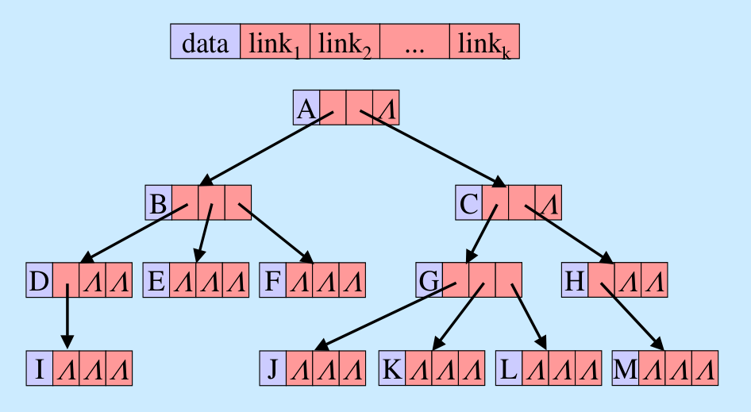

# Tree

## Definition of Tree

- 트리 : 계층적인 구조를 나타내는 자료구조
    - 부모-자식 관계의 노드들로 이루어짐
- 트리는 하나 이상의 노드로 구성된 유한 집합으로서,
    - 특별히 지정된 노드인 루트(root)가 있음
    - 루트를 제외한 나머지 노드들은 교차하지 않는 분리 집합 T_(1,) T_2, …, T_m (m ≥ 1)으로 분할되며, T_(1,) T_2, …, T_m은 루트의 부분 트리(subtree)로서 각각이 트리임
- 응용분야
    - 계층적인 조직 표현
    - 컴퓨터 디스크의 디렉토리 구조
    - 인공지능에서의 결정 트리(decision tree)

## Tree Terminology

- 노드, 마디, 정점(node, vertex)
    - 트리를 구성하는 기본 원소
    - 저장된 정보와 부분트리를 가리키는 링크들로 구성
- 부(하위) 트리의 차수/갯수/간선수(degree)
    - 노드의 차수(degree of a node) : 해당 노드의 부분 트리의 개수
    - 즉, 각 노드가 지닌 가지의 수 (한 노드에 연결된 자식 노드의 수)
- 계수(order)
    - 자식 노드들 중 최대 개수
- 레벨(level), 높이(height), 깊이(depth)
    - 레벨(수준) : 루트로부터 단순 경로의 길이
        - 루트의 레벨 : 0 or 1
    - 높이 (깊이) : (최대 레벨 값 + 1)
- 경로 (path), 길이 (length)
    - 경로 (path) : 한 노드에서 다른 한 노드에 이르는 길 사이에 놓여있는 노드들의 순서
    - 경로 길이 (length) : 출발 노드에서 목적 노드까지 거치는 노드의 갯수
- 루트 노드 (root node, 뿌리)
    - 부모가 없는 최상위 루트 노드(트리 자료구조의 진입 노드) : root node
- 단/끝단/단말 노드 (terminal node), 가지 노드 (branch node), 리프 노드(잎,leaf node)
    - 가지를 가지지 않는 즉 degree가 0 인 노드를 단말 노드(terminal node)라 하며,
    - degree가 0 이 아닌 노드들을 간노드(non-terminal node), 가지노드(branch node)라 함
- 자식 (child), 부모 (parent) 노드, 형제 (brother) 노드
    - 자식 노드(child)
    - 부모 노드(parent)
    - 형제 노드(brother or sibling)
        - 부모가 같은 자식 노드들
    - 선조(ancestor) : 부모 노드와 그의 부모들을 총칭
        - 해당 노드부터 루트까지의 모든 노드들
        - 고유 선조(proper ancestor) : 해당 노드를 제외한 선조
    - 자손(descendant) : 자식 노드와 그 자식들을 총칭
        - 해당 노드를 루트로 하는 부분트리의 모든 노드들
        - 고유 자손(proper descendants) : 해당 노드를 제외한 자손
- 크기 (size)
    - 특정 노드가 자신을 포함한 자손의 수
- 서브 트리 (subtree)
    - 하나의 노드와 그 노드들의 자손들로 이루어진 트리

## Types of trees

- 트리
    - 일반 트리
    - 이진 트리

- 일반 트리
    
    
    
    - 표현
        - 괄호 : (A(B(D(I),E,F),C(G(J,K,L),H(M))))
        - 컴퓨터상의 표현 : 데이터와 최대 차수만큼의 링크 필드

- 이진 트리(Binary Tree)
    - 모든 노드가 2개의 서브트리를 가지고 있는 트리
    - 노드의 유한 집합으로 `공집합`이거나 `루트와 왼쪽 부분트리 및 오른쪽 부분 트리`로 불리는 두개의 서로 분리된 이진 트리로 구성됨
    - 이진 트리의 노드에는 최대 2개까지의 자식 노드가 존재
        - 모든 노드의 차수가 2 이하가 됨 → 구현하기가 편리함
    - 이진 트리에는 서브 트리간의 순서가 존재

## Binary Tree

- 성질
    - 노드의 개수가 n개이면, 간선의 개수는 n-1
    - 높이가 h인 이진트리의 경우, 최소 h개의 노드를 가지며, 최대 2^h-1개의 노드를 가짐
    - n개의 노드를 가지는 이진트리의 높이
        - 최대 : n
        - 최소 : log(n+1), 밑 : 2
- 종류
    - 사향 이진 트리(skewed binary tree)
        - 모두 왼쪽 자식만 있거나(왼쪽 사향 이진 트리),
        - 모두 오른쪽 자식만 있는 트리(오른쪽 사향 이진 트리)
    - 완전 이진 트리(complete binary tree)
        - 높이가 h일 때, 레벨 h−2까지는 노드가 완전히 차 있고, 레벨 h-1에서는 노드가 왼쪽부터 차 있는 트리
    - 포화 이진 트리(full binary tree)
        - 각 레벨에 노드가 모두 차 있는 이진 트리
        - 포화 이진 트리이면 완전 이진 트리 O
        - 완전 이진 트리이면 포화 이진 트리 X
        - 전체 노드의 개수 : 레벨(k), 높이(h)


$$
2^0 + 2^1 + \cdots + 2^{h-1} \\ = \sum_{i=0}^{h-1} 2^i = \frac{1(2^{h}-1)}{2-1} \\ = 2^h - 1 = 2^{k+1} - 1
$$


- 노드
    - 레벨 k에 있는 최대 노드 수 : 2^k
    - 높이가 h인 트리의 최대 노드 수 : 2^h - 1
    - 단말 노드 수를 n0, 차수가 2인 노드 수를 n2라 할 때, 항상 n0 = n2 + 1
        - 전체 노드의 수 : n, 전체 링크의 수 : b
        - n0 : 자식이 없는 노드 수,  n1 : 자식이 1개인 노드 수, n2: 자식이 2개인 노드 수
        - n = n0 + n1 + n2 (1), b = n - 1 (2), b = n1 + 2 * n2 (3)
            - n - 1 = n1 + 2 * n2
            - n = n1 + 2 * n2 + 1
            - n0 + n1 + n2 = n1 + 2 * n2 + 1
            - n0 = n2 + 1
- 표현
    - 배열에 의한 방법
        - 모든 이진 트리를 포화 이진 트리라고 가정하고 각 노드에 번호를 붙여서 그 번호를 배열의 인덱스로 삼아 노드의 데이터를 배열에 저장하는 방법
        - 장점
            - 임의의 노드에 대해 부모, 자식 노드의 위치 계산이 쉬움
        - 단점
            - 완전 이진 트리가 아니면 메모리 낭비가 큼
        - i번째 노드의 부모 노드 위치
            - ceil(i - 1 / 2), (단, i ≠ 0)
        - i번째 노드의 왼쪽 자식 노드 위치
            - 2i + 1 (단, 2i + 1 ≤ n − 1)
        - i번째 노드의 오른쪽 자식 노드 위치
            - 2(i + 1) (단, 2(i + 1) ≤ n − 1)
    - 연결 리스트에 의한 방법
        - 링크 표현법: 포인터를 이용하여 부모 노드가 자식 노드를 가리키게하는 방법

## Binary Tree Traversal

- 트리 순회 : 트리의 모든 노드를 한번씩 방문하는 것
    - 트리의 구조를 분석하거나, 각 노드에 저장되어 있는 정보를 체계적으로 읽어올 때 사용
- 3가지의 기본적인 순회방법
    - 전위순회(preorder traversal) : VLR
        - 자손 노드보다 루트 노드를 먼저 방문
        - 구조화 된 문서 출력
    - 중위순회(inorder traversal) : LVR
        - 왼쪽 자손, 루트, 오른쪽 자손 순으로 방문
    - 후위순회(postorder traversal) : LRV
        - 루트 노드보다 자손을 먼저 방문
        - 디렉토리 용량 계산

- 중위 순회
    - 먼저 트리의 왼쪽으로 NULL 노드를 만날 때까지 계속 내려간 다음, NULL 노드를 만나면 그 NULL 노드의 부모 노드를 방문하고 다시 오른쪽 부트리에 대해 같은 방법으로 수행함
    - 만약 오른쪽 부트리에 더 이상 방문할 노드가 없다면 트리의 바로 윗 레벨의 방문되지 않은 마지막 노드에 대해서 계속적으로 운행
    - Complexity
        - 재귀적 프로그램의 시간 복잡도 : O(n)
            - 기본 연산 : printf(); inorder();
            - printf()의 수행 횟수
                - 각 노드의 값은 한번 씩만 출력됨 : n번
            - inorder()의 수행 횟수
                - 모든 노드의 수 + null 링크 방문 수
                - null 링크 방문 수 = 단말 노드의 수 * 2
                - 모든 노드의 수 > 단말 노드의 수
                - inorder()의 수행 횟수 < n+2n
        - 재귀적 프로그램의 공간 복잡도 : O(n)
            - 사향 트리일 때 최악의 경우 c * n번(모든 노드 수+ null링크 방문 수)의 재귀 호출이 가능함
            - 재귀 호출 때 마다 ptr이 스택에 쌓이므로 최악의 경우 필요한 스택의 크기는 c * n임
        - 반복문을 이용한 중위 순회의 시간 복잡도 : O(n)

```c
void inorder(treePointer ptr)
{
    if (ptr) {
        inorder(ptr->leftChild);
        printf("%c",ptr->data);
        inorder(ptr->rightChild);
    }
}

void iterInorder (treePointer ptr)
{
    int top = -1;
    treePointer stack[MAX_SIZE];
    for (;;) {
        for (; ptr; ptr = ptr->leftChild)
            push(&top, ptr);
        ptr = pop(&top);
        if (!ptr)
            break;
        printf("%c", ptr->data);
        ptr = ptr->rightChild;
    }
}
```


- 레벨 순회(level order)
    - 각 노드를 레벨순으로 검사하는 순회 방법
    - 지금까지의 순회 방법이 스택을 사용했던 것에 비해 레벨 순회는 큐를 사용하는 순회 방법

```c
void levelOrder(treePointer ptr) {
    int front = rear = 0;
    treePointer queue[MAX_SIZE];
    if (!ptr)
        return;
    enqueue(front, &rear, ptr);
    for (;;) {
        ptr = dequeue(&front, rear);
        if (ptr) {
            printf("%c", ptr->data);
            if (ptr->leftChild)
                enqueue(front, &rear, ptr->leftChild);
            if (ptr->rightChild)
                enqueue(front, &rear, ptr->rightChild);
        } else {
            break;
        }
    }
}
```

## Binary Tree Operation

- 노드 개수
    - 탐색 트리안의 노드의 개수를 계산
    - 각각의 서브트리에 대하여 순환 호출한 다음, 반환되는 값에 1을 더하여 반환

```c
int get_node_count(TreeNode *node)
{
    int count = 0;
    if (node != NULL)
        count = 1 + get_node_count(node->left) + get_node_count(node->right);
    return count;
}
```

- 높이
    - 서브트리에 대하여 순환호출하고 서브 트리들의 반환값 중에서 최대 값을 구하여 반환

    
```c
int get_height(TreeNode *node)
{
    int height = 0;
    if (node != NULL)
        height = 1 + max(get_height(node->left), get_height(node->right));
    return height;
}
```
