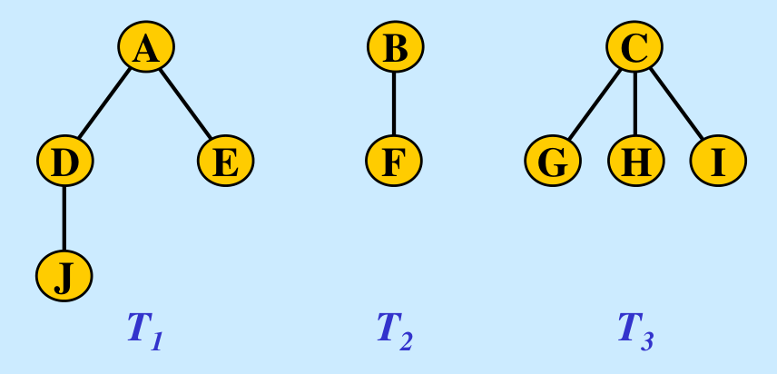

# Forest, Binary Search Tree

## Forest

- forest : m (m ≥ 0) 개의 트리로 구성된 집합
    
    
    
- F = T_1, T_2, … , T_m을 이진트리 BT({T_1, T_2, …, T_m}) 변환하는 방법
    1. m = 0인 경우, 즉 F = ∅ 이면, 대응되는 BT(∅) = ∅
    2. m > 0인 경우,
        - 루트 : T_1의 루트 Root(T_1)
        - 왼쪽 부분트리 : Root(T_1)의 부분트리 BT({T_11, T_12, …, T_1r})
        - 오른쪽 부분트리 : BT({T_2, T_3, …, T_m})


## Threaded Binary Tree


- 이진트리의 NULL 링크를 이용하여 순환 호출 없이도 트리의 노드들을 순회하는 것이 가능할 수 있음
- 스레드 이진 트리(threaded binary tree)
    - NULL 링크에 중위 순회시에 선행 노드인 중위 선행자(inorder predecessor)나 후속 노드인 중위 후속자(inorder successor)를 저장시켜 놓은 트리
    - 이진 트리의 2n개 링크 중 (n+1)개는 NULL
        - 노드 수 : n, 각 노드별 링크 수 : 2
        - 전체 링크 수 : n * 2
        - 노드 n 개를 잇는 링크 수 : n-1
        - NULL 링크 수 : 2n - (n - 1) = n + 1
    - NULL 링크를 스레드(thread) 포인터로 사용하여 스택 없이 중순위 운행이 가능함

```c
typedef struct TreeNode {
	int data;
	struct TreeNode *left, *right;
	int is_thread;
} TreeNode;

TreeNode *find_successor(TreeNode *p)
{
	TreeNode *q = p->right;
	if (q == NULL || p->is_thread == TRUE)
		return q;
	while (q->left != NULL)
		q = q->left;
	return q;
}

void thread_inorder(TreeNode *t)
{
	TreeNode *q;
	q = t;
	while (q->left != NULL)
		q = q->left;
	do {
		printf("%d ", q->data);
		q = find_successor(q);
	} while (q != NULL);
}
```

- NULL 링크에 스레드가 저장되면 링크에 자식을 가리키는 포인터가 저장되어 있는지 스레드가 저장되어있는 지 구분 필요
    - is_thread 필드 필요
- 스레드 중위 순회 함수
    - 중위 순회는 가장 왼쪽 노드부터 시작하기 때문에, 왼쪽 자식이 NULL이 될때 까지 왼쪽 링크를 타고 이동함
    - 데이터를 출력함
    - 중위 후속자를 찾는 함수를 호출하여 후속자가 NULL이 아니면 계속 루프를 돔

## Binary Search Tree

- 탐색작업을 효율적으로 하기 위한 자료구조
- key(왼쪽서브트리) ≤ key(루트노드) ≤ key(오른쪽서브트리)
- 모든 노드의 Key는 유일함 이진탐색를 중위순회하면 오름차순으로 정렬된 값을 얻을 수 있음
- 이진 탐색 트리: 공집합이거나 다음을 만족하는 이진 트리
    - 공집합이 아닌 왼쪽 부분 트리의 모든 키값은 루트의 키값 보다 작음
    - 공집합이 아닌 오른쪽 부분 트리의 모든 키값은 루트의 키값보다 큼
    - 왼쪽 부분 트리와 오른쪽 부분 트리도 이진 탐색 트리

```c
TreeNode *search(TreeNode *node, element key)
{
	if (node == NULL)
		return NULL;

	if (key == node->key)
		return node;
	else if (key < node->key)
		return search(node->left, key);
	else
		return search(node->right, key);
}

TreeNode *search(TreeNode *node, int key)
{
	while (node != NULL) {
		if (key == node->key)
			return node;
		else if (key < node->key)
			node = node->left;
		else
			node = node->right;
	}
	return NULL;
}
```

- Search Operation
    - Idea
        - 비교한 결과가 같으면 탐색이 성공적으로 끝남
        - 주어진 키 값이 루트 노드의 키값보다 작으면 탐색은 이 루트 노드의 왼쪽 자식을 기준으로 다시 시작
        - 주어진 키 값이 루트 노드의 키값보다 크면 탐색은 이 루트 노드의 오른쪽 자식을 기준으로 다시 시작
    - Algorithms : 재귀적인 탐색 방법 (찾고자 하는 값 : key)
        - 루트가 null 이면 탐색 실패
        - 루트의 원소값 = key 이면 탐색 성공 & 종료
        - 루트의 원소값 > key 이면 왼쪽 부분 트리를 재귀적으로 탐색
        - 루트의 원소값 < key 이면 오른쪽 부분 트리를 재귀적으로 탐색

```c
/**
 * @p: parent node of t
 * @t: current node
 * @n: new node
 */
void insert_node(TreeNode **root, element key)
{
	TreeNode *p, *t, *n;

	t = *root;
	p = NULL;

	/*
	 * Search : Insertion Location
	 *
	 * When the iteration statement ends,
	 * t is the location of the new node and
	 * p is the parent node of the new node.
	 *
	 * if p is NULL,
	 * tree is empty status and
	 * the new node will be the root node.
	 * else
	 * the new node will be left or right child of p.
	 */
	while (t != NULL) {
		if (key == t->key)
			return;
		p = t;
		if (key < t->key)
			t = p->left;
		else
			t = p->right;
	}

	n = (TreeNode *)malloc(sizeof(TreeNode));
	if (n == NULL)
		return;
	n->key = key;
	n->left = n->right = NULL;

	if (p != NULL) {
		if (key < p->key)
			p->left = n;
		else
			p->right = n;
	} else {
		*root = n;
	}
}
```

- Insert Operation
    - Idea
        - 이진 탐색 트리에 원소를 삽입하기 위해서는 먼저 탐색을 수행하는 것이 필요
        - 탐색에 실패한 위치가 바로 새로운 노드를 삽입하는 위치
    - 삽입 방법 (삽입되는 원소값 : key)
        - key를 탐색
        - 탐색이 실패한 위치에 새로운 노드 삽입
    - Algorithms
        - Case1
            - 비어 있는 트리에 노드를 삽입
        - Case2
            - 삽입하고자 하는 key가 트리에 이미 존재
        - Case3
            - 새로운 노드를 기존 노드의 왼쪽 자식 링크에 삽입하는 경우
            - 새로운 노드를 기존 노드의 오른쪽 자식 링크에 삽입하는 경우

```c
/**
 * @p: parent node of t
 * @t: current node
 * @child: child node of t
 * @succ: successor node of t
 * @succ_p: parent node of succ
 */
void remove_node(TreeNode**root, int key)
{
	TreeNode *p, *child, *succ, *succ_p, *t;

	p = NULL;
	t = *root;

	/*
	 * Search : key node Location
	 *
	 * When the iteration statement ends,
	 * t is the location of the remove node and
	 * p is the parent node of the remove node.
	 *
	 * if t is NULL,
	 * key is not in the tree.
	 * else
	 * 1. (t->left == NULL) && (t->right == NULL) : leaf node
	 * 2. (t->left == NULL) || (t->right == NULL) : branch node have one child
	 * 3. branch node have two childs
	 */
	while (t != NULL && t->key != key) {
		p = t;
		t = (key < p->key) ? p->left : p->right;
	}

	if (t == NULL) {
		printf("key is not in the tree");
		return;
	}

	if ((t->left == NULL) && (t->right == NULL)) {
		if(p != NULL){
			if(p->left == t)
				p->left = NULL;
			else
				p->right = NULL;
		} else {
			*root = NULL;
		}
	} else if ((t->left == NULL) || (t->right == NULL)) {
		child = (t->left != NULL) ? t->left : t->right;
		if (p != NULL) {
			if (p->left == t)
				p->left = child;
			else
				p->right = child;
		} else {
			*root = child;
		}
	} else {
		succ_p = t;
		succ = t->right;
		while (succ->left != NULL) {
			succ_p = succ;
			succ = succ->left;
		}
		if (succ_p->left == succ)
			succ_p->left = succ->right;
		else
			succ_p->right = succ->right;

		t->key = succ->key;
		t = succ;
	}

	free(t);
}
```

- Remove Operation
    - Idea
        - 이진 탐색 트리에 원소를 삭제하기 위해서는 먼저 탐색을 수행하는 것이 필요
        - 탐색에 성공한 위치가 바로 삭제할 노드의 위치
    - 삭제 방법 (삭제되는 원소값 : key)
        - key를 탐색
        - 탐색이 성공한 위치 노드의 종류에 따라 삭제
            - 삭제하려는 노드가 단말 노드 일 경우
            - 삭제하려는 노드가 왼쪽이나 오른쪽 서브 트리 중 하나만 가지고 있는 경우
            - 삭제하려는 노드가 두개의 서브 트리 모두 가지고 있는 경우
    - Algorithms
        - Case1 : 삭제하려는 노드가 단말 노드일 경우
            - 단말노드의 부모노드를 찾아서 연결을 끊음
        - Case2 : 삭제하려는 노드가 하나의 서브 트리만 갖고 있는 경우
            - 해당 노드는 삭제하고 서브 트리는 부모 노드에 붙여줌
        - Case3 : 삭제하려는 노드가 두개의 서브트리를 갖고 있는 경우
            - 삭제노드와 가장 비슷한 값을 가진 노드를 삭제노드 위치로 가져옴
                - 왼쪽 서브트리에서 가장 큰 값
                - 오른쪽 서브트리에서 가장 작은 값 (위 코드는 이 방식을 채택)

## Time Complexity of BST

- 이진 탐색 트리에서의 탐색, 삽입, 삭제 연산의 시간 복잡도는 트리의 높이를 h라고 했을 때 : O(h)
- 이진 탐색 트리의 높이
    - 최선의 경우
        - 이진 트리가 균형적으로 생성되어 있는 경우 (완전 이진 트리)
        - h = logn, 밑 : 2
    - 최악의 경우
        - 한쪽으로 치우친 경우 (사향 이진 트리)
        - h = n
        - 순차탐색과 시간복잡도가 같음
        - 효율성 측면에서 최악의 경우 O(logn)이 바람직 → AVL 트리, 2-3 트리
- 이진 탐색 트리의 탐색, 삽입, 제거의 평균 시간은 O(logn)으로 증명 되어 있음