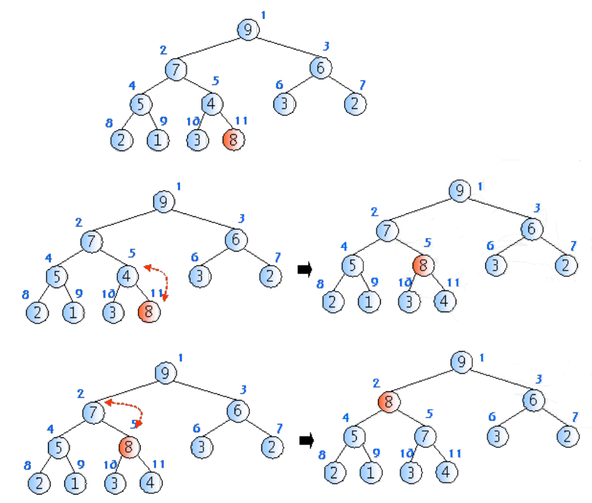

# Priority Queue, Heap

## Definition of Priority Queue

- 우선순위를 가진 항목들을 저장하는 큐
- FIFO 순서가 아니라 우선 순위가 높은 데이터가 먼저 나감
- 가장 일반적인 큐
    - 스택이나 FIFO 큐를 우선순위 큐로 구현할 수 있음
        
        
        | 자료구조 | 삭제되는 요소 |
        | --- | --- |
        | 스택 | 가장 마지막(최근)에 들어온 데이터 |
        | 큐 | 가장 먼저 들어온 데이터 |
        | 우선순위 큐 | 가장 우선순위가 높은 데이터 |

## Priority Queue ADT

- Object
    - n개의 element형의 우선 순위를 가진 요소들의 모임
- Operation
    - create() ::= 우선 순위큐를 생성
    - init(q) ::= 우선 순위큐 q를 초기화
    - is_empty(q) ::= 우선 순위큐 q가 비어있는지를 검사
    - is_full(q) ::= 우선 순위큐 q가 가득 찼는가를 검사
    - insert(q, x) ::= 우선 순위큐 q에 요소 x를 추가
    - delete(q) ::= 우선 순위큐로부터 가장 우선순위가 높은 요소를 삭제하고 이 요소를 반환
    - find(q) ::= 우선 순위가 가장 높은 요소를 반환

## Usage of the priority queue

- 응용 분야
    - 시뮬레이션 시스템(여기서의 우선 순위는 대개 사건의 시각)
    - 네트워크 트래픽 제어
    - 운영 체제에서의 작업 스케쥴링

## Priority Queue Implementation

- 배열을 이용한 우선순위 큐
- 연결리스트를 이용한 우선순위 큐
- 힙(heap)을 이용한 우선순위 큐

| 표현 방법 | 삽입 | 삭제 |
| --- | --- | --- |
| 순서없는 배열 | O(1) | O(n) |
| 순서없는 연결 리스트 | O(1) | O(n) |
| 정렬된 배열 | O(n) | O(1) |
| 정렬된 연결 리스트 | O(n) | O(1) |
| 힙 | O(logn) | O(logn) |

## Definition of Heap

- 노드들이 저장하고 있는 키들이 다음과 같은 식을 만족하는 완전이진트리
    - 최대 힙(max heap)
        - 부모 노드의 키값이 자식 노드의 키값보다 크거나 같은 완전 이진 트리
        - key(부모노드) ≥ key(자식노드)
    - 최소 힙(min heap)
        - 부모 노드의 키값이 자식 노드의 키값보다 작거나 같은 완전 이진 트리
        - key(부모노드) ≤ key(자식노드)
    - 힙의 높이
        - n개의 노드를 가지고 있는 힙의 높이는 floor(logn)
            - 힙은 완전이진트리
            - 마지막 레벨 h을 제외하고는 각 레벨 i에 2^(i-1)개의 노드 존재

## Heap Implementation

- 배열을 이용한 구현
    - 완전이진트리이므로 각 노드에 번호를 붙임
    - 이 번호를 배열의 인덱스라고 생각
- 부모노드와 자식노드를 찾기가 쉬움
    - 왼쪽 자식의 인덱스 = (부모의 인덱스) * 2
    - 오른쪽 자식의 인덱스 = (부모의 인덱스) * 2 + 1
    - 부모의 인덱스 = (자식의 인덱스) / 2



```c
void insert_max_heap(HeapType *h, element item)
{
	int i;
	i = ++(h->heap_size);

	while ((i != 1) && (item.key > h->heap[i/2].key)) {
		h->heap[i] = h->heap[i/2];
		i /= 2;
	}
	h->heap[i] = item;
}
```

- 삽입 연산
    - 회사에서 신입 사원이 들어오면 일단 말단 위치에 앉힌 다음에, 신입 사원의 능력을 봐서 위로 승진시키는 것과 비슷한 원리
    - 알고리즘
        1. 힙에 새로운 요소가 들어 오면, 일단 새로운 노드를 힙의 마지막 노드에 이어서 삽입
        2. 삽입 후에 새로운 노드를 부모 노드들과 교환해서 힙의 성질을 만족
    - 새로운 키 k의 삽입연산후 힙의 성질이 만족되지 않을 수 있음
    - Upheap는 삽입된 노드로부터 루트까지의 경로에 있는 노드들을 k와 비교, 교환함으로써 힙의 성질을 복원
    - 키 k가 부모노드보다 작거나 같으면 upheap는 종료
    - 힙의 높이가 floor(logn)이므로 upheap연산은 O(logn)
        - 최악의 경우, 루트 노드까지 올라가야 하므로 트리의 높이에 해당하는 비교 연산 및 이동 연산이 필요


```c
element delete_max_heap(HeapType *h)
{
	int parent, child;
	element item, temp;
	item = h->heap[1];
	temp = h->heap[(h->heap_size)--];
	parent = 1;
	child = 2;
	while (child <= h->heap_size) {
		if ((child < h->heap_size) && (h->heap[child].key) < h->heap[child+1].key)
			child++;
		if (temp.key >= h->heap[child].key)
			break;
		h->heap[parent] = h->heap[child];
		parent = child;
		child *= 2;
	}
	h->heap[parent] = temp;
	return item;
}
```

- 삭제 연산
    - 최대 힙에서의 삭제는 가장 큰 키값을 가진 노드를 삭제하는 것을 의미
        - 따라서 루트 노드가 삭제
    - 삭제 연산은 회사에서 사장의 자리가 비게 되면 먼저 제일 말단 사원을 사장 자리로 올린 다음에, 능력에 따라 강등시키는 것과 비슷함
    - 알고리즘
        1. 루트 노드를 삭제
        2. 마지막 노드를 루트 노드로 이동
        3. 루트에서부터 단말 노드까지의 경로에 있는 노드들을 교환하여 힙 성질을 만족시킴
    - 힙의 높이가 floor(logn)이므로 downheap 연산은 O(logn)
        - 최악의 경우, 가장 아래 레벨까지 내려가야 하므로 역시 트리의 높이 만큼의 시간이 걸림

---

```c
/**
 * main
 */

#include <stdio.h>

#define MAX_ELEMENT 200

typedef struct {
	int key;
} element;

typedef struct {
	element heap[MAX_ELEMENT];
	int heap_size;
} HeapType;

void init(HeapType *h)
{
	h->heap_size =0;
}

int main(void)
{
	element e1={10}, e2={5}, e3={30};
	element e4, e5, e6;

	HeapType heap;
	init(&heap);

	insert_max_heap(&heap, e1);
	insert_max_heap(&heap, e2);
	insert_max_heap(&heap, e3);

	e4 = delete_max_heap(&heap);
	printf("< %d > ", e4.key);

	e5 = delete_max_heap(&heap);
	printf("< %d > ", e5.key);

	e6 = delete_max_heap(&heap);
	printf("< %d > ", e6.key);

	return 0;
}
```

---

```c
void heap_sort(element a[], int n)
{
	int i;
	HeapType h;
	init(&h);

	for (i = 0; i < n; i++)
		insert_max_heap(&h, a[i]);

	for(i = (n - 1); i >= 0; i--)
		a[i] = delete_max_heap(&h);
}
```

- 힙을 이용하면 정렬 가능 : 힙 정렬
    - 힙 정렬이 최대로 유용한 경우는 전체 자료를 정렬하는 것이 아니라 가장 큰 값 몇 개만 필요할 때
- 알고리즘
    - 먼저 정렬해야 할 n개의 요소들을 최대 힙에 삽입
    - 한번에 하나씩 요소를 힙에서 삭제하여 저장하면 됨
- 복잡도
    - 하나의 요소를 힙에 삽입하거나 삭제할 때 시간이 O(logn) 만큼 소요되고 요소의 개수가 n개이므로 전체적으로 O(nlogn)시간이 걸림(빠른편)

## Huffman Code

- 이진 트리는 각 글자의 빈도가 알려져 있는 메시지의 내용을 압축하는데 사용될 수 있음
    - 이런 종류의 이진트리를 허프만 코딩 트리라고 함
- 만약 텍스트가 e, t, n, I, s의 5개의 글자로만 이루어졌다고 가정하고 각 글자의 빈도수가 다음과 같다고 가정
    
    
    
- 생성 절차
    
    
    
    1. 빈도수에 따라 5개의 글자 나열 (4, 6, 8, 12, 15)
    2. 가장 작은 빈도수를 가진 글자 2개(4, 6) 추출하여 이진트리 구성
    3. 합쳐진 글자를 리스트에 삽입하여 (10, 8, 12, 15) 얻음
    4. 이 빈도수를 정렬하여 (8,10,12,15) 얻음
    - 동일 반복
- 최종 트리
    - 왼쪽 edge는 1, 오른쪽 edge는 0
    - 빈도수 6에 해당하는 글자 i의 허프만 코드 : 110