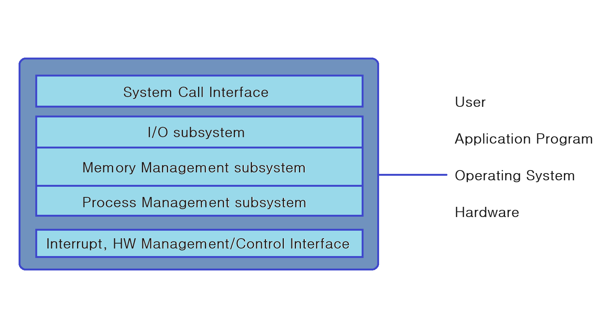

# Introduction

## 리눅스란

- Linus Tovalds에 의해 개발된 운영체제
    - 운영체제: 시스템 소프트웨어
        - 시스템 하드웨어 관리
        - 응용 소프트웨어 실행을 위한 하드웨어 추상화 플랫폼 및 시스템 서비스 제공

## 유닉스란

- AT&T 사에 의해 1960년대 개발
- BSD 계열, SYS-V 계열, POSIX 계열로 구분
    - BSD(Berkeley Software Distribution)
        - 캘리포니아 버클리 대학에서 무료로 배포하기 시작한 유닉스 버전들로 TCP/IP 네트워킹 등에 큰 발전을 기여하였고, 1980년대 발표된 4.2 BSD 이후 SYS-V 계열 유닉스에 많은 영향
    - SYS-V(System Five)
        - AT&T 사에서 초기에 개발한 유닉스에서 발전하게된 유닉스 버전들을 통칭
    - POSIX(Portable Operating System Interface for Computer Environment)
        - IEEE/ANSI 에서 제안한 개방형 운영체제에 대한 권고안을 토대로 작성된 개념적인 유닉스 운영체제

## 오픈소스와 리눅스

- 자유 소프트웨어 운동(Free Software Movement) 및 제단(FSF)
    - 리처드 스톨먼(Richard Matthew Stallman, 1953)이 1980년대초 소프트웨어가 상업화 되어 가는 시장에 맞서 소프트웨어의 본래 생산 유통 방식인 정보 공유의 방식을 복원하고자 한 운동
    - 여러 사람의 손을 거쳐 더 완성도 높은 소프트웨어를 생산하고, 모든 소프트웨어를 자유 소프트웨어로 만드는 것을 지향하는 단체로 자유 소프트웨어 제단(Free Software Foundation)을 설립
    - 원칙
        - 자유 소프트웨어 운동은 다음 몇가지의 원칙을 기반으로 함
        - 소프트웨어의 작동 원리를 연구하고 이를 자신의 필요에 맞게 변경시킬 수 있는 자유
        - 소프트웨어를 이웃과 함께 공유하기 위해서 이를 복제하고 배포할 수 있는 자유
        - 소프트웨어를 향상시키고 이를 공동체 전체의 이익을 위해서 다시 환원시킬 수 있는 자유
        - 즉, 소스 코드 공개를 통해 누구나 소프트웨어를 수정할 수 있게 하며, 자유로운 복제와 배포를 허용하는 것
- GNU 프로젝트
    - 누구나 자유롭게 “실행, 복사, 수정, 배포” 할 수 있고, 누구도 그런 권리를 제한하면 안된다는 소프트웨어 라이선스(GPL)
    - GNU는 “GNU is Not Unix”라는 재귀 약자
        - gcc
        - glibc
        - gnu-utils (make 등)
        - gdb
        - emacs
    - [GNU software](https://www.gnu.org/software/software.html)
- 오픈소스 프로젝트
    - 기존의 자유 소프트웨어(Free Software)라는 용어에 암시된 정치적 선언과 도덕적 철학을 비난했던 자유 소프트웨어 운동에 참여한 사람들이 제안
    - 오픈소스 모델과 개방형 협업
    - 오픈소스 라이선스
        - 넷스케이프, 아파치 등
        - [우리나라 오픈소스SW 라이선스 종합정보시스템][https://www.olis.or.kr/](https://www.olis.or.kr/)
    - 자유-오픈 소스 소프트웨어(Free and open-source software, FOSS)

## 리눅스 배포판

- [Linux Distro](https://ko.wikipedia.org/wiki/%EB%A6%AC%EB%88%85%EC%8A%A4_%EB%B0%B0%ED%8F%AC%ED%8C%90)
- 배포판 구성요소
    - Linux Kernel
    - Desktop UI
    - Utilities
- 배포판 선택 방법
    - 상업 vs 비상업
    - 기업용(Enterprise), 개인용(Power, Home)
    - 하드웨어 지원 및 하드웨어 벤더의 인증(Certification)
    - 서버군, 데스크탑군, 임베디드군, 특수목적(방화벽, 라우터, 클러스터)
    - 특정 산업군(교육, 과학, 음악, 생물학 등)
    - 보안성, 안정성, 사용성, 이식성
    - 지리적 위치(현지 국가 서포트)

## GUI

- GNOME(GNU Network Object Model Environment)
    - 커뮤니티 탄생: 1997년 8월
    - 디자인 철학: 손쉬운 사용
    - GNU의 후원을 받아, 즉 Free and Open Source Software 철학을 담아 탄생
    - 개발도구: GTK+, Unity
- KDE(K-Desktop Environment)
    - 커뮤니티 탄생: 1996년 10월
    - 디자인 철학: 기능과 확장성
    - 다중 플랫폼 호환성을 위해 탄생(Linux, FreeBSD, Microsoft Windows, Solaris, MAC 등)
    - 개발도구: Qt, Plasma
- XFce(XForms Common Environment)
    - 디자인 철학: 2D lightweight(오래된 HW도 지원하기 위해 저사양에서도 가능한)
- LXDE(Lightweight X11 Desktop Environment)
    - 디자인 철학: Minimalistic Desktop Environment

## 운영체제란

- 운영체제(Operating System, OS)는 시스템 하드웨어를 관리할 뿐 아니라 응용 프로그램을 실행하기 위하여 하드웨어 추상화 플랫폼과 공통 시스템 서비스를 제공하는 시스템 소프트웨어
    - 최근에는 가상화 기술의 발전으로 실제 하드웨어가 아닌 하이퍼바이저 위에서 실행되기도 함

## 커널

- 단일형 커널(monorithic)
    - 유저 모드: 응용 프로그램
    - 커널 모드: 프로세스, 메모리 관리자 통신 모듈(Interprocess Communication, IPC), 파일 시스템, 디바이스 드라이버 등 다수의 기능
    - 대표 유형: 유닉스, 리눅스, MS-DOS 등(그러나 현실적으로는 Layered)
- 마이크로 커널
    - 유저 모드: 응용 프로그램
    - 커널 모드
        - 응용 프로그램 통신, 파일 시스템, 장치 관리자
        - 기본 통신(IPC), 메모리 관리, 프로세스 관리 등 최소화 기능
        - 대표 유형: QNX, Mach, Windows(그러나 현실적으로는 Hybrid)
- 리눅스 커널
    - [맵](https://makelinux.github.io/kernel/map/)
    - [버전](https://www.kernel.org/)
        - [타임라인](https://en.wikipedia.org/wiki/Linux_kernel_version_history)
    - [깃](https://git.kernel.org/)
    - [바닐라커널](https://git.kernel.org/pub/scm/linux/kernel/git/torvalds/linux.git/)

## 우분투 리눅스

- [우분투 리눅스](https://ubuntu.com/)
    - [데스크탑 버전](https://ubuntu.com/download/desktop)
    - [우분투 배포판](https://wiki.ubuntu.com/Releases)
- Code name
- 버전
    - {Major Version}.{Minor Version}.{Patch Version}
- 지원
    - LTS: Long-Term Support
- 특징
    - GA: General Availability
    - HWE: Hardware Enablement