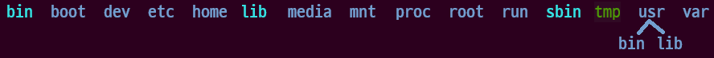

# Architecture and Characteristics of Operating System

## 부팅 시퀀스

- 운영체제의 부팅 과정
    - ROM BIOS: Basic Input/Output System(CMOS)
        - POST(Power On Self Test) 및 물리적 Boot 디바이스 선정
    - MBR: Master Boot Record
        - HDD의 특정 섹터 (0번 섹터)
    - 부트로더: Boot Loader
        - 소프트웨어 영역(멀티 부트 등 처리를 위한 멀티 스테이지 부트)
        - LILO, GRUB(Grand Unified Bootloader), GRUB2, uboot
    - 커널: Linux Kernel
        - 운영체제 소프트웨어 메모리에 올려서 구동(HW 디비이스, FS 등)
        - `/sbin/init`을 실행하며 `initrd` 패키지의 실행(pid 1)
    - 부팅: Init process
        - 루트 유저 프로세스로 `systemd` 등의 부팅 과정 수행
        - `/etc/inittab` 등 실행
    - 부팅: Run Level
        - `/etc/rc.d/rc*.d`
        - 소프트웨어 부트 스크립트

## 부트로더

- `grub.cfg` ← `/etc/grub.d/*` 내용들과 `/etc/default/grub` 을 통해 생성

## 파일시스템

- `/etc/fstab`

## 시작프로세스

- 우분투 운영체제의 부팅 프로세스
    - 고전적 부팅 시스템
        - System-V init service
        - `/etc/inittab`
    - 개선된 부팅 시스템(Until 14.04-Trusty)
        - **Upstart** init service
    - 현재의 부팅 시스템(Since 16.04-Xenial)
        - **systemd** boot process
    - 호환성 모드를 위해 일부 존재(실제로는 미사용)
        - `/etc/init/rc-sysinit.conf`
        - `/etc/rc3.d/*`
    - 현재의 systemd를 통한 부트 시퀀스
        - `/etc/systemd/system/multi-user.target.wants/*`
- systemd
    - startup 프로세스를 구동하는 프로그램
        - 기존 init 보다 단순한 프로세스
        - 동시성(병행 실행)을 제공하며 부팅 속도를 대폭 향상 시킴
        - 프로세스간의 dependency를 손쉽게 처리 함
        - 서비스 모니터링의 편리함(재시작, Crash 등에 대한 모니터링)
        - 저널 로깅 시스템을 사용한 편리한 모니터링
        - 컴포넌트의 손쉬운 추가/삭제
- init vs systemd
    
    
    | SysV, Upstart: init - Run Level | systemd: targets |
    | --- | --- |
    | 0: halt(시스템 종료) | 0: poweroff.target |
    | 1: Single user mode(복원 모드) | 1: rescue.target |
    | 2: Multi user mode, without NFS | 2/3/4: multi-user.target |
    | 3: Full multi user mode(텍스트 유저 모드) | 5: graphical.target |
    | 4: unused(커스텀) | 6: reboot.target |
    | 5: X11(그래픽 유저모드) |  |
    | 6: Reboot(재부팅) |  |
    - SysV, Upstart: init - Run Level
        - `$ cat /etc/inittab`
        - `$ init 3, init 5`
    - systemd: targets
        - `$ sudo systemctl get-default`
        - `$ sudo systemctl enable multi-user.target`
        - `$ sudo systemctl set-default multi-user.target`
- 시스템 명령어의 혼재 (SysV, Upstart, systemd)
    
    ```bash
    # 같은 역할을 하는 스크립트의 경우 init 명령어 보다는 systemd 명령어를 사용하는 것을 권장
    # systemctl
    $ sudo service --status-all
    $ sudo service network-manager restart
    $ sudo systemctl restart network-manager
    
    # 시작 프로세스 만들기
    # /lib/systemd/system/test.service
    $ systemctl daemon-reload
    $ systemctl enable test.service
    $ systemctl start test.service
    $ systemctl status test.service
    $ systemctl stop test.service
    $ systemctl disable test.service
    ```
    

## 디렉토리 구조

- 파일시스템 및 디렉토리 구조
    - FHF(Filesystem Hierarchy Standard) 표준 파일 시스템
    - /: 루트 디렉토리
        
        
        
        - 시스템 관리
            - /etc: 각종 설정파일
                - /etc/*
                    - /etc/apt, /etc/dhcp, /etc/default, /etc/logrotate.d, /etc/vim
            - /lib: 라이브러리(및 커널모듈)
                - /lib/modules/*
                    - lsmod
            - /root: 루트 사용자의 홈 디렉토리
            - /sbin: 시스템(관리자용) 명령어
            - /var: 시스템 운용중에 생성되는 임시 데이터 저장소
                - /var/*
                    - /var/log/*, /var/log/syslog
        - 일반 사용자
            - /bin: 기본적인 명령어
            - /home: 사용자의 홈 디렉토리 (→ 사용자 아이디 디렉토리 → 사용자 파일)
            - /tmp: 임시 저장소
            - /usr: 일반 사용자들 공통 파일
                - /usr/bin
        - 시스템 설정
            - /dev: 시스템 디바이스(장치파일)
            - /media: 외부 저장소(cdrom, usb 등)
            - /mnt: 외부 저장소 또는 파일시스템 마운트포인트
            - /proc: 시스템 설정들의 가상파일시스템(pseudo-file 시스템)
                - /proc/*
                    - /proc/meminfo
        - 부팅
            - /boot: 부트로더 디렉토리

## 사용자

- 다중 사용자
- 사용자 권한
    - **Root login not recommended**
        - use sudoer
    - 나(owner), 그룹(group), 남(other)