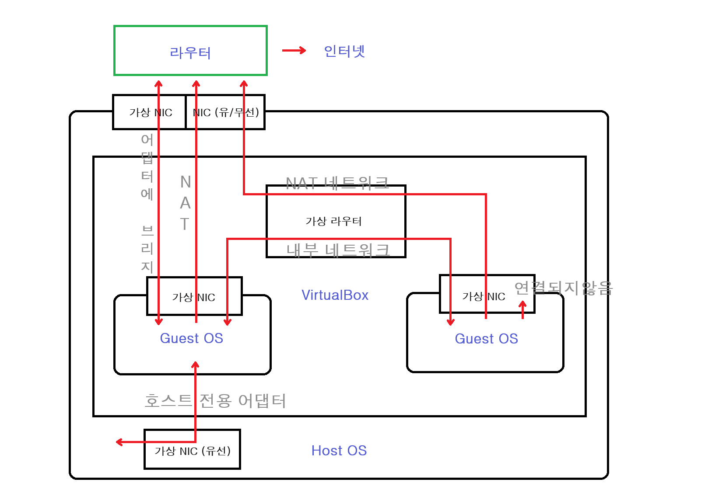

# VM

## 가상환경

- 가상환경(Virtual Machine) 이란
    - 하이퍼바이저(Hypervisor) 호스트 컴퓨터에서 다수의 운영체제(Operating System)를 동시에 실행하기 위한 논리적 플랫폼(Platform)
    - 가상화 머신 모니터 또는 가상화 머신 매니저(VMM)라고도 부름

## 가상환경 제공 소프트웨어

- [virtual box](https://www.virtualbox.org/)
    - 설치
        - 하드 디스크
            - 지금 새 가상 하드 디스크 만들기
        - 하드 디스크 파일 종류
            - VDI(VirtualBox Disk Image)
        - 물리적 하드 드라이브에 저장
            - 동적 할당
        - 설치 후
            - 장치 → 게스트 확장 CD 이미지 삽입 → VBox_GAs_*
    - 설정
        - 네트워크
            - 네트워크 어댑터 사용하기
            - 다음에 연결됨: NAT
        - VM 종료
            - 현재 시스템 상태 저장하기: (Suspend(절전모드) / Hybernate(최대절전모드))
            - 컴퓨터 끄기 신호 보내기: (정상 종료 - Graceful Shutdown)
            - 시스템 전원 끄기: (강제 종료 - 물리적 Power Off)
    - 네트워크
        
        
        
        - NAT: 가상머신 내부 네트워크 에서 Host PC 외부 네트워크 단방향 연결 (Host 내부 네트워크와 통신 불가)
        - 어댑터에 브리지: 호스트 PC와 등등하게 외부 네트워크와 연결 (IP할당 외부로부터 받음)
        - 내부 네트워크: Host 내부 네트워크와만 통신 가능
        - 호스트 전용: Host 와 내부 네트워크와만 통신 가능 (외부 네트워크와 단절)
        - 일반 드라이버: 거의 미사용 (UDP 터널 네트워크 등)
        - NAT 네트워크: NAT + 내부 네트워크와 통신 가능
        - 연결되지 않음: 네트워크 미사용 (Link Down)

- [vmware](https://www.vmware.com/kr/products/workstation-player/workstation-player-evaluation.html)
- [Microsoft Hyper-V](https://docs.microsoft.com/ko-kr/virtualization/hyper-v-on-windows/quick-start/enable-hyper-v)
- [AWS](https://console.aws.amazon.com/console/home)
- [GCP](https://console.cloud.google.com/)

## 가상환경 원격 접속

- 호스트
    - openssh-server 설정
    - `$ ifconfig`
        - IP 주소 확인
- 클라이언트
    - `$ ping host_addr`
        - 패킷 테스트
    - 접속 실패
        - NAT 내부망 내 로 접속하기
            - 호스트측에서 포트포워딩 추가: SSH TCP/22
        - 호스트 전용 어댑터로 접속하기
            - Virtual Box 설정 → 네트워크 → 어댑터# → 호스트 전용 어댑터
            - 호스트 네트워크 관리자 → 192.168.*.1/24, 255.255.255.0, DHCP 서버 사용
        - 그 외