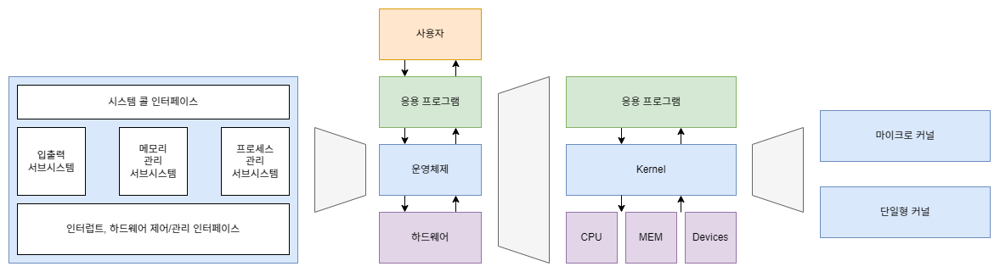

# ch01 리눅스 기초와 이론

## 리눅스 역사, 배포판 종류

- 리눅스란
    - 리눅스(Linux)는 Linus Tovals에 의해 개발된 운영체제
    - 미닉스(Minix) 운영체제를 표방하여 학습적인 용도로 개발되어 유즈넷 뉴스그룹 comp.os.minux에 초기 버전을 발표
    - 처음에는 인텔 CPU을 장착한 PC에서 구동되는 운영체제로 개발 되었으나, 그 후 다양한 CPU와 워크스테이션에까지 이식(Porting)

```
From: torvalds@klaava.Helsinki.FI (Linus Benedict Torvalds)
Newsgroups: comp.os.minix
Subject: Gcc-1.40 and a posix-question
Message-ID: <1991Jul3.100050.9886@klaava.Helsinki.FI>
Date: 3 Jul 91 10:00:50 GMT
```

- 유닉스란
    - 유닉스(Unix)는 AT&T 사에 의해 1960년대 개발된 운영체제
    - 메인프레임, 중형, 소형 컴퓨터 시스템용 운영체제로 고전적으로 사용되었으며, PC용 운영체제로도 개발
    - 계보
        - BSD(Berkeley Software Distribution) 계열 유닉스
            - 캘리포니아 버클리 대학에서 무료로 배포하기 시작한 유닉스 버전들로 TCP/IP 네트워킹 등에 큰 발 전을 기여하였고, 1980년대 발표된 4.2 BSD이후 SYS-V 계열의 유닉스에 많은 영향을 미침
        - 시스템 V (System Five) 계열 유닉스
            - AT&T 에서 초기에 개발한 유닉스로, 시스템 III, 시스템 V 등으로 발전하게 된 유닉스 버전들을 통칭
        - POSIX (Portable Operating System Interface for Computer Environment) 유닉스
            - IEEE/ANSI 에서 제안 한 개방형 운영체제에 대한 권고안을 토대로 작성된 개념적인 유닉스 운영체제
- 오픈소스와 리눅스
    - 자유 소프트웨어 운동(Free Software Movement) 및 재단(FSF)
        - In fact, such a movement exists, and you can be part of it. The free software movement was started in 1983 by computer scientist Richard M. Stallman, when he launched a project called GNU, which stands for “GNU is Not UNIX”, to provide a replacement for the UNIX operating system - a replacement that would respect the freedoms of those using it.
        - Then in 1985, Stallman started the Free Software Foundation, a nonprofit with the mission of advocating and educating on behalf of computer users around the world.
        - There are now many variants or ‘distributions’ of this GNU operating system using the kernel Linux. We recommend those GNU/Linux distributions that are 100% free software; in other words, entirely freedom-respecting.
    - GNU 프로젝트
        - [Philosophy: What is Free Software](https://www.gnu.org/philosophy/free-sw.html.en)
    - 오픈소스 프로젝트
        - 기존의 자유 소프트웨어라는 용어에 암시된 정치적 선전과 도덕적 철학을 비난했던 자유 소프트웨어 운동에 참여한 사람들이 제안
    - [라이선스](https://olis.or.kr/license/compareGuide.do)

- 리눅스 배포판
    - [GNU/Linux distro timeline](https://en.wikipedia.org/wiki/File:Linux_Distribution_Timeline.svg)
    - 슬랙웨어(Slackware) 계열
        - 대표 파생 유형: SuSE 리눅스(SLES, SLED, OpenSuSE)
        - 패키지 관리자: rpm, zypper
        - 특징: “안정성”, 노벨(Novell)에 인수
    - 데비안(Debian) 계열
        - 대표 파생 유형: Ubuntu, Konoppix, Lindows, Mint, Kali Linux
        - 패키지 관리자: dpkg, apt
        - 특징: “데비안 선언문” - 상업적 시장에서 경쟁 가능한 비상업적 배포판을 만드는 것 FSF의 GNU프로젝트의 지원을 받아 만들어 짐
        - Ubuntu 특징: “전 세계 사람 누구나 어렵지 않게 Linux를 사용하자” 라는 목적으로 탄생
    - 레드헷(Redhat) 계열
        - 대표 파생 유형: RHEL, Fedora, CentOS, Mandrake
        - 패키지 관리자 : rpm, yum
        - 특징: 서버 운영체제의 강자, 유료(RHEL) 및 무료(CentOS)
    - 배포판 구성 요소
        - Linux Kernel
        - Desktop UI
        - Utilities
    - 배포판 선택 방법
        - 상업적 vs 비상업적
        - 기업용(엔터프라이즈), 개인용(파워유저, 홈유저)
        - 하드웨어 지원, 및 특정 하드웨어 벤더의 인증(Certification)
        - 서버군, 데스크탑군, 임베디드군, 특수목적(방화벽, 라우터, 클러스터)
        - 특정 산업군(교육적, 과학적, 음악적, 생물학적 등)
        - 보안성, 안정성, 사용성, 이식성
        - 지리적 위치(현지 국가 서포트)
- GUI
    - GNOME(GNU Network Object Model Environment)
        - 커뮤니티 탄생: 1997년 8월
        - 디자인 철학: 손쉬운 사용
        - GNU의 후원을 받아, 즉 Free and Open Source Software 철학을 담아 탄생함
        - 개발도구: GTK+, Unity
    - KDE(K-Desktop Environment)
        - 커뮤니티 탄생: 1996년 10월
        - 디자인 철학: 기능과 확장성
        - 다중 플랫폼 호환성을 위해 탄생(Linux, FreeBSD, Microsoft Windows, Solaris, MAC 등)
        - 개발도구: Qt, Plasma
    - XFce(XForms Common Environment)
        - 디자인 철학: 2D lightweight(오래된 HW도 지원하기 위해 저사양에서도 가능한)
    - LXDE(Lightweight X11 Desktop Environment)
        - 디자인 철학: Minimalistic Desktop Environment

- 운영체제란
    
    
    
    - 운영체제(Operating System)는 시스템 하드웨어를 관리할 뿐 아니라 응용 소프트웨어를 실행하기 위하여 하드웨어 추상화 플랫폼과 공통 시스템 서비스를 제공하는 시스템 소프트웨어
    - 가상화 기술의 발전에 따라 실제 하드웨어가 아닌 하이퍼바이저 위에서 실행되기도 함
- 커널
    
    
    
    - [Linux kernel map](https://makelinux.github.io/kernel/map/)
    - [The Linux Kernel Archives](https://www.kernel.org/)
    - [kernel.org git repositories](https://git.kernel.org/)
    - [Linux kernel version history](https://en.wikipedia.org/wiki/Linux_kernel_version_history)

- 우분투 배포판
    - 프로젝트명
    - 버전: {Major Version}.{Minor Version}.{Patch Version}
    - 기능
        - 홀수 버전: 최신 기능(플래그쉽)
        - 짝수 버전: 안정성
    - 지원
        - LTS: Long-Term Support
            - 최초 릴리즈로부터, 최소 5년 Security 서포트
    - 특징
        - GA(Gerneal Availability): 5년 Security 서포트
        - HWE(Hardware Enablement): 6개월 Security 서포트 + 그 다음 HWE 버전

## 가상환경

- 가상환경(Virtual Machine)이란
    - 하이퍼바이저(Hypervisor)는 호스트 컴퓨터에서 다수의 운영 체제(Operating System)를 동시에 실행하기 위한 논리적 플랫폼(Platform)
    - 가상화 머신 모니터 또는 가상화 머신 매니저(Virtual Machine Monitor or Virtual Machine Manager, VMM)라고도 부름
- VirtualBox 네트워크
    - NAT: 가상머신 내부 네트워크에서 Host PC 외부 네트워크 단방향 연결(Host 내부 네트워크와 통신 불가) → 1대의 PC로 인터넷 연결
        
        
        
    - 어댑터에 브리지: 호스트 PC와 동등하게 외부 네트워크와 연결(IP할당 외부로부터 받음) → N대의 PC로 인터넷 연결
        
        
        
    - 내부 네트워크: Host 내부 네트워크와만 통신 가능 → 내부의 게스트 OS간 통신
        
        
        
    - 호스트 전용: Host와 내부 네트워크와만 통신 가능(외부 네트워크와 단전) → 게스트OS-호스트OS간 통신
        
        
        
    - 일반 드라이버: 거의 미사용(UDP 터널 네트워크 긍)
    - NAT 네트워크: NAT + 내부네트워크와 통신 가능 → 가상 네트워크를 통해서 인터넷 연결
        
        
        
    - 연결되지 않음: 네트워크 미사용(Link Down)
        
        
        

## 운영체제의 구조와 특징

- 운영체제란
    
    
    
    - 운영체제(Operating System)는 시스템 하드웨어를 관리할 뿐 아니라 응용 소프트웨어를 실행하기 위하여 하드웨어 추상화 플랫폼과 공통 시스템 서비스를 제공하는 시스템 소프트웨어
    - 가상화 기술의 발전에 따라 실제 하드웨어가 아닌 하이퍼바이저 위에서 실행되기도 함
- 운영체제의 부팅 과정
    - ROM BIOS: Basic Input/Output System(CMOS)
        - POST(Power On Self Test) 및 물리적 Boot 디바이스 선정
    - MBR: Master Boot Record
        - HDD 의 특정 섹터(0번 섹터 512Byte)
    - 부트로더: Bootloader
        - 소프트웨어 영역 (멀티 부트 등 처리를 위한 멀티 스테이지 부트)
        - LILO, GRUB(Grand Unified Bootloader), GRUB2, uboot
    - 커널: Linux Kernel
        - 운영체제 소프트웨어 메모리에 올려서 구동(HW 디바이스, FS 등)
        - /sbin/init 을 실행하며 initrd 패키지의 실행(pid 1)
    - 부팅: Init process
        - 루트 유저 프로세스로 systemd 등의 부팅 과정 수행
        - /etc/inittab 등 실행
            - 부팅: Runlevel (/etc/rc.d/rc*.d/)
        - 소프트웨어 부트 스크립트
- 우분투
    - 부트로더
        - grub.cfg ← /etc/grub.d/* 내용들과 /etc/default/grub 을 통해 생성
    - 부팅 프로세스
        
        
        |  | 고전 SysV 및 Upstart - init Runlevel | systemd - target |
        | --- | --- | --- |
        | 0 | halt(시스템 종료) | poweroff.target |
        | 1 | Single user mode(복원모드) | rescue.target |
        | 2 | Multiuser mode, without NFS | multi-user.target |
        | 3 | Full multiuser mode(텍스트 유저 모드) | multi-user.target |
        | 4 | unused(커스텀) | multi-user.target |
        | 5 | X11(그래픽 유저모드) | graphical.target |
        | 6 | Reboot (재부팅) | reboot.target |
        - 파일시스템 마운트
            - /etc/fstab
        - 고전적 부팅 시스템
            - System-V init service
                - /etc/inittab
        - 개선된 부팅 시스템(14.04까지)
            - Upstart init service
                - init 3, init 5
        - 현재의 부팅 시스템(16.04부터)
            - systemd boot process
                - sudo systemctl get-default
                - sudo systemctl enable multi-user.target
                - sudo systemctl set-default multi-user.target
            - 현재의 systemd 를 통한 부트 시퀀스
                - /etc/systemd/system/multi-user.target.wants/*
        - 호환성 모드를 위해 일부 존재(실제로는 미사용)
            - /etc/init/rc-sysinit.conf
            - /etc/rc3.d/*
        - 같은 역할을 하는 스크립트의 경우 init 명령어 보다는 systemd 명령어를 사용하는 것을 권장
            - systemctl
- 파일시스템 및 디렉토리 구조
    
    
    
- 사용자
    - 다중 사용자
        
        
        
        - Ctrl + Alt + F1 to 6: 텍스트 터미널 1 to 6
        - Ctrl + Alt + F7: GUI 터미널
    - 사용자 권한
        - 관리자
        - 일반 사용자
    - 사용자 분류
        - 나(owner)
        - 그룹(group)
        - 남(other)

## SSH 원격 접속환경 구축

- SSH 클라이언트 소프트웨어
    - PuTTY
    - SecureCRT
    - Teraterm
    - Xshell
    - MobaXterm
- SSH 데몬 설치
    
    ```bash
    $ systemctl status sshd.service
    $ sudo apt install openssh-server
    $ ifconfig
    # NAT
    enp0s3    Link encap:Ethernet  HWaddr 08:00:27:25:ea:c5  
              inet addr:10.0.2.15  Bcast:10.0.2.255  Mask:255.255.255.0
              inet6 addr: fd00::57d0:ba9c:cdf0:6020/64 Scope:Global
              inet6 addr: fd00::9118:b85c:a56d:7e4e/64 Scope:Global
              inet6 addr: fe80::6e37:b39:83e1:b663/64 Scope:Link
              UP BROADCAST RUNNING MULTICAST  MTU:1500  Metric:1
              RX packets:14 errors:0 dropped:0 overruns:0 frame:0
              TX packets:93 errors:0 dropped:0 overruns:0 carrier:0
              collisions:0 txqueuelen:1000 
              RX bytes:2578 (2.5 KB)  TX bytes:13109 (13.1 KB)
    # Host 전용 어댑터
    enp0s8    Link encap:Ethernet  HWaddr 08:00:27:9d:ff:cd  
              inet addr:192.168.56.101  Bcast:192.168.56.255  Mask:255.255.255.0
              inet6 addr: fe80::9bc1:6996:1ce8:34d9/64 Scope:Link
              UP BROADCAST RUNNING MULTICAST  MTU:1500  Metric:1
              RX packets:3 errors:0 dropped:0 overruns:0 frame:0
              TX packets:61 errors:0 dropped:0 overruns:0 carrier:0
              collisions:0 txqueuelen:1000 
              RX bytes:1240 (1.2 KB)  TX bytes:7416 (7.4 KB)
    
    lo        Link encap:Local Loopback  
              inet addr:127.0.0.1  Mask:255.0.0.0
              inet6 addr: ::1/128 Scope:Host
              UP LOOPBACK RUNNING  MTU:65536  Metric:1
              RX packets:20 errors:0 dropped:0 overruns:0 frame:0
              TX packets:20 errors:0 dropped:0 overruns:0 carrier:0
              collisions:0 txqueuelen:1000 
              RX bytes:1274 (1.2 KB)  TX bytes:1274 (1.2 KB)
    
    $ sudo nano /etc/ssh/sshd_config
    Port #
    PermitRootLogin yes
    ```
    
    - NAT → 포트 포워딩 추가, 루프백(loopback) 인터페이스
        
        
        
        
        
    - Host 전용 어댑터
        
        
        
        
        
- IP 주소 확인
    - ifconfig
    - 고전적 이름
        - eth0, eth1, wlan0
    - systemd v197 새로운 이름
        - ethernet network peripheral # serial #
        - [Predictable Network Interface Names](https://www.freedesktop.org/wiki/Software/systemd/PredictableNetworkInterfaceNames/)
