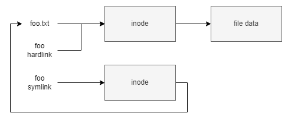

# ch02-01 리눅스 쉘과 CLI 명령어

## 기본 명령어 다루기

- 화면 지우기
    
    ```bash
    # 터미널 지우기
    ## $: 프롬프트
    ## ~: 홈 디렉토리
    clear
    ```
    
- 파일 다루기
    
    
    
    ```bash
    # 파일 보기
    ## ls(=list) [OPTION]... [FILE]...
    ## [OPTION]: l(long), a(all), s(size)
    ## [FILE]: *.txt(확장자가 .txt 파일)
    ls
    
    # 파일 만들기/지우기
    ## touch [OPTION]... [FILE]...
    ## 파일 생성보다는 현재 시간(timestamp)로 바꾸기
    ## 해당 파일이 존재하지 않는 경우 0바이트 파일 생성
    touch
    
    ## rm(=remove)
    ## rm [OPTION]... [FILE]...
    ## [OPTION]: r(recursive)
    ## 파일(또는 디렉토리) 삭제
    rm
    
    # 파일 내용 보기
    ## cat(=concatenate) [OPTION]... [FILE]...
    ## [OPTION]: e(줄의 맨 뒤에 $붙이기, 히든 캐릭터 공백 등 확인), n(줄 번호 보여주기)
    ## 파일 내용 보여주기
    ## 정확히는 input(=FILE)과 output(=STDOUT)을 연결
    cat
    
    ## more [OPTION]... [FILE]...
    ## space: 페이지 단위로 이동
    ## enter: 줄 단위로 이동
    more
    
    ## less [OPTION]... [FILE]...
    ## space: 페이지 단위로 이동
    ## enter: 줄 단위로 이동
    ## arrow: 상하좌우, 페이지 up/down
    ## more 보다 향상된 기능, 모든 파일을 메모리에 올리지 않아 속도가 빠름
    less
    
    # 디렉토리 만들기/지우기
    ## mkdir(=make directory) [OPTION]... [DIRECTORY]...
    ## [OPTION]: p(parents)
    ## 디렉토리 생성
    mkdir
    
    ## rmdir(=remove directory) [OPTION]... [DIRECTORY]...
    ## [OPTION]: p(parents)
    ## 디렉토리 삭제
    rmdir
    
    # 디렉토리 이동
    ## cd(=change directory)
    ## .(나 자신), ..(부모 디렉토리), ~(홈 디렉토리), -(이전 디렉토리)
    cd
    
    # 파일 복사/이동
    ## cp(=copy) [OPTION]... [SRC][DST]
    ## 파일 복사
    ## cp file1 file2 : 파일 복사
    ## cp file1 dir1 : 파일을 디렉토리 안으로 복사
    ## cp -r dir1 dir2 : 디렉토리 복사
    cp
    
    ## mv(=move) [OPTION]... [SRC][DST]
    ## 파일 이동
    ## mv file1 file2 : 파일 이름(SRC)을 새 파일 이름(DST)으로 변경
    ## mv file1 dir1 : 파일을 디렉토리 안으로 이동
    ## mv dir1 dir2 : 디렉토리(SRC)를 디렉토리(DST) 안으로 이동
    mv
    
    # 파일 링크
    ## ln(=link) [OPTION]... [TARGET][LINKNAME]
    ## 파일에 하드링크/소프트링크(심볼릭링크) 만들기
    ln -s file1 file1symlink
    ln file1 file1hardlink 
    
    # 파일 속성 보기: file
    ## file [OPTION]... [FILE]...
    
    # 시스템 종료: reboot, poweroff, shutdown
    ```
    
- 시스템 종료
    
    ```bash
    # 재부팅
    ## reboot
    
    # 종료
    ## poweroff
    
    # 주어진 시간에 종료, 기본값 +- n분 후
    ## shutdown [OPTION]... [TIME]...
    ## shutdown -P now : 바로 종료
    ## shutdown -r now : 바로 재시작
    ```
    
- 도움말
    
    ```bash
    # 도움말/매뉴얼
    ## man(manual) [OPTION]... [PAGE][COMMAND]
    ## [OPTION] : a(모두 출력), k(검색)
    ## [PAGE] : 1(일반 명령어), 2(시스템 호출), 3(C표준 라이브러리 함수), 4(특수파일, /dev 등), 5(파일 형식과 Conventions), 6(게임과 화면보호기), 7(기타), 8(시스템관리 명령어와 데몬)
    ## man -k ^printf : 검색 -정규표현식
    ```
    

## 사용자, 그룹 및 권한(퍼미션)

- 사용자와 권한 관련 명령어
    - 계정 종류
        - root 유저와 사용자 계정
        - 계정 살펴보기
            - /etc/passwd, /etc/shadow, /etc/group
            - 내 권한: whoami(내가 누구인지 내 계정 확인), id(내가 갖고 있는 권한, 포함된 그룹 확인)
            - 그룹 계정 및 권한(sudoer & sudo)
        - 사용자 생성과 그룹 생성 (adduser, useradd, usermod, deluser, userdel, addgroup, delgroup)
        - 파일 권한 다루기 (chmod, chown, chgrp, umask)
        - 파일 다루기 상급
            - setuid, setgid
- 슈퍼유저
    - 시스템 운영 관리자 계정으로 일반적으로 리눅스 운영체제에서는 루트(root) 유저
    - 관리자 권한을 일반 사용자 권한과 구분하며 사용자의 부주의로 발생하는 시스템 손상과 바이러스, 악성코드의 침입에 의한 피해를 보호
    - 내가 관리하는 PC라도, 나는 슈퍼유저가 아님
- 권한의 대여
    - sudo: 슈퍼유저(superuser)의 권한을 수행(do)
    - sudoer
        
        
        
        - sudo visudo: 슈퍼유저의 권한을 편집
            - sudo cat /etc/sudoers: 슈퍼유저의 권한 확인
            - 설정파일을 통한 변경
                - 계정명 호스트명=(실행계정명) 명령어
                    - user1 ALL=(ALL) /sbin/ifconfig
                - [사용자] [권한]
                - [%그룹] [권한]
            - 사용자를  sudo 권한에 추가
                - useradd -aG user1 sudo
    - su [username]
        - 사용자의 권한을 대여
            
            ```bash
            # user1의 id로 로그인 (user1의 passwd 필요)
            su user1
            
            # user1의 id로 로그인 (user1의 passwd 필요, user1의 home 디렉토리 사용)
            su - user1
            
            # root의 id로 로그인 (root의 passwd 필요)
            su
            su root
            
            # 내 권한을 상승하여 root 사용자의 권한으로 로그인 (현재 디렉토리 사용)
            sudo su
            
            # 내 권한을 상승하여 root 사용자의 권한으로 홈 디렉토리 사용 (root의 home)
            sudo su -
            
            # user1 사용자의 권한으로 홈 디렉토리 사용 (sudoer의 passwd 필요, user1의 home)
            sudo su - user1
            ```
            
- 사용자 계정과 그룹 계정
    - 사용자 계정: cat /etc/passwd
        
        
        
        | 사용자명 | 패스워드 | 계정 UID | 계정 GUI | 이름 | 홈 디렉토리 | 로그인 쉘 |
        | --- | --- | --- | --- | --- | --- | --- |
        | root(슈퍼유저) | x | 0 | 0 | root | /root | /bin/bash |
        | p1n9u(사용자) | x | 1000 | 1000 | ,,, | /home/p1n9u | /bin/bash |
        | www-data(서비스 계정) | x | 33 | 33 | www-data | /var/www | /usr/sbin/nologin |
    - 사용자 암호: cat /etc/shadow
        
        
        
        | 사용자명 | 패스워드 | 최종 수정일 | 패스워드 최소 변경일 | 패스워드 최대 사용일 | 패스워드 만료 경고기간 | 패스워드 유예 기간 | 계정 만료 기간 | 예약필드 |
        | --- | --- | --- | --- | --- | --- | --- | --- | --- |
        | root | \$y\$j9T\$… | 19752 | 0 | 99999 | 7 |  |  |  |
        | p1n9u | \$y\$j9T\$… | 19752 | 0 | 99999 | 7 |  |  |  |
        | www-data | * | 19683 | 0 | 99999 | 7 |  |  |  |
        - 패스워드
            - !: locked
            - '\$1\$': MD5
            - '\$2a\$': Blowfish
            - '\$2y\$': Blowfish
            - '\$5\$': SHA-256
            - '\$6\$': SHA-512
            - '\$7\$'(or '\$y\$'): yescrypt
        - 리눅스(유닉스)의 모든 기간 epoch = 1970년 1월 1일 00:00:00 UTC
    - 사용자 명령어
        
        ```bash
        # 사용자 추가
        ## adduser [OPTION]... [--home DIR] [--shell SHELL] [--disabled-password] [--disabled-login] user
        ## adduser user1 sudo: user1을 sudo 그룹에 추가
        
        # 사용자 추가 (useradd - user add with default, none-dialog 방식, adduser의 아래 레벨 실행파일
        ## useradd [OPTION] user: 사용자(기본값으로) 추가
        ## useradd user1: 사용자 user1 추가
        ## useradd -D: 사용자 생성 기본값 확인
        ## useradd -D -b /usr: 사용자 기본 홈 디렉토리 /usr로 변경
        ## useradd -D -s /bin/bash: 사용자 기본 쉘 bash로 변경
        ## useradd -D -e 2020-12-31: 사용자 계정 만료일 설정
        
        # 계정 생성시 참조하는 파일
        ## /etc/default/useradd
        ## /etc/login.defs
        ## /etc/skel
        
        # 사용자 암호 정책 변경 / 암호 변경
        ## chage(= change age) [OPTION]... user
        ## chage user1: 암호 정책 변경
        ## chage -l user1: 암호 정책 확인
        ## chage -E 2020-12-31 -m 1 -M 90 -W 7 user1
        
        ## passwd [OPTION]... user1: 암호 변경
        ## passwd -l user1: 계정 잠금
        ## passwd -u user1: 계정 잠금 해제
        ## passwd -S user1: 계정 상태 확인
        ## passwd -n <mindays> user1: 암호 최소 기간
        ## passwd -x <maxdays> user1: 암호 최대 기간
        
        # 사용자 삭제
        ## deluser [OPTION]... user
        ## deluser user1
        ## deluser user1 --remove-home
        ## deluser user1 sudo: user1을 sudo 그룹에서 제거
        
        ## userdel [OPTION]... user (non-interactive mode)
        ## userdel user1: 사용자 계정 삭제(홈 삭제)
        ## userdel -f user1: 로그인 중이더라도 삭제
        
        # 그룹 생성
        ## addgroup [OPTION]... group
        ## groupadd [OPTION]... group (실제 addgroup의 바이너리)
        
        # 그룹 삭제
        ## delgroup [OPTION]... group
        
        # 그룹 계정 / 사용자 할당(또는 사용자 정보 수정)
        ## usermod [OPTION]... user
        ## usermod -c <nmae change> user1: 사용자 이름 수정
        ## usermod -a -G sudo user1: user1을 sudo 그룹에 추가
        ```
        
- 파일의 권한
    
    
    
    - 사용자 접근 권한의 구분
        - 유형, 권한
            - 유형:  -, d, c, b, s, l, p
            - 권한: 소유자(owner) / 그룹(group) / 그외(other)
                - r: read 4
                - w: write 2
                - x: execute 1
            - 리눅스의 기본 파일 권한: 666(rw-rw-rw-)
            - 리눅스의 기본 디렉토리 권한: 777(rwxrwxrwx)
            - umask [-S]
        - 링크수
        - 소유자
        - 그룹
        - 파일크기
        - 변경일자
        - 이름
    - 권한 변경
        
        ```bash
        # 파일/디렉토리 권한 변경
        ## chmod [OPTION]... [MODE]... file
        ## chmod 755 file
        ## chmod u+x file
        ## chmod u-x file
        ## chmod g+rw file
        ## chmod g-rx file
        ## chmod o+rwx file
        ## chmod o-rwx file
        ## chmod +x file: user/group/other 모두
        
        # 소유권 변경
        ## chown [OPTION]... [USER][:GROUP] file: 파일/디렉토리의 소유자/그룹 변경
        ## chown user1 file
        ## chown user1:group1 file
        ## chown :group1 file
        
        ## chgrp [OPTION]... [GROUP] file
        ## chgrp group1 file
        ```
        
    - 파일의 특수 실행 권한
        
        
        
        ```bash
        chmod 4777 file
        chmod u+s file
        
        chmod 2755 file
        chmod g+s file
        
        chmod 1700 file
        chmod +t file
        ```
        
        - 파일의 권한을 일시적으로 소유주(setuid) 혹은 소유그룹(setgid)의 권한으로 빌려서 실행함
        - SetUID는 4xxx, SetGID 는 2xxx로, StickyBit은 1xxx 로 설정
        - 기존 권한의 위치에 덮어쓰기 때문에, 해당 기능만 존재할 경우 대문자 S/S/T로 표기
        - 기존 권한(실행권한)을 포함하고 있는 경우 소문자 s/s/t로 표기
        - sticky bit
            - 리눅스는 파일의 sticky bit는 무시
            - 특정 디렉토리를 누구나 자유롭세 사용 할 수 있게 하기 위함 (공용 디렉토리에 사용)
            - 단, sticky 비트가 디렉토리에 적용되면 디렉토리 소유자나 파일 소유자 또는 슈퍼유저가 아닌 사용자들은 파일을 삭제하거나 이름을 변경하지 못하도록 막음, 파일 또는 디렉토리 생성은 누구나 할 수 있음
            - 해당 디렉토리에 생성된 파일은 해당 사용자의 소유주로 저장됨
            - 공유 모드라고도 함

## Shell

- 리눅스 쉘이란
    - 사용자 명령어 및 프로그램을 실행할 수 있는 공간 (사용자 인터페이스)
- 리눅스 쉘의 종류
    - 두개의 메인 타입
        - Bourne shell: 특징 $ 프롬프트
        - C shell: 특징 % 프롬프트
    - Bourne Shell 의 변천사
        - Bourne shell → sh
        - Korn shell → ksh
        - Bourne Again shell → bash
        - POSIX shell → sh
    - C-type shell 의 변천사
        - C shell → csh
        - TENEX/TOPS C shell → tcsh
- 리눅스 쉘
    - 프롬프트(prompt)
        - 사용자와 인터렉티브(interactive) 한 입력을 주고 받을 수 있는 명령 대기 표시자
        - 우분투 기본 프롬프트
            - [username@hostname]:<directory> $
            - 환경변수 PS1 에 기록됨 (PS1 = Prompt Statement One)
                
                
                
                
                
    - 색상(color)
        - 사용자와 인터렉티브(interactive) 한 입력을 주고 받을 수 있도록 도움을 주는 색상값 ANSI 표준
            - ANSI(American National Standard Institute, 미국 국가표준 협회) ASCII-CODE 등 정의
            - [ANSI color: ANSI escape code 중 하나로 ISO/IEC-9529 표준 (UNIX, Linux, DOS, Windows)](https://en.wikipedia.org/wiki/ANSI_escape_code)
        - 사용방법
            - ESC + [코드값;코드값;… + 글자
                - ESC는 고정값 \e 또는 \033
                - 코드값: 진함, 흐림, 이탤릭, 밑줄, 깜빡임, … , 글자색, 배경색, 밝기, … 등
- 입출력 기본 명령어
    
    ```bash
    # 출력
    ## echo [OPTION]... [STRING]
    ## [OPTION]: n(뉴라인 제외), e(Escape 코드 지원) E(Escape 코드 미지원, 기본값)
    
    # 리다이렉션
    ## 출력 장치의 유형
    ## stdout: 표준출력 fd1
    ## stderr: 에러출력 fd2
    ## stdin: 표준입력 fd0
    
    ## 표준 출력을 입력으로 받는 유틸리티
    ## 필터링: less, more, grep
    ## 변경: awk, sed
    ## 유틸리티: sort, wc
    
    ## '>': output
    echo "test" > file
    
    ## '>>': append
    echo "test2" >> file
    
    ## '2>': error
    aaa 2> file
    
    ## '2>&': merge
    ## 아래 명령은 동일한 표현
    ## 출력 결과물의 성공 값(1, stdout)을 file로 보내고 에러 값(2, stderr)을 1번(stdout)과 같은 파일로 출력
    ls /tmp/* > file 2>&1
    ls /tmp/* &> file
    
    ## '<': input
    cat < file
    
    ## '<<': delimeter, stdin으로부터 delimeter 값이 들어올때까지의 입력
    cat << end
    
    ## '|': pipe
    ## ls -l | grep test: 출력값 내에서 검색
    ## ls -l | wc -l: 출력값 내에서 줄 개수 확인
    ## ls -l | grep test | wc -l: 다중 파이프 활용
    ## cat file | more: 출력값 내에서 페이징 처리
    ```
    
- 명령어 히스토리
    
    ```bash
    # 히스토리
    ## 쉘에서 입력한 명령어들의 기록
    ## histroy [OPTION]
    ## [OPTION]: '#'(최근 n개의 히스토리 보기), c(clear, 히스토리 버퍼 삭제)
    
    # 저장 개수
    ## HISTSIZE: 버퍼 사이즈
    ## HISTFILESIZE: 쉘 종료시 파일에 기록되는 사이즈
    echo $HISTSIZE
    echo $HISTFILESIZE
    
    # 쉘 명령어
    ## '!#': n번째 라인 다시 실행
    ## '!!': 바로 이전 명령어 다시 실행
    ```
    
- 환경변수
    
    ```bash
    # 1. PATH 디렉토리 확인
    # 2. 실행권한 확인
    # 3. 명령어를 해당 사용자ID로 실행
    # 4. SetUID 확인
    # 5. 해당 명령어의 소유주 권한으로 실행
    
    # 바이너리 실행파일은, PATH의 순차적으로 검색
    echo $PATH
    export PATH=$PATH:(DIR)
    
    # 바이너리 실행 위치 확인
    which file
    
    # 환경변수 확인
    printenv
    
    # 언어(LANGUAGE) 및 언어셋(LANG)
    echo $LANGUAGE
    echo $LANG
    
    # 언어와 언어셋(캐릭터셋), 그리고 다양한 지역 설정 값 확인
    ## /etc/locale-gen
    locale
    localectl
    locale-gen
    
    # 단축명령어
    ## ls: ls --color=auto 의 축약어
    ## ll: ls -alF 의 축약어
    alias
    ```
    
    - 주요 환경변수
        - PATH: 실행 파일의 경로 모음
        - HOME: 사용자의 홈 디렉토리
        - PWD: 현재 워킹 디렉토리
        - LANG: 현재 언어 셋(인코딩)
        - USER: 사용자 아이디
        - LANGUAGE: 현재 언어
        - COLUMNS: 터미널의 가로 크기
        - LINES: 터미널의 세로 크기
        - LS_COLORS: ls 명령어의 출력 칼러코딩
        - PS1: 쉘 프롬프트
- 쉘 부팅 시퀀스
    - BASH 의 interactive shell 시작 시퀀스
        - /etc/profile 수행(공통 수행 - 환경 설정들)
            - /etc/profile.d/.sh(공통 수행)
            - /etc/bash.bashrc(공통 수행 - 시스템 alias 등)
        - ~/.profile 수행(사용자별 디렉토리 - 시작 프로그램 등)
            - ~/.bashrc  수행(사용자별 디렉토리 - alias 등)
                - ~/.bash_aliases(이 파일이 추가적으로 있다면 수행 - 기본은 없음)
    - BASH 의 종료 시퀀스
        - ~/.bash_logout
    - 사용자 계정이 만들어질 때
        - 원본파일 /etc/skel/ 내용이 사용자 home에 복사 됨
- 쉘 스크립트
    
    ```bash
    # foo.txt 파일을 읽어서 화면에 출력
    while read line; do echo $line; done < foo.txt
    
    # /etc/passwd 파일을 입력값으로 읽어서, 해당 컬럼을 파싱
    while IFS=: read -r F1 F2 F3 F4 F5 F6 F7
    do
    	echo "USER: $F1 use [$F7] shell and [$F6] home diretory."
    done < /etc/passwd
    
    # 입출력 인자값
    ## $0: 스크립트/명령어 이름
    ## $#: 전달된 파라미터 수
    ## $$: 프로세스 번호
    ## $?: 실행 결과
    ## $1, $2, ...: 입력 인자
    ## $*: 입력인자 모두
    ```
    
    - 스크립트 작성 및 /bin/sh 또는 /bin/bash 를 통해 실행
        - /bin/sh foo.sh
    - 실행 퍼미션을 통한 직접 실행
        - chmod +x foo.sh
        - ./foo.sh
    - 쉘 스크립트의 속성을 첫 줄에 정의(she(#)bang(!) 또는 shabang, hashbang)
        - #!/bin/bash
        - #!/usr/bin/perl
        - #!/usr/bin/python
    - shebang 무시하고 직접 실행
        - bash -m foo.sh
