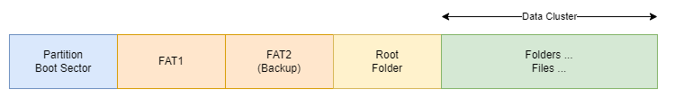

# ch02-02 파일 시스템 구조

## 파일 시스템

- 주요 디렉토리
    - /boot
        - grub 및 커널, initrd, 멀티 부팅 시 메모리 테스트를 위한 memtest 도구
    - /home
        - 사용자 디렉토리 및 슈퍼유저(root) 의 홈 디렉토리 /root
    - /etc
        - 시스템 프로세스의 각종 설명파일들
        - /etc/*-release
            - 운영체제 정보를 갖고 있는 파일들
    - /var
        - 시스템 프로세스의 각종 임시 파일들 및 로그 파일들
- 파일 시스템 명령어
    - 검색(find)
        
        ```bash
        # find [OPTION]... [PATH]... [EXPRESSION]...
        ## 원하는 파일의 검색
        
        ## 내 현재 디렉토리에서 확장자가 .txt인 파일을 찾는 법
        find *.txt
        
        ## 내 현재 디렉토리에서부터 확장자가 .txt인 파일을 찾는 법
        find . -name "*.txt"
        
        ## 내 현재 디렉토리에서 파일명이 foo로 시작하는 파일만 찾는 법
        find . -name "foo" -type f
        
        ## 내 현재 디렉토리에서 디렉토리명이 dir 로 시작하는 디렉토리만 찾는 법
        find . -name "dir*" -type d
        
        ## 내 현재 디렉토리에서 용량이 100,000,000 바이트(100M) 보다 큰 파일 찾는 법
        ## 100000000c 대신 100000k 또는 100M 사용 가능
        find . -size +100000000c
        
        ## 최근 생성된 파일만 찾아보기(2020년 5월 15일 이후 변경된 파일)
        ## newerct 대신 newermt로 할 경우 최근 변경된 파일
        find -newerct "15 May 2020" -ls
        
        ## 최근 2일에서 5일 사이에 변경된 파일 찾기
        find . -mtime +2 -a -mtime -5 -ls
        
        ## 루트 디렉토리로부터 파일 사이즈가 100M 이상인 파일을 찾아서 ls 로 상세 표시하기
        find / -size 100M -exec ls -l {} \; 2>/dev/null
        
        ## 루트 디렉토리로부터 txt 파일을 찾아서 그 안에 "foo" 라는 글자가 포함된 파일과 내용 표시
        find / -name "*.txt" -exec grep "foo" {} \; -print 2>/dev/null
        
        ## 루트 디렉토리로부터 특정 [조건]의 파일 찾아서 특정 [디렉토리]로 복사하기
        find / [조건문] -print -exec cp {} [경로] \; 2>/dev/null
        ```
        
    - 속성(stat)
        
        ```bash
        # stat [OPTION]... [FILE]
        ## 원하는 파일의 속성(주로 시간) 
        
        ## 확인 시간의 유형(atime, mtime, ctime)
        ## Access: 파일에 최근 접근 시간(고전적으로는 read 시에도 올라갔으나 지금은 다소 변경됨)
        ## Modify: 파일의 내용 변경 시간
        ## Change: 파일의 수정 시간(inode 관점에서의 변화 시간 - 생성, 변경, 속성 수정 등)
        
        ## ls 명령어에서의 시간 확인
        ## ls -l: 기본값(mtime)
        ## ls -l -u: atime
        ## ls -l -c: ctime
        ```
        
    - 필터링(grep)
        
        ```bash
        # grep [OPTION]... PATTERN [FILE]
        ## 특정 패턴 검색 (또는 정규표현식 패턴 검색)
        
        # 정규표현식 (RegEx = Regular Expression)
        ## 기본 정규 표현식 (Basic Regular Expression)
        ## [PATTERN]
        ## '^s': 문장의 시작이 s로 시작하는 줄
        ## 'e$': 문장의 끝이 e 로 끝나는 줄
        ## '..e$': 문장의 끝이 3글자 중 e로 끝나는 줄
        ## 'app*': 문장의 시작/중간/끝 이 ap와 p의 “0개혹은 그 이상” 의 개수를 갖고 있는 줄
        ## '^[at]': 문장의 시작 첫 단어가 a 또는 t 로 시작하는 줄
        ## '[0-9]': 문장의 중간에 숫자 0~9 까지를 포함하고 있는 줄
        
        # 확장 정규 표현식 (Extended Regular Expression)
        ## [p]{2}: 문장 내 p라는 글자가 연속 두번 나오는 경우
        ## ^[a-zA-Z0-9]{3,9}: 문장의 시작이 소문자/대문자/숫자로 시작하는 3~9길이
        
        ## 파일 내에서 usage 라는 단어 검색
        grep "usage" [FILE]
        
        ## 파일 내에서 "vim" 또는 "Vim" 이라는 단어 각각 찾는 법 (및 대소문자 구분 없이)
        grep "vim" [FILE]     (대소문자 구분)
        grep "Vim" [FILE]
        grep -i "vim"
        
        ## 하위 디렉토리 모두 검색
        grep -r "vim" [PATH]
        
        ## 파일 목록에서 특정 단어 검색
        ls -al | grep txt
        
        ## 로그 파일에서 경고만 검색
        cat /var/log/syslog | grep -i "warn"
        
        ## 프로세스 목록에서 특정 단어 검색 (및 특정 단어 예외)
        ps x | grep "/bin"
        ps x | grep "/bin" | grep -v "grep"
        
        ## 특정 포트가 열려 있는지 확인
        netstat -a | grep 80
        netstat -a | grep ":80"
        ```
        
        - [Test Site1](https://regexr.com/)
        - [Test Site2](https://regex101.com/)
    - 정렬(sort)
        
        ```bash
        # sort [OPTION]... [FILE]
        ## 파일의 내용을 특정 순서(옵션)로 정렬
        ## FILE 보다는 PIPE 와 더 많이 연동
        
        ## 디렉토리 목록을 정렬(기본값: 첫번째 컬럼)
        ls -l | sort
        
        ## 디렉토리 목록을 두번째 컬럼으로 정렬(기본값: 캐릭터 정렬)
        ls -l | sort -k 2
        
        ## 디렉토리 목록을 두번째 컬럼으로 숫자로 정렬
        ls -l | sort -k 2 -n     (또는 -k2n 붙여써도 무방)
        
        ## 디렉토리 목록을 파일 사이즈별로 정렬(기본값: 오름차순)
        ls -l | sort -k 5 -n
        
        ## 디렉토리 목록을 파일 사이즈별로 역순 정렬(내림차순)
        ls -l | sort -k 5 -n -r
        
        ## 두개 이상의 키로 정렬(두번째 컬럼(숫자) & 다섯번째 컬럼)
        ls -l | sort -k 2n -k5
        
        ## 파이프 외에 인풋 리디렉션도 가능
        sort -k 2 -k 5 < dir.txt
        ```
        
    - 내용 검색/편집
        
        ```bash
        # awk
        ## 패턴 검색 및 텍스트 프로세싱
        
        ## 디렉토리 목록 중 첫번째 컬럼만 출력
        ls -l | awk '{print $1}'
        
        ## 디렉토리 목록 중 파일명과 사이즈만 출력(아홉번째 컬럼, 다섯번째 컬럼)
        ls -l | awk '{print $9, $5}'
        ls -l | awk '{print "FILENAME:"$9, "SIZE:"$5}'
        
        ## 디렉토리 목록 중 사이즈를 모두 더해서 결과만 출력
        ls -l | awk '{sum += $5} END {print sum}'
        
        ## 디렉토리 목록 중 파일 사이즈별로 소팅해서 10000 바이트보다 큰 것만 출력
        ls -l | sort -k 5 | awk '$5 >= 10000 {print}'
        
        ## 암호 파일에서 콜론(:) 을 구분자로 잘라서 첫번째 컬럼만 출력
        cat /etc/passwd | awk -F":" '{print $1}'
        
        # sed
        ## sed 's/패턴/변환/g'
        ## 스트림라인 편집기(search and replace)
        
        ## 파일 내의 모든 book 을 books 로 변경
        cat /usr/share/doc/vim/copyright | sed 's/book/books/g'
        
        ## (글자가 있는) 모든 줄의 맨 끝을 ! 표로 끝나도록 변경
        cat /usr/share/doc/vim/copyright | sed 's/.$/!/g'
        
        ## 출력 결과를 소문자에서 대문자로 변경
        ls -l | sed 's/[a-z]/\U&/g'
        
        ## 출력 결과를 대문자에서 소문자로 변경
        cat /etc/passwd | sed 's/[A-Z]/\L&/g'
        ```
        
    - 분석
        
        ```bash
        # 중복 제거(uniq) 및 단어 분석(word-count)
        
        ## 파일 내에 중복되는 줄 제거
        cat foo.txt | uniq
        
        ## 파일 내의 "라인수/단어수/문자수" 출력
        wc foo.txt(또는 cat foo.txt | wc)
        wc -l foo.txt(라인수만 출력)
        
        ## 인증 로그 내에서 시간 값(처음 3컬럼)을 제거하고 나머지 값에서 uniq한 메시지만 출력
        cat /var/log/auth.log | awk '$1=$2=$3=""; {print $0}' | sort | uniq
        cat /var/log/auth.log | awk '$1=$2=$3=""; {print substr($0,4)}' | sort | uniq
        cat /var/log/auth.log | awk '{out=""; for(i=4;i<=NF;i++){out=out" "$i}; print out}' | sort | uniq
        ```
        
    - 디스크 용량
        
        ```bash
        # du [OPTION].. [FILE]
        ## 파일 용량 출력
        ## [OPTION]
        ## k: 결과 값의 KB 단위 출력(기본값)
        ## m: 결과 값의 MB 단위 출력
        ## h: 사용자 편의 용량(KB/MB/GB, 1M=2^20=1,048,576)
        ## H: 사용자 편의 용량(KB/MB/GB, 1M=1,000,000)
        ## s: 합계만 출력
        ## S: 서브 디렉토리 용량 합치지 않고, 각각 계산
        
        ## 현재 디렉토리부터 사용된 용량 확인
        du
        
        ## 디렉토리별 용량을 오름차순 정렬해서 출력
        du -S | sort -n     
        
        ## 디렉토리별 누적 용량을 출력하여 GB 이상의 디렉토리 출력
        du / -h 2>/dev/null | grep [0-9]G
        
        ## 디렉토리 용량을 최대 1 디렉토리 depth 까지만 출력
        du --max-depth=1
        ```
        
    - 압축
        
        ```bash
        # tar [OPTION]... [FILE] [PATH]
        ## [OPTION]
        ## c: create(생성)
        ## x: extract(해지)
        ## v: verbose(디테일한 상황 보고 - 실행 중 파일 목록 출력)
        ## f: file(저장될 파일명 지정)
        ## t: list(목록 확인)
        ## z: zip(압축)
        ## j: bzip2(압축)
        
        # *.tar
        ## tar 아카이브 만들기
        tar cvf myzip.tar dir1
        
        ## tar 아카이브 내용 확인
        tar tf myzip.tar
        
        ## tar 아카이브 풀기
        tar xvf myzip.tar
        
        # *.tar.gz
        ## tar.gz 아카이브 만들기
        tar zcvf myzip.tar.gz dir1
        
        ## tar.gz 아카이브 내용 확인
        tar tf myzip.tar.gz
        
        ## tar.gz 아카이브 풀기
        tar zxvf myzip.tar.gz
        
        # *.tar.bz2
        ## tar.bz2 아카이브 만들기
        tar jcvf myzip.tar.bz2 dir1
        
        ## *.tar.bz2 아카이브 내용 확인
        tar tf myzip.tar.bz2
        
        ## *.tar.bz2 아카이브 풀기
        tar jxvf myzip.tar.bz2
        
        # gzip [OPTION]... [FILE]
        ## 다양한 압축 유틸리티들
        ## gzip
        ## bzip2
        ## xz
        
        ## 알고리즘 비교
        ## 압축 용량: gzip > bzip2 > xz
        ## 압축 시간: gzip < bzip2 << xz
        ## 압축 해지 시간: gzip < xz < bzip2
        
        ## 압축 하기
        gzip file
        bzip2 file
        xz file
        
        ## 압축 풀기
        gzip -d filename
        gzip2 -d filename
        xz -d filename
        ```
        

## 디스크

- 디바이스 인터페이스 유형
    - IDE(Integrated Drive Electronics) : IBM PC AT 호환기의 HDD, CD-ROM, …
        - P-ATA(Parallel ATA 방식)의 40/80 pin 케이블
    - SATA(Serial Advanced Technology Attachment) : 직렬 방식의 규격
        - S-ATA (Serial ATA 방식)의 7 pin 케이블
    - SCSI(Small Computer System Interface) : 주변 장치의 연결을 위해 사용 하던 ANSI 표준 규격
    - 전송 속도
        - IDE/E-IDE: 초당 33 / 66 / 100MB/s, 133MB/s
            - 케이블 사이즈 : 40pin/80pin
        - SATA: 초당 150MB/s, 300MB/s, 600MB/s (6Gbps), …
- 장치파일, 블록/캐릭터 디바이스
    - 블록 디바이스
        - 하드 디스크, CD/DVD,  USB등 블록이나 섹터 단위로 데이터를 전송하는 디바이스
    - 캐릭터 디바이스
        - 키보드, 마우스, 프린터 등의 입출력 장치로 바이트 단위로 데이터를 전송하는 디바이스
    - 리눅스의 장치파일(디바이스) 관리
        - /dev
            - sr0: cd-rom
            - hda1: PAPA 방식 HDD1(파티션 1)
            - sda1: SATA 방식 HDD1(파티션 1)
            - sda2: SATA 방식 HDD1(파티션 2)
            - sdb1: SATA 방식 HDD2(파티션 1)
            - tty: 터미널
        - /dev/input: 입력 디바이스들
        - /dev/block: 블록 디바이스들(디스크)
        - /dev/char: 캐릭터 디바이스들(입력, 입출력)
- 파일 시스템 유형
    - 마이크로소프트(MS) 사가 개발한 파일시스템
        - FAT 파일 시스템: File Allocation Table
        - exFAT 파일 시스템: Extended FAT
            
            
            
        - NTFS 파일 시스템: New Technology File System
            
            
            
    - 리눅스의 파일시스템(EXT, Extended File System)
        - EXT2
            
            
            
        - EXT4
- 디스크 파티션
    
    
    
    - 파티션의 종류
        - Primary Partition: 운영 체제가 부팅이 될 수 있는 파티션(엑티브 여부에 따라)
        - Extended Partition: 데이터가 저장되는 논리적(Logical) 파티션을 최대 4개까지 포함 할 수 있음
    - 참고
        - 더 확장성이 뛰어난, LVM을 통한 파티션을 늘리고 줄이는 growpart 등은 다루지 않았음
        - 또한, 과거에는 파티션이 필수였지만, 요즘은 파티션 없이도 Data Disk를 사용 할 수 있음
- USB 추가하기
    - 가상 디바이스
        1. 호스트 시스템에 인식된 USB 디스크를 게스트 시스템으로 연결하기
        2. 호스트 시스템에 인식시키지 않고, 해당 디바이스를 상시 게스트 시스템에 먼저 연결하기
    - 시스템의 이해
        - 우분투 커널에서의 디바이스 인식 과정 이해
            - usb 디바이스
                - 드라이버
                    - 블록 스토리지
                        - 파티션
            - 유저스페이스 마운트
            - 유틸리티
                
                ```bash
                # 커널 메시지 확인
                dmesg
                
                # usb 정보 확인
                lsusb
                ```
                
    - 디바이스 확인 명령어
        - 디스크 유형, 파티션 확인 및 파일 시스템 마운트
            - 유틸리티
                
                ```bash
                # 현재 디스크 확인
                sudo fdisk -l
                
                # usb를 마운트할 폴더 생성
                mkdir /home/user/usbspace
                
                # usb 마운트
                mount /dev/sdb1 /home/user/usbspace
                
                # 마운트 상태 확인
                mount | grep /dev/sdb1
                mount | grep /home/user/usbspace
                
                # 마운트 해제
                umount /home/user/usbspace
                ```
                
- 디스크 추가하기
    - 디스크 확인
        
        
        
        
        
        ```bash
        # 현재 디스크 확인
        sudo fdisk -l
        
        # 현재 디스크 용량 확인
        df
        df -h
        df -T
        df -T | grep "^/dev"
        
        # 블럭 장치 정보 확인(마운트 되지 않은 블럭 장치 포함)
        ## [OPTION]
        ## t: 토폴로지 포함 출력
        ## l: 포맷한 디스크 목록 출력
        lsblk
        ```
        
    - 파티션 생성
        
        
        
        ```bash
        # lsblk를 통해 확인한 디스크 파티션 생성
        sudo fdisk /dev/sdb
        ```
        
    - 디스크 포맷 및 연결 (마운트)
        
        
        
        
        
        
        
        ```bash
        # 디스크 포맷
        sudo mkfs -t ext4 /dev/sdb1
        
        # 마운트할 디렉토리 생성(추후, 권한 추가 필요)
        sudo mkdir /home/homedata
        
        # 디스크 마운트
        sudo mount /dev/sdb1 /home/homedata
        ```
        
    - 자동 마운트 설정
        
        
        
        ```bash
        # /etc/fstab 수정
        sudo nano /etc/fstab
        
        # 마지막 라인에 추가
        /dev/sdb1    /home/homedata    ext4    defaults    0    0
        ```