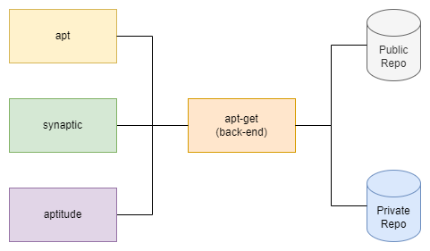

# ch02-03 응용 프로그램

## 패키지 설치/업데이트/업그레이드

- 패키지란
    - 리눅스의 다양한 운영체제에서는, 내가 원하는 프로그램(소프트웨어)을 실행하기 위해서는, 해당 소 스코드를 해당 환경에서 컴파일 하여야 함
    - 이유
        - 다른 운영체제 (배포판)
        - 다른 커널
        - 다른 라이브러리
    - 고려 사항
        - 소스 코드
        - 컴파일 할때마다 걸리는 시간
        - 다양한 이슈(버전 이슈, 라이브러리 및 그 의존성 라이브러리 이슈 등)
    - 결론
        - 해당 배포판 환경에 맞추어 미리 빌드한 실행파일을 압축
- 패키지 관리자
    
    
    
    ```bash
    # apt(= Advanced Package Tool) [COMMAND]
    
    ## Repository 내용 가져오기
    apt update
    
    ## Repository 패키지 목록 출력(로컬 캐시)
    apt list
    
    ## 설치된 패키지 목록 출력
    apt list --installed
    
    ## 업그레이드 가능한 목록 출력
    apt list --upgradeable
    
    ## 패키지 업그레이드
    apt upgrade
    
    ## 더 이상 사용되지 않는 패키지 삭제(업그레이드 이 후 dependency 또한 업그레이드되어 더 이상 참조되지 않는 패키지)
    apt autoremove
    
    ## Repositry 검색(로컬 캐시)
    apt search
    
    ## 패키지 정보 표시
    apt show
    
    ## Repository 내의 패키지 설치
    apt install
    
    ## 설치된 패키지 삭제(설정 유지)
    apt remove
    
    ## 설치된 패키지 삭제 + 설정파일 삭제
    apt purge
    
    ## 패키지 업그레이드 과정에서 삭제가 필요하다면 그 또한 수행하며 업그레이드
    apt full-upgrade
    
    # 개인 Repository(PPA, Personal Package Archives)
    ## https://launchpad.net/
    
    ## 개인 Repository 추가
    sudo add-apt-repository ppa:<PPA_REPO_NAME/PPA>
    
    ## 개인 Repository 삭제
    sudo add-apt-repository --remove ppa:<PPA_REPO_NAME/PPA>
    
    ## (개인 Repository에서) 설치된 패키지와 Repository를 모두 삭제
    sudo apt install ppa-purge
    ppa-purge ppa:<PPA_REPO_NAME/PPA>
    ```
    
- 우분투 패키지 유틸리티 GUI: 소프트웨어 & 업데이트
    - Ubuntu 소프트웨어
        - main: 공식(Official) 지원, 오픈소스 소프트웨어
        - universe: 커뮤니티 지원(Community maintained), 오픈소스 소프트웨어
        - restricted: 공식(Official) 지원, 비-오픈소스 소프트웨어(주로 디바이스 드라이버 등)
        - multiverse: 미지원(Unsupported), 비-오픈소스 소프트웨어 상용 소프트웨어(영상/사진, 음악/DVD 플레이어 등)
    - 기타 소프트웨어
        - CD-ROM 에서 설치 시
        - 캐노니컬 파트너 협력사 제품 및 제품의 소스코드
        - 구글 크롬 등
        - 사용자의 필요에 따라 추가 등록
    - 보안 업데이트
        - security: 중요한 보안 업데이트(취약점 패치 등)
        - updates: 보안(취약점) 패치는 아니지만, 중요한 업데이트, 치명적인 버그 등
        - backports: 최신 기능(major patch) 에 추가된 기능 중 일부가 구버전에도 반영(백포팅) 된 업데이트
        - 업데이트 데몬
            - (각종 유형의 업데이트를) 주기적 체크하는 데몬들
            - update-manager 데몬(설정 /etc/update-manager/release-upgrades)
            - aptd 데몬
            - update-notifier 데몬
            - unattended-upgrade
- 우분투 패키지 유틸리티 CLI
    - /etc/apt/*
        - /etc/apt/sources.list: 패키지를 가져오기 위한 목록
        - /etc/apt/sources.list.d/: 추가적인 소스 리스트
        - /etc/apt/apt.conf: APT 설정 파일 (메뉴얼)
        - /etc/apt/apt.conf.d/: 추가적인 APT 설정 파일 (각종 데몬들이 추가/관리)
        - /var/cache/apt/archives/: 패키지 파일을 가져온 저장소
        - /var/lib/apt/lists/: 상태 저장소
- 패키지 유틸리티 dpkg(Debian package manager)
    
    ```bash
    # dpkg를 이용한 유틸리티 다운로드, 설치, 삭제
    
    ## 설치 (install)
    dpkg -i <pkg>
    
    ## 삭제 (remove)
    dpkg -r <pkg>
    
    ## 설정파일포함 삭제 (purge)
    dpkg -P <pkg>
    
    ## 설치된 패키지 목록 출력 (list)
    dpkg -l
    
    ## 설치할 패키지 검색 (리포지토리로부터 search)
    dpkg -s <pkg>
    
    ## 설치된 패키지의 설치 위치
    dpkg -S <pkg>
    
    ## 설치할 패키지의 정보 보기 (information)
    dpkg -I <local_pkg>
    
    ## 설치할 파일의 내용물 미리 살펴보기 (contents)
    dpkg -c <local_pkg>
    
    ## 패키지 파일의 압축 풀기 (extract)
    dpkg -x <pkg> <location>
    
    ## 패키지 파일의 압축 내용을 보여주며 풀기 (extract)
    dpkg -X <pkg> <location>
    ```
    
    - 패키지 파일의 설치, 확장자 .deb 또는 .dpkg
- 패키지 업데이트
    - 가능한 한 최신 버전으로 유지
        - Repository 최신 유지
        - 보안패치 등의 업데이트 최신 유지(취약점 등)
        - 각종 일반 패키지 최신 버전으로 유지(버그 등)

## 데몬 서비스

- 데몬이란(daemon)
    - 사용자가 직접적으로 제어하지 않고, 백그라운드에서 돌면서 여러 작업을 하는 프로그램
- 서비스란(service)
    - 주로 서버/클라이언트 모델에서 출발하여, 사용자의 요청에 응답하는 프로그램 (주로 데몬 형태로 구동됨)
    - 주요 서비스
        - 웹서버: httpd
        - 파일서버: ftpd
        - 웹프록시: squid
        - 시큐어쉘(원격터미널): sshd
        - 시스템로깅: syslogd, rsyslogd
        - 프린터데몬: cupsd, lpd
        - 네트워크서비스: inetd, xinetd 그 외 다수 …
- 우분투의 데몬
    - SystemV 명령어(service를 통한 확인)
        - 우분투 16/18에서는 (기본적으로는) SysV의 service를 사용하지 않음
        - 내부적으로는 systemctl 로 호출
            - service --status-all
            - service <daemon-name> status
            - service <daemon-name> start
            - service <daemon-name> stop
            - service <daemon-name> restart
    - Systemd 명령어(systemctl을 통한 확인)
        - systemctl status
        - systemctl status <daemon-name>
        - systemctl start <daemon-name>
        - systemctl stop <daemon-name>
        - systemctl restart <daemon-name>
        - 정확히는 <daemon-name> → daemon-name.service
- Systemd를 통한 서비스 관리
    
    
    
    - systemd 경로
        - /sbin/init → /lib/system/systemd
    - systemd의 사용 이유
        - 프로세스의 자동 시작
        - 프로세스간의 의존성 관리
        - 프로세스의 갑작스런 종료에 대응
        - 부팅 옵션(런레벨)에 따른 다른 프로세스 구동
    - systemd 디렉토리 구조
        - /lib/systemd/system
        - 런레벨에 따른 타겟 서비스 목록
            - /lib/systemd/system/default.target
            - /lib/systemd/system/runlevel?.target
        - 심볼릭 링크(/etc → /lib)를 통한 구현체
            - /etc/systemd/system/*.service
    - systemd 유닛 종류
        - service, socket, device, mount, automount, swap, target, path, timer, slice, scope
            - /lib/systemd/system/.service
            - /lib/systemd/system/.socket
            - /lib/systemd/system/*.mount
            - …
- 시스템 컨트롤 명령어
    
    ```bash
    # systemctl을 통한 다양한 데몬/서비스 확인
    
    ## 실행 중인 서비스 목록 확인
    ## [state]: failed, active, running
    systemctl list-units
    systemctl list-units --type=service
    systemctl list-units --type=service --state=running
    
    ## 부팅 시 선택 가능한 타겟 옵션 확인
    systemctl list-units --type=target
    
    ## 부팅 시 기본 옵션(현재 runlevel 확인)
    systemctl get-default
    
    ## 부팅 시 기본 옵션 변경(runlevel 변경)
    systemctl set-default <target>
    sudo systemctl set-default multi-user.target
    
    ## 서비스 상태 확인
    systemctl status <servicename>.service
    
    ## 서비스 시작
    systemctl start <servicename>.service
    
    ## 서비스 중지
    systemctl stop <servicename>.service
    
    ## 서비스 재시작
    systemctl restart <servicename>.service
    
    ## 설정 재로드
    systemctl reload <servicename>.service
    
    ## 부팅시 서비스 자동 시작
    systemctl enable <servicename>.service
    
    ## 부팅시 서비스 자동 시작 삭제
    systemctl disable <servicename>.service
    
    ## 서비스 숨기기 (시작불가)
    systemctl mask <servicename>.service
    
    ## 서비스 숨기기 제거
    systemctl unmask <servicename>.service
    
    ## 서비스 명령어의 설정파일 확인
    systemctl cat <service-name>.service
    
    ## 서비스 명령파일 수정하기
    systemctl edit --full <service-name>.service
    
    ## 새로운 데몬 서비스가 생성된 경우 그 라이브러리 목록 재 갱신
    systemctl daemon-reload
    
    # journalctl 을 통한 다양한 데몬/서비스 로그 확인
    
    ## 서비스 로그 확인
    ## 전체 로그
    journalctl
    
    ## 부팅 후 로그
    journalctl -b
    
    ## 최근 로그 및 이후 로그 트래킹 대기
    journalctl -f
    
    ## 특정 서비스의 로그 확인
    journalctl -u <service-name>
    
    ## 특정 이벤트 속성 조회하기(크리티컬 속성의 로그 확인)
    journalctl -p crit
    
    ## 특정 날짜로 조회하기
    journalctl -u <service-name> --since=2020-06-01 --until=today
    
    ## 로그의 크기 확인
    journalctl --disk-usage
    
    ## 로그 디렉토리 위치
    /var/log/journal
    
    # 로그 레벨
    ## emerg (0)
    ## alert (1)
    ## crit (2)
    ## err (3)
    ## warning (4)
    ## notice (5)
    ## info (6)
    ## debug (7)
    
    # since / until
    ## 2020-05-01
    ## 2020-05-01 12:00:00
    ## yesterday, today, now
    ```