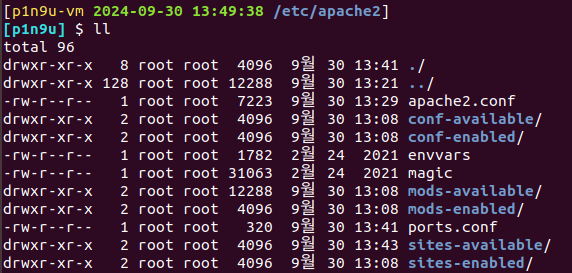

# ch02-04 개발 환경 구축

## 각종 서버 설치하기

- 웹 서버
    - Apache
        
        
        
        
        
        
        
        
        
        
        
        
        
        
        
        ```bash
        # apache2.service install
        sudo apt install apache2
        
        # 웹 서비스(기본) 설정 보기
        /etc/apache2/apache2.conf
        
        # 웹 서비스 사이트별 설정 보기
        /etc/apache2/site-available/*
        /etc/apache2/site-enabled/*
        
        # 웹 서비스 만들기
        ## index.html
        /var/www/html/
        /var/www/apache2/html/
        
        # 웹 서비스 로그
        /var/log/apache2/*
        ```
        
        - RedHat/Fedora 계열: httpd
        - Debian 계열: apache2
    - Nginx
        
        
        
        
        
        
        
        
        
        
        
        
        
        
        
        ```bash
        # nginx.service install
        sudo apt install nginx
        
        # 웹 서비스(기본) 설정 보기
        /etc/nginx/nginx.conf
        
        # 웹 서비스 사이트별 설정 보기
        /etc/nginx/site-available/*
        /etc/nginx/site-enabled/*
        
        # 웹 서비스 만들기
        ## index.html
        /var/www/html/
        /var/www/nginx/html
        
        # nginx를 사용한 php 연동 웹 서버 구축(FastCGI Process Manager)
        ## 웹 서비스에 php 연동하기
        sudo apt install php7.2-fpm
        
        ## 설정파일 찾기
        ## 바로 안나오면 sudo updatedb
        locate php.ini
        nano /etc/php/7.2/fpm/php.ini
        
        ## php 재시작
        systemctl restart php7.2-fpm
        
        ## nginx 설정파일 수정
        nano /etc/nginx/site-available/default
        nginx –t
        
        ## nginx 재시작
        sudo systemctl restart nginx
        ```
        
        - 모든 배포판: nginx
- 파일 서버
    - vsftpd
        
        ```bash
        # vsftpd.service install
        sudo apt install vsftpd
        
        # FTP 서비스 설정 보기
        ## https://aegypius.tistory.com/entry/ftp-%EC%84%A4%EC%B9%98-%EB%B0%8F-%ED%99%9C%EC%9A%A9
        /etc/vsftpd.conf
        
        ## 익명 사용자 읽기 전용(보안 유의), anonymous_enable=YES
        ## 로컬 사용자 계정 사용, local_enabled=YES
        ## 업로드 가능(쓰기권한 필요), write_enable=YES
        
        # 예외 규칙
        ## chroot_local_user=YES: 최상위 디렉토리를 해당 계정의 홈 디렉토리롤 제한
        ## 로컬 FTP 루트 디렉토리 설정, local_root=/srv/ftp
        ## allow_writeable_chroot=YES
        ## chroot는 그것이 각 계정의 홈 디렉토리라고 할지라도 root가 소유해야 함
        ## 이 때 소유권으로 로그인이 안될 경우 해당 줄로 해결 가능
        ## 또는 ftp 전용 디렉토리를 소유자 루트, 권한 755 로 만들어서 해결 가능
        
        ## chroot_local_user=YES 일 때
        ## chroot_list_enable=YES, chroot_list_file=/etc/vsftpd.chroot_list
        ## list에 등록된 계정은 상위 디렉토리로 이동 가능, 이 외 상위 디렉토리 제한
        
        ## chroot_local_user=NO 일 때
        ## chroot_list_enable=YES, chroot_list_file=/etc/vsftpd.chroot_list
        ## list에 등록된 계정은 상위 디렉토리 제한, 이 외 상위 디렉토리로 이동 가능
        
        # 포트 변경
        ## listen_port = 21000
        ## pasv_min_port=21001
        ## pasv_max_port=21010
        
        # FTP 접속 테스트 하기(로컬)
        ftp 127.0.0.1
        
        # PAM 모듈을 통한 접근제어(허용된 사용자만 FTP 접근)
        ## sense=allow
        ## file=/etc/ftpusers_permit 
        sudo nano /etc/pam.d/vsftpd
        
        # 사용자 접근제한(disallow, default)
        /etc/ftpusers
        
        # 사용자 접근제한(allow)
        ## 직접 생성
        /etc/ftpusers_permit
        ```
        
- DB 서버
    - MySQL
        
        ```bash
        # mysql.service install
        sudo apt install mysql-server
        
        # DB 서비스 설정하기(root 암호 등 보안 설정)
        sudo mysql_secure_installation
        
        # DB 접속 테스트 (시험후수정)
        ## 16.04: mysql
        ## 18.04 ~: sudo mysql
        mysql –u root –p
        sudo mysql
        ```
        
    - PostgreSQL
        
        ```bash
        # To manually configure the Apt repository and install
        ## https://www.postgresql.org/download/linux/ubuntu/
        ## https://wiki.postgresql.org/wiki/Apt
        ## 현 시점 18.04 repo 지원 X, https://apt.postgresql.org/pub/repos/apt/dists/
        
        ## 확인
        ls –al /usr/lib/postgresql/(version)/bin/
        
        # 설치 확인
        dpkg –l | grep postgres
        cat /etc/passwd | grep postgres
        
        # 접속 테스트
        sudo –u postgres psql
        \l
        \q
        ```
        

## 개발 환경 구축

- 개발 언어
    - c 개발 환경
        
        ```bash
        # c 언어 및 관련 개발 환경 구축
        sudo apt install build-essential
        sudo apt install binutils
        
        # 확인
        gcc --version
        g++ --version
        make --version
        ```
        
    - python 개발 환경
        
        ```bash
        # python 언어 및 관련 개발 환경 구축
        sudo apt install python
        sudo apt install python3
        
        # 확인
        python --version
        python3 --version
        
        # anaconda 개발 환경 구축
        ## https://www.anaconda.com/download/success
        
        ## 다운로드
        curl -O https://repo.anaconda.com/archive/Anaconda3-2024.06-1-Linux-x86_64.sh
        
        ## 설치 스크립트 실행
        bash Anaconda3-2020.02-Linux-x86_64.sh
        bash Anaconda3-2020.02-Linux-x86_64.sh -b -p /data/anaconda
        
        ## PATH 설정 및 재로딩(바로적용)
        /data/anaconda/bin/conda init
        source ~/.bashrc
        conda --version
        
        ## 개발환경 만들기
        conda create --name my_env35 python=3.5
        conda activate my_env35
        
        ## 주피터 노트북 데몬 실행
        jupyter notebook --ip=0.0.0.0 --no-browser
        
        ## 주피터 노트북 암호 생성
        jupyter notebook password
        
        ## 주피터 노트북 설정 파일 만들기
        jupyter notebook --generate-config
        jupyter notebook --config=~/.jupyter/jupyter_notebook_config.py --no-browser
        
        ## 터미널이 닫혀도 백그라운드에서 실행되는 프로세스로 실행하기
        nohup jupyter notebook &
        
        ## 주피터 노트북 부팅 서비스로 만들어 자동 실행
        sudo nano /lib/systemd/system/jupyter.service
        
        [Unit]
        Description=Jupyter Notebook Server
        
        [Service]
        Type=simple
        PIDFile=/run/jupyter.pid
        ExecStart=/data/anaconda/bin/jupyter-notebook --config=/home/<username>/.jupyter/jupyter_notebook_config.py
        WorkingDirectory=/data/anaconda
        User=<username>
        Group=<username>
        Restart=always
        RestartSec=10
        
        [Install]
        WantedBy=multi-user.target
        
        ## 설정 변경(~/.jupyter/jupyter_notebook_config.py)
        c.NotebookApp.ip = '*'
        c.NotebookApp.notebook_dir = '/data/workspace/'
        c.NotebookApp.open_browser = False
        ```
        
    - java 개발 환경
        
        ```bash
        # 배포판 기본 버전 java 설치
        
        ## Runtime 설치
        sudo apt install default-jre
        
        ## SDK 설치
        sudo apt install default-jdk
        ```
        
    - docker 개발 환경
        
        ```bash
        # 컨테이너 관리 도구 docker 설치
        
        ## 우분투 공식
        sudo apt install docker.io
        
        ## docker 공식 사이트로부터 repo를 추가 한 후 설치
        ## https://docs.docker.com/engine/install/ubuntu/
        sudo add-apt-repository "deb [arch=amd64] https://download.docker.com/linux/ubuntu bionic stable"
        curl –fsSL https://download.docker.com/linux/ubuntu/gpg | sudo apt-key add -
        sudo apt-key fingerprint 0EBFCD88
        sudo apt update
        sudo apt install docker-ce docker-ce-cli
        
        ## docker 공식 사이트로부터 자동 설치 스크립트를 다운로드 받아 설치
        ## -f: fail-silently, -s: silent, -S: show-error, -L: location
        curl –fsSL https://get.docker.com/ | sudo sh
        
        # docker의 설정(이미지/컨테이너 디렉토리 관리/변경)
        
        ## sudo 없이 사용하기
        sudo usermod –aG docker $USER
        
        ## 도커 이미지/컨테이너 디렉토리 변경
        
        ### 현재 동작중인 도커 서비스 확인 및 중지
        sudo lsof | grep /var/lib/docker
        sudo systemctl stop docker
        
        ### 디렉토리 변경 설정파일 추가
        sudo nano /lib/systemd/system/docker.service
        ExecStart= 앞 부분 위에 옵션 추가 --data-root=/data/docker_dir
        
        ### 기존 도커 디렉토리 용량 확인
        sudo du –sh /var/lib/docker
        
        ### 변경된 디렉토리 용량 확인
        sudo du –sh /data/docker_dir
        ```
        
    - 개발도구 버전관리 유틸리티
        
        ```bash
        ls -al /usr/bin/java*
        ls -al /etc/alternatives/java*
        
        sudo update-alternatives --list java
        sudo update-alternatives --install "/usr/bin/java" "java" "/data/jdk-12/bin/java" 1
        sudo update-alternatives --install "/usr/bin/javac" "javac" "/data/jdk-12/bin/javac" 1
        sudo update-alternatives --config java
        sudo update-alternatives --config javac
        ```