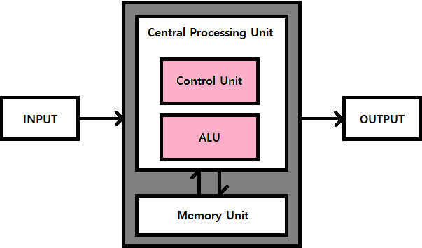

# STAGE 3 Computer Science

# Background: Computer Architecture

## 1. 서론

### 서론

- 컴퓨터 구조와 명령어 집합 구조, 그리고 인텔의 x86-64에 대해 간단히 살펴볼 것
- 컴퓨터는 각자 다른 기능을 수행하는 여러 부품들의 도움으로 작동
    - CPU는 컴퓨터의 작동에 핵심이 되는 연산을 처리하고, 저장장치는 데이터를 저장
    - 이 외에도 GPU는 그래픽 데이터를, 랜 카드는 네트워크 통신을, 사운드 카드는 소리 데이터를 처리하는 것에 특화되어 있음
    - 각 부품들은 특징이 뚜렷하여 컴퓨터에서 고유의 기능을 수행
- 서로 다른 부품들이 모여서 ‘컴퓨터’라는 하나의 기계로서 작동할 수 있는 것은 컴퓨터에 대한 기본 설계가 존재하기 때문
    - 이 설계에 맞춰서 여러 하드웨어가 개발되고, 이들을 조립해서 컴퓨터가 완성
    - 컴퓨터 과학에서는 이러한 설계를 **‘컴퓨터 구조(Computer Architecture)’** 라고 부름
- 전체적인 컴퓨터 구조 중에서 특히 CPU가 사용하는 명령어와 관련된 설계를 **명령어 집합 구조(Instruction Set Architecture, ISA)** 라고 하는데, 가장 널리 사용되는 ISA 중 하나가 인텔의 **x86-64 아키텍처**

## 2. 컴퓨터 구조와 명령어 집합 구조

### 컴퓨터 구조

- **컴퓨터 구조(Computer Architecture)** 란 컴퓨터가 효율적으로 작동할 수 있도록 하드웨어 및 소프트웨어의 기능을 고안하고, 이들을 구성하는 방법
- 컴퓨터 구조는 컴퓨터의 기능 구조에 대한 설계, 명령어 집합 구조, 마이크로 아키텍처, 그리고 기타 하드웨어 및 컴퓨팅 방법에 대한 설계 등이 포함
- **컴퓨터의 기능 구조에 대한 설계** 란 컴퓨터가 연산을 효율적으로 하기 위해 어떤 기능들이 컴퓨터에 필요한지 고민하고, 설계하는 분야
    - 대표적으로 폰 노이만 구조, 하버드 구조, 수정된 하버드 구조가 있음
- CPU의 명령어에 대한 설계는 **명령어 집합 구조(Instruction Set Architecture)** 라고 불리며, CPU가 처리 해야 하는 명령어를 설계하는 분야
    - 대표적으로 ARM, MIPS, AVR, 인텔의 x86 및 x86-64 등이 있음
- CPU의 하드웨어적 설계는 **마이크로 아키텍처(Micro Architecture)** 라고 불리며 정의된 명령어 집합을 효율적으로 처리할 수 있도록, CPU의 회로를 설계하는 분야
    - 캐시 설계, 파이프라이닝, 슈퍼 스칼라, 분기 예측, 비순차적 명령어 처리 등이 있음
- **하드웨어 및 컴퓨팅 방법론**
    - 직접 메모리 접근

### 폰 노이만 구조

- 초기 컴퓨터 과학자 중 한 명인 폰 노이만은 컴퓨터에 연산, 제어, 저장의 세 가지 핵심 기능이 필요하다고 생각
    - 근대의 컴퓨터는 연산과 제어를 위해 **중앙 처리 장치(Central Processing Unit, CPU)** 를, 저장을 위해 **기억 장치(memory)** 를 사용
    - 장치간에 데이터나 제어 신호를 교환할 수 있도록 **버스(bus)** 라는 전자 통로를 사용
- 중앙 처리 장치
    - CPU는 프로그램의 연산을 처리하고 시스템을 제어하는 컴퓨터의 두뇌
    - 프로세스의 코드를 불러오고, 실행하고, 결과를 저장하는 일련의 모든 과정이 CPU에서 일어남
    - CPU는 산술/논리 연산을 처리하는 산술 논리 장치(Arithmetic Logic Unit, ALU)와 CPU를 제어하는 제어장치(Control Unit), CPU에 필요한 데이터를 저장하는 레지스터(Register) 등으로 구성
- 기억장치
    - 기억장치는 컴퓨터가 동작하는데 필요한 여러 데이터를 저장하기 위해 사용되며, 용도에 따라 주기억장치와 보조기억장치로 분류
    - 주기억장치는 프로그램 실행 과정에서 필요한 데이터들을 임시로 저장하기 위해 사용되며, 대표적으로 램(Random-Access Memory, RAM)이 있음
    - 이와 반대로 보조기억장치는 운영 체제, 프로그램 등과 같은 데이터를 장기간 보관하고자 할 때 사용, 대표적으로 하드 드라이브(Hard Disk Drive, HDD), SSD(Solid State Drive)가 있음
- 버스
    - 버스는 컴퓨터 부품과 부품 사이 또는 컴퓨터와 컴퓨터 사이에 신호를 전송하는 통로
        - 대표적으로 데이터가 이동하는 데이터 버스(Data Bus), 주소를 지정하는 주소 버스(Address Bus), 읽기/쓰기를 제어하는 제어 버스(Control Bus)가 있음
        - 이 외에도 랜선이나 데이터 전송을 목적으로 하는 소프트웨어, 프로토콜 등도 버스라고 불림

### 명령어 집합 구조

- **명령어 집합 구조(Instruction Set Architecture, ISA)** 란 CPU가 해석하는 명령어의 집합
    - 프로그램의 코드는 기계어로 작성되어 있는데, 프로그램을 실행하면 이 명령어들을 CPU가 읽고, 처리
- ISA는 IA-32 , x86-64(x64), MIPS, AVR 등 다양하게 존재
    - 다양한 ISA가 개발되고 사용되는 이유는 모든 컴퓨터가 동일한 수준의 연산 능력을 요구하지 않으며, 컴퓨팅 환경도 다양하기 때문
- 예를 들어, 인텔의 x86-64는 고성능 프로세서를 설계하기 위해 사용
    - 이를 기반으로한 CPU들은 많은 전력을 소모하며, 발열도 상대적으로 심함
    - 그러므로 안정적으로 전력을 공급할 수 있고, 냉각 장치를 구비하는데 공간 상의 부담이 크지 않은 데스크톱 또는 랩톱에 적합
- 그러나 드론과 같이 배터리를 사용하거나 공유기, 인공지능 스피커처럼 크기가 작은 임베디드 기기들은 이러한 제약 조건을 해결하기 어려움
    - 특히 스마트폰은 피부에 닿기 때문에 발열 문제에 민감하고, 배터리로 작동하므로 높은 전력을 안정적으로 공급하기 어려움
    - 그래서 많은 임베디드 장비들은 전력 소모와 발열이 적은 ARM이나 MIPS 또는 AVR의 프로세서를 사용

## 3. x86-64 아키텍처

### x86-64 아키텍처

- x64 아키텍처는 인텔의 64비트 CPU 아키텍처
    - 인텔의 32비트 CPU 아키텍처인 IA-32를 64비트 환경에서 사용할 수 있도록 확장한 것으로, 대다수의 개인용 컴퓨터들이 인텔의 x64 CPU를 사용
- n 비트 아키텍처
    - 위의 ‘64비트 아키텍처', '32비트 아키텍처’에서 64와 32는 CPU가 한번에 처리할 수 있는 데이터의 크기
    - 컴퓨터 과학에서는 이를 CPU가 이해할 수 있는 데이터의 단위라는 의미에서 ***WORD*** 라고 부름
    - WORD의 크기는 CPU 설계에 따라 달라짐
        - 예를 들어, 일반적인 32비트 아키텍처에서 ALU는 한 번에 32비트 크기의 값을 연산할 수 있으며, 레지스터의 용량 및 각종 버스들의 대역폭이 32비트 크기를 가짐
        - 따라서 이들로 구성된 CPU는 설계 상 32비트의 데이터까지만 처리할 수 있음
- WORD가 크면 유리한 점
    - 현대의 PC는 대부분 64비트 아키텍처의 CPU를 사용하는데, 그 이유 중 하나는 32비트 아키텍처의 CPU가 제공할 수 있는 가상 메모리(Virtual Memory)의 크기가 작기 때문
    - 가상 메모리는 CPU가 프로세스에게 제공하는 가상의 메모리 공간인데, 32비트 아키텍처에서는 4,294,967,296바이트(=4기가 바이트)가 최대로 제공 가능한 가상 메모리의 크기
    - 일상적으로 사용하기에는 적절할 수 있지만, 많은 메모리 자원을 소모하는 전문 소프트웨어나 고사양의 게임 등을 실행할 때는 부족할 수 있음
    - 반면 64비트 아키텍처에서는 이론상 16엑사 바이트(=16,777,216 테라바이트)의 가상메모리를 제공할 수 있음
    - 일반적으로 이 용량은 완전한 사용이 불가능할 정도로 큰 크기이기 때문에, 가용한 메모리 자원이 부족해서 소프트웨어의 최고 성능을 낼 수 없다거나 소프트웨어의 실행이 불가능한 상황은 거의 발생하지 않음
- x86-64의 여러 이름: Intel64, IA-32e, amd64, EM64T, …

### x86-64 아키텍처: 레지스터

- 레지스터는 CPU 내부의 저장장치로, CPU가 빠르게 접근하여 사용할 수 있음
    - 산술 연산에 필요한 데이터를 저장하거나 주소를 저장하고 참조하는 등 다양한 용도로 사용
    - x64 아키텍처에는 **범용 레지스터(General Register), 세그먼트 레지스터(Segment Register), 명령어 포인터 레지스터(Instruction Pointer Register, IP), 그리고 플래그 레지스터(Flag Register)** 가 존재
- 범용 레지스터
    
    
    | 이름 | 주용도 |
    | --- | --- |
    | rax (accumulator register) | 함수의 반환 값 |
    | rbx (base register) | x64에서는 주된 용도 없음 |
    | rcx (counter register) | 반복문의 반복 횟수, 각종 연산의 시행 횟수 |
    | rdx (data register) | x64에서는 주된 용도 없음 |
    - 범용 레지스터는 주 용도는 있으나, 그 외 임의의 용도로도 사용될 수 있는 레지스터
    - x86-64에서 각각의 범용 레지스터는 8바이트를 저장할 수 있으며, 부호 없는 정수를 기준으로 (2^64 - 1)까지 나타낼 수 있음
    - 표 외에도 x64에는 r8, r9, … , r15까지의 범용 레지스터가 더 존재
- 세그먼트 레지스터
    - x64 아키텍처에는 *cs, ss, ds, es, fs, gs* 총 6가지 세그먼트 레지스터가 존재하며, 각 레지스터의 크기는 16비트
        - 세그먼트 레지스터는 x64로 아키텍처가 확장되면서 용도에 큰 변화가 생긴 레지스터
    - 과거 IA-32, IA-16에서는 세그먼트 레지스터를 이용하여 사용 가능한 물리 메모리의 크기를 키우려고 했음
        - 예를 들어 IA-16에서는, 어떤 주소를 cs:offset라고 한다면, 실제로는 cs<<4 + offset의 주소를 사용하여 16비트 범위에서 접근할 수 없는 주소에 접근할 수 있었음
        - 당시에는 범용 레지스터의 크기가 작아서 사용 가능한 메모리의 주소 폭이 좁았지만, x64에서는 사용 가능한 주소 영역이 굉장히 넓기 때문에 이런 용도로는 거의 사용되지 않았음
    - 현대의 x64에서 cs, ds, ss 레지스터는 코드 영역과 데이터, 스택 메모리 영역을 가리킬 때 사용되고, 나머지 레지스터는 운영체제 별로 용도를 결정할 수 있도록 범용적인 용도로 제작된 세그먼트 레지스터
- 명령어 포인터 레지스터
    - 프로그램의 코드는 기계어로 작성되어 있음
        - 이 중에서 CPU가 어느 부분의 코드를 실행할지 가리키는게 명령어 포인터 레지스터의 역할
        - x64 아키텍처의 명령어 레지스터는 *rip*이며, 크기는 8바이트
- 플래그 레지스터
    
    
    | 플래그 | 의미 |
    | --- | --- |
    | CF(Carry Flag) | 부호 없는 수의 연산 결과가 비트의 범위를 넘을 경우 설정 |
    | ZF(Zero Flag) | 연산의 결과가 0일 경우 설정 |
    | SF(Sign Flag) | 연산의 결과가 음수일 경우 설정 |
    | OF(Overflow Flag) | 부호 있는 수의 연산 결과가 비트 범위를 넘을 경우 설정 |
    - 플래그 레지스터는 프로세서의 현재 상태를 저장하고 있는 레지스터
        - x64 아키텍처에서는 RFLAGS라고 불리는 64비트 크기의 플래그 레지스터가 존재하며, 과거 16비트 플래그 레지스터가 확장된 것
        - 플래그 레지스터는 자신을 구성하는 여러 비트들로 CPU의 현재 상태를 표현
    - 간단한 예로 a=3, b=5일 때, a에서 b를 빼는 연산을 하면, 연산의 결과가 음수이므로 SF가 설정
        - 그러면 CPU는 SF를 통해 a가 b보다 작았음을 알 수 있음
        - 실제로 이런 원리로 수의 대소를 비교하는 어셈블리 명령어가 존재
    - [FLAGS register](https://en.wikipedia.org/wiki/FLAGS_register)
- 레지스터 호환
    
    
    
    - x86-64 아키텍처는 IA-32의 64비트 확장 아키텍처이며, 호환이 가능
        - IA-32에서 CPU의 레지스터들은 32비트 크기를 가지며, 이들의 명칭은 각각 e*ax, ebx, ecx, edx, esi, edi, esp, ebp*
        - 호환성을 위해 이 레지스터들은 x86-64에서도 그대로 사용이 가능
    - *rax, rbx, rcx, rdx, rsi, rdi, rsp, rbp*가 이들의 확장된 형태이며, eax, ebx 등은 확장된 레지스터의 하위 32비트를 가리킴
        - 예를 들어, eax는 rax의 하위 32비트를 의미
    - 마찬가지로 과거 16비트 아키텍처인 IA-16과의 호환을 위해 *ax, bx, cx, dx, si, di, sp, bp*는 e*ax, ebx, ecx, edx, esi, edi, esi, esp ,ebp*의 하위 16비트를 가리킴
    - 이들 중 몇몇은 다시 상위 8비트, 하위 8비트로 나뉘는데 이들 전체에 대한 내용은 (오른쪽) 그림에서 확인할 수 있음
    - rax = 0x0123456789abcdef 일 때, eax, ax, ah, al
        - eax = 0x89abcdef, ax = 0xcdef, ah = 0xcd, al = 0xef

# Background: Windows Memory Layout

## 1. 서론

### 서론

- **메모리 레이아웃(Memory Layout)** 이란 프로세스 **가상 메모리(Virtual Memory)** 의 구성
    - 프로그램을 실행하면 운영체제는 프로세스에게 사용 가능한 메모리 공간을 할당
    - 컴퓨터 과학에서는 이 공간을 가상 메모리라고 부름
- 운영체제는 프로그램의 정보를 참조하여 프로그램에 저장된 데이터가 적절한 영역에 저장
    - 프로세스가 사용할 가상 메모리를 용도 별로 구획하고, 프로세스가 사용하는 데이터를 적절한 구획에 저장
    - 유사한 데이터를 모아놓기 때문에 운영체제는 각 구획에 적절한 권한을 부여할 수 있으며, 개발자는 프로세스의 메모리를 더 직관적으로 이해할 수 있음
- 소프트웨어 리버스 엔지니어링의 핵심은 바이너리를 분석하여 바이너리의 동작을 이해하는 것
    - 이전 **Background: Computer Architecture** 를 참고하면, 바이너리의 동작은 메모리와 굉장히 밀접한 관련이 있음
    - 따라서 바이너리의 동작을 자세히 이해하기 위해서는 바이너리가 상호 작용하는 메모리에 대한 이해가 필요

## 2. 프로세스 메모리 구조

### 섹션

- 윈도우의 PE 파일은 PE 헤더와 1개 이상의 섹션으로 구성
    - 섹션이란, 유사한 용도로 사용되는 데이터가 모여있는 영역
    - “.text”섹션에는 PE의 코드가 적혀있고, “.data”에는 PE가 실행 중에 참조하는 데이터가 적혀있음
- 섹션에 대한 정보는 PE 헤더에 적혀있음
    - PE헤더에 저장되는 섹션과 관련된 데이터 중, 중요한 것은 다음과 같음
        - 섹션의 이름
        - 섹션의 크기
        - 섹션이 로드될 주소의 오프셋
        - 섹션의 속성과 권한
- 윈도우는 PE를 실행할 때, 이 정보를 참조하여 PE의 각 섹션들을 가상 메모리의 적절한 세그먼트에 매핑
    - PE에 필수로 존재해야하는 섹션이 정해진 것은 아니지만, “.text”, “.data”, “.rdata” 섹션이 일반적으로 사용

### .text

- .text 섹션은 실행 가능한 기계 코드가 위치하는 영역
- 프로그램이 동작하려면 코드를 실행할 수 있어야 하므로 이 세그먼트에는 읽기 권한과 실행 권한이 부여됨
    - 반면 쓰기 권한이 있으면 공격자가 악의적인 코드를 삽입하기가 쉬워지므로, 대부분의 현대 운영체제는 이 세그먼트에 쓰기 권한을 제거

### .data

- .data 섹션에는 컴파일 시점에 값이 정해진 전역 변수들이 위치
    - CPU가 이 섹션의 데이터를 읽고 쓸 수 있어야 하므로, 읽기/쓰기 권한이 부여됨

### .rdata

- .rdata 섹션에는 컴파일 시점에 값이 정해진 전역 상수와 참조할 DLL 및 외부 함수들의 정보가 저장됨
    - CPU가 이 섹션의 데이터를 읽을 수 있어야 하므로, 읽기 권한이 부여되지만, 쓰기는 불가능
    - 과거에는 참조할 DLL과 외부 함수들의 정보를 .idata 섹션에 저장하였으나, 최근에는 대부분 .rdata에 저장

### 섹션이 아닌 메모리

- 윈도우의 가상 메모리 공간에는 섹션만 로드되는 것이 아님
    - 프로그램 실행에 있어 필요한 스택과 힙 역시 가상 메모리 공간에 적재
- 스택
    - 윈도우즈 프로세스의 각 쓰레드는 자신만의 스택 공간을 가지고 있음
        - 보통 지역 변수나 함수의 리턴 주소가 저장됨
        - 이 영역은 자유롭게 읽고 쓸수 있어야 하기 때문에 읽기/쓰기 권한이 부여됩됨
        - 스택은 확장될 때, 기존 주소보다 낮은 주소로 확장됨
- 힙
    - 힙은 프로그램이 여러 용도로 사용하기 위해 할당받는 공간
        - 따라서 모든 종류의 데이터가 저장될 수 있음
        - 스택과 다른 점은 비교적 스택보다 큰 데이터도 저장할 수 있고 전역적으로 접근이 가능하도록 설계되었단 점
        - 또한 실행중 동적으로 할당받는 점 역시 다름
    - 권한은 보통은 데이터를 읽고 쓰기만 하기 때문에 읽기/쓰기 권한만을 가지나, 상황에 따라 실행 권한을 가지는 경우도 존재
