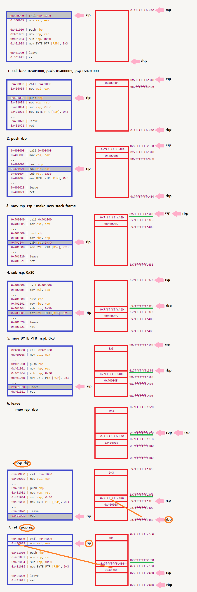

# STAGE 4 x86 Assembly

# x86 Assembly

## 1. 어셈블리어와 x86-64

### 어셈블리 언어

- 어셈블리 언어는 컴퓨터의 기계어와 치환되는 언어
- 이는 기계어가 여러 종류라면 어셈블리어도 여러 종류여야 함을 의미
- CPU에 사용되는 ISA는 IA-32, x86-64, ARM, MIPS 등 종류가 굉장히 다양
- 따라서 이들의 종류만큼 많은 수의 어셈블리어가 존재

### x64 어셈블리 언어

- 기본 구조
    - x64 어셈블리 언어는 단순한 문법 구조를 지님
    - 이들의 문장은 동사에 해당하는 **명령어(Operation Code, Opcode)** 와 목적어에 해당하는 **피연산자(Operand)** 로 구성

### 명령어

| 명령 코드 |  |
| --- | --- |
| 데이터 이동(Data Transfer) | mov, lea |
| 산술 연산(Arithmetic) | inc, dec, add, sub |
| 논리 연산(Logical) | and, or, xor, not |
| 비교(Comparison) | cmp, test |
| 분기(Branch) | jmp, je, jg |
| 스택(Stack) | push, pop |
| 프로시져(Procedure) | call, ret, leave |
| 시스템 콜(System call) | syscall |
- 인텔의 x64에는 매우 많은 명령어가 존재
- 이 중 중요한 21개의 명령어들은 위의 표와 같이 분류할 수 있음
- 피연산자
    
    
    | 메모리 피연산자 |  |
    | --- | --- |
    | QWORD PTR [0x8048000] | 0x8048000의 데이터를 8바이트만큼 참조 |
    | DWORD PTR [0x8048000] | 0x8048000의 데이터를 4바이트만큼 참조 |
    | WORD PTR [rax] | rax가 가르키는 주소에서 데이터를 2바이트 만큼 참조 |
    - 피연산자에는 총 3가지 종류가 올 수 있음
        - 상수(Immediate Value)
        - 레지스터(Register)
        - 메모리(Memory)
    - 메모리 피연산자는 []으로 둘러싸인 것으로 표현되며, 앞에 크기 지정자(Size Directive) TYPE PTR이 추가될 수 있음
        - 여기서 타입에는 BYTE, WORD, DWORD, QWORD가 올 수 있으며, 각각 1바이트, 2바이트, 4바이트, 8바이트의 크기를 지정
    - 자료형 WORD의 크기가 2바이트인 이유
        - 초기에 인텔은 WORD의 크기가 16비트인 IA-16 아키텍처를 개발
            - CPU의 WORD가 16비트였기 때문에, 어셈블리어에서도 WORD를 16비트 자료형으로 정의하는 것이 자연스러웠음
        - 이후에 개발된 IA-32, x86-64 아키텍처는 CPU의 WORD가 32비트, 64비트로 확장
            - 그러나 인텔은 WORD 자료형의 크기를 16비트로 유지
            - WORD 자료형의 크기를 변경하면 기존의 프로그램들이 새로운 아키텍처와 호환되지 않을 수 있기 때문
            - 그래서 인텔은 기존에 사용하던 WORD의 크기를 그대로 유지하고, DWORD(Double Word, 32bit)와 QWORD(Quad Word, 64bit)자료형을 추가로 만들었음

## 2. x86-64 어셈블리 명령어

### 데이터 이동

| mov rdi, rsi | rsi의 값을 rdi에 대입 |
| --- | --- |
| mov QWORD PTR[rdi], rsi | rsi의 값을 rdi가 가리키는 주소에 대입 |
| mov QWORD PTR[rdi+8*rcx], rsi | rsi의 값을 rdi+8*rcx가 가리키는 주소에 대입 |
| lea rsi, [rbx+8*rcx] | rbx+8*rcx 를 rsi에 대입 |

```nasm
=================================

[Register]
rbx = 0x401A40

=================================

[Memory]
0x401a40 | 0x0000000012345678
0x401a48 | 0x0000000000C0FFEE
0x401a50 | 0x00000000DEADBEEF
0x401a58 | 0x00000000CAFEBABE
0x401a60 | 0x0000000087654321

=================================

[Code]
1: mov rax, [rbx+8]
2: lea rax, [rbx+8]

=================================
```

- 데이터 이동 명령어는 어떤 값을 레지스터나 메모리에 옮기도록 지시
    - `mov dst, src` : src에 들어있는 값을 dst에 대입
    - `lea dst, src` : src의 유효 주소(Effective Address, EA)를 dst에 저장
- 레지스터, 메모리 및 코드가 위와 같을 때, 적절한 값
    - Code를 1까지 실행했을 때, `rax`에 저장된 값은 **0xC0FFEE**
    - Code를 2까지 실행했을 때, `rax`에 들어있는 값은 **0x401A48**

### 산술 연산

| add eax, 3 | eax += 3 |
| --- | --- |
| add ax, WORD PTR[rdi] | ax += *(WORD *)rdi |
| sub eax, 3 | eax -= 3 |
| sub ax, WORD PTR[rdi] | ax -= *(WORD *)rdi |
| inc eax | eax += 1 |
| dec eax | eax -= 1 |

```nasm
=================================

[Register]
rax = 0x31337
rbx = 0x555555554000
rcx = 0x2

=================================

[Memory]
0x555555554000| 0x0000000000000000
0x555555554008| 0x0000000000000001
0x555555554010| 0x0000000000000003
0x555555554018| 0x0000000000000005
0x555555554020| 0x000000000003133A

==================================

[Code]
1: add rax, [rbx+rcx*8]
2: add rcx, 2
3: sub rax, [rbx+rcx*8]
4: inc rax

==================================

[rbx+rcx*8]: [0x555555554000 + 0x10] == [0x555555554010] == 0x0000000000000003
add rax, [rbx+rcx*8]: 0x31337 + 0x0000000000000003 == 0x3133A
add rcx, 2: 0x2 + 0x2 == 0x4
[rbx+rcx*8]: [0x555555554000 + 0x20] == [0x555555554020] == 0x000000000003133A
sub rax, [rbx+rcx*8]: 0x3133A - 0x000000000003133A == 0
inc rax: 0 + 0x1 == 0x1

=================================
```

- 산술 연산 명령어는 덧셈, 뺄셈, 곱셈, 나눗셈 연산을 지시
    - `add dst, src` : dst에 src의 값을 더함
    - `sub dst, src` : dst에서 src의 값을 뺌
    - `inc op` : op의 값을 1 증가시킴
    - `dec op` : op의 값을 1 감소 시킴
- 레지스터, 메모리 및 코드가 위와 같을 때, 적절한 값
    - Code를 1까지 실행했을 때, `rax`에 저장된 값은 **0x3133A**
    - Code를 3까지 실행했을 때, `rax`에 저장된 값은 **0**
    - Code를 4까지 실행했을 때, `rax`에 저장된 값은 **1**

### 논리 연산 - and, or

```nasm
=================================

[Register]
eax = 0xffff0000
ebx = 0xcafebabe

[Code]
and eax, ebx

[Result]
eax = 0xcafe0000

==================================

[Register]
eax = 0xffff0000
ebx = 0xcafebabe

[Code]
or eax, ebx

[Result]
eax = 0xffffbabe

==================================

[Register]
rax = 0xffffffff00000000
rbx = 0x00000000ffffffff
rcx = 0x123456789abcdef0

[Code]
1: and rax, rcx
2: and rbx, rcx
3: or rax, rbx

[Result]
1: rax = 0x12345678000000000
2: rbx = 0x000000009abcdef0
3: rax = 0x123456789abcdef0

=================================
```

- 논리 연산 명령어는 and, or, xor, neg 등의 비트 연산을 지시
    - 이 연산은 **비트 단위**로 이루어 짐
    - `and dst, src` : dst와 src의 비트가 모두 1이면 1, 아니면 0
    - `or dst, src` : dst와 src의 비트 중 하나라도 1이면 1, 아니면 0
- 레지스터, 메모리 및 코드가 위와 같을 때, 적절한 값
    - Code를 1까지 실행했을 때, `rax`에 저장된 값은 **0x12345678000000000**
    - Code를 2까지 실행했을 때, `rbx`에 저장된 값은 **0x000000009abcdef0**
    - Code를 3까지 실행했을 때, `rax`에 저장된 값은 **0x123456789abcdef0**

### 논리연산 - xor, not

```nasm
=================================

[Register]
eax = 0xffffffff
ebx = 0xcafebabe

[Code]
xor eax, ebx

[Result]
eax = 0x35014541

==================================

[Register]
eax = 0xffffffff

[Code]
not eax

[Result]
eax = 0x00000000

==================================

[Register]
rax = 0x35014541
rbx = 0xdeadbeef

[Code]
1: xor rax, rbx
2: xor rax, rbx
3: not eax

[Result]
1: rax = 0xebacfbae
2: rax = 0x35014541
3: eax == 0xffffffff - 0x35014541 == 0xcafebebe

=================================
```

- 논리 연산 명령어
    - `xor dst, src` : dst와 src의 비트가 서로 다르면 1, 같으면 0
    - `not op` : op의 비트 전부 반전
- 레지스터, 메모리 및 코드가 위와 같을 때, 적절한 값
    - Code를 1까지 실행했을 때, `rax`에 저장된 값은 **0xebacfbae**
    - Code를 2까지 실행했을 때, `rax`에 저장된 값은 **0x35014541**
    - Code를 3까지 실행했을 때, `eax`에 저장된 값은 **0xcafebebe**
        - rax : 0x0000000035014541
        - eax : 0x35014541

### 비교

```nasm
=================================

[Code]
1: mov rax, 0xA
2: mov rbx, 0xA
3: cmp rax, rbx ; ZF=1

=================================

[Code]
1: xor rax, rax
2: test rax, rax ; ZF=1

=================================
```

- 비교 명령어는 두 피연산자의 값을 비교하고, 플래그를 설정
    - `cmp op1, op2` : op1과 op2를 비교
        - 연산의 결과는 op1에 대입하지 않음
        - 서로 같은 두 수를 빼면 결과가 0이 되어 ZF플래그가 설정되는데, 이후에 CPU는 이 플래그를 보고 두 값이 같았는지 판단할 수 있음
    - `test op1, op2` : op1과 op2를 비교
        - test는 두 피연산자에 AND 비트연산을 취함
        - 연산의 결과는 op1에 대입하지 않음
        - 위 코드에서 0이된 `rax`를 op1과 op2로 삼아 test를 수행하면, 결과가 0이므로 ZF플래그가 설정, 이후에 CPU는 이 플래그를 보고 rax가 0이었는지 판단할 수 있음

### 분기

```nasm
=================================

[Code]
1: xor rax, rax
2: jmp 1 ; jump to 1

=================================

[Code]
1: mov rax, 0xcafebabe
2: mov rbx, 0xcafebabe
3: cmp rax, rbx ; rax == rbx
4: je 1 ; jump to 1

=================================

[Code]
1: mov rax, 0x31337
2: mov rbx, 0x13337
3: cmp rax, rbx ; rax > rbx
4: jg 1  ; jump to 1

=================================
```

- 분기 명령어는 `rip`를 이동시켜 실행 흐름을 바꿈
    - `jmp addr` : addr로 rip를 이동
    - `je addr` : 직전에 비교한 두 피연산자가 같으면 점프 (jump if equal)
    - `jg addr` : 직전에 비교한 두 연산자 중 전자가 더 크면 점프 (jump if greater)
- 분기문은 굉장히 많은 수가 존재
    - 몇 개만 살펴보면 이름을 통해 직관적으로 의미를 파악할 수 있기 때문에, 이들을 전부 다루기 보다는 실제 코드를 분석하면서 감을 익혀나갈 것

### 스택

```nasm
=================================

[Operation : push]
rsp -= 8
[rsp] = val

=================================

[Register]
rsp = 0x7fffffffc400

[Stack]
0x7fffffffc400 | 0x0  <= rsp
0x7fffffffc408 | 0x0

[Code]
push 0x31337

=================================

[Register]
rsp = 0x7fffffffc3f8 ; rsp -= 8

[Stack]
0x7fffffffc3f8 | 0x31337 <= rsp ; [0x7fffffffc3f8] = 0x31337
0x7fffffffc400 | 0x0
0x7fffffffc408 | 0x0

=================================

[Operation : pop]
reg = [rsp]
rsp += 8

=================================

[Register]
rax = 0
rsp = 0x7fffffffc3f8

[Stack]
0x7fffffffc3f8 | 0x31337 <= rsp 
0x7fffffffc400 | 0x0
0x7fffffffc408 | 0x0

[Code]
pop rax

=================================

[Register]
rax = 0x31337 ; rax = 0x31337
rsp = 0x7fffffffc400 ; rsp += 8

[Stack]
0x7fffffffc400 | 0x0 <= rsp 
0x7fffffffc408 | 0x0

=================================
```

- x64 아키텍쳐에서는 다음의 명령어로 스택을 조작
    - `push val` : val을 스택 최상단에 쌓음
    - `pop reg` : 스택 최상단의 값을 꺼내서 reg에 대입

### 프로시저

```nasm
=================================

[Operation : call]
push return_address
jmp addr

================================= ; before call

[Register]
rip = 0x400000
rsp = 0x7fffffffc400

[Stack]
0x7fffffffc3f8 | 0x0
0x7fffffffc400 | 0x0 <= rsp

[Code]
0x400000 | call 0x401000  <= rip
0x400005 | mov esi, eax
...
0x401000 | push rbp

================================= ; after call

[Register]
rip = 0x401000
rsp = 0x7fffffffc3f8

[Stack]
0x7fffffffc3f8 | 0x400005  <= rsp
0x7fffffffc400 | 0x0

[Code]
0x400000 | call 0x401000
0x400005 | mov esi, eax
...
0x401000 | push rbp  <= rip

=================================

[Operation : leave]
mov rsp, rbp
pop rbp

================================= ; before leave

[Register]
rsp = 0x7fffffffc400
rbp = 0x7fffffffc480

[Stack]
0x7fffffffc400 | 0x0 <= rsp
...
0x7fffffffc480 | 0x7fffffffc500 <= rbp
0x7fffffffc488 | 0x31337

[Code]
leave

================================= ; after leave

[Register]
rsp = 0x7fffffffc488
rbp = 0x7fffffffc500

[Stack]
0x7fffffffc400 | 0x0
...
0x7fffffffc480 | 0x7fffffffc500
0x7fffffffc488 | 0x31337 <= rsp
...
0x7fffffffc500 | 0x7fffffffc550 <= rbp

=================================

[Operation : ret]
pop rip

================================= ; before ret

[Register]
rip = 0x401021
rsp = 0x7fffffffc3f8

[Stack]
0x7fffffffc3f8 | 0x400005 <= rsp
0x7fffffffc400 | 0x123456789abcdef

[Code]
0x400000 | call 0x401000
0x400005 | mov esi, eax
...
0x401000 | push rbp
0x401001 | mov rbp, rsp
0x401004 | sub rsp, 0x30
0x401008 | mov BYTE PTR [RSP], 0x3
...
0x401020 | leave
0x401021 | ret <= rip

================================= ; after ret

[Register]
rip = 0x400005
rsp = 0x7fffffffc400

[Stack]
0x7fffffffc3f8 | 0x400005
0x7fffffffc400 | 0x123456789abcdef <= rsp

[Code]
0x400000 | call 0x401000
0x400005 | mov esi, eax <= rip
...
0x401000 | push rbp
0x401001 | mov rbp, rsp
0x401004 | sub rsp, 0x30
0x401008 | mov BYTE PTR [RSP], 0x3
...
0x401020 | leave
0x401021 | ret

=================================
```



- 컴퓨터 과학에서 프로시저(Procedure)는 특정 기능을 수행하는 코드 조각
    - 프로시저를 사용하면 반복되는 연산을 프로시저 호출로 대체할 수 있어서 전체 코드의 크기를 줄일 수 있으며, 기능별로 코드 조각에 이름을 붙일 수 있게 되어 코드의 가독성을 크게 높일 수 있음
- 프로시저를 부르는 행위를 호출(Call)이라고 부르며, 프로시저에서 돌아오는 것을 반환(Return)이라고 부름
    - 프로시저를 호출할 때는 프로시저를 실행하고 나서 원래의 실행 흐름으로 돌아와야 하므로, call 다음의 명령어 주소(return address, 반환 주소)를 스택에 저장하고 프로시저로 rip를 이동시킴
- x64 어셈블리 언어에는 프로시저의 호출과 반환을 위한 call, leave, ret 명령어가 있음
    - `call addr` : addr에 위치한 프로시저 호출
    - `leave` : 스택 프레임 정리
    - `ret` : return address로 반환
- 스택프레임
    - 스택은 함수별로 자신의 지역변수 또는 연산과정에서 부차적으로 생겨나는 임시 값들을 저장하는 영역
        - 만약 이 스택 영역을 아무런 구분 없이 사용하게 된다면, 서로 다른 두 함수가 같은 메모리 영역을 사용할 수 있게 됨

### 시스템 콜

```nasm
=================================

[Register]
rax = 0x1   
rdi = 0x1   
rsi = 0x401000  
rdx = 0xb

=================================

[Memory]
0x401000 | "Hello Wo"   
0x401008 | "rld"    

=================================

[Code]  
syscall

=================================
```

- 윈도우, 리눅스, 맥 등의 현대 운영체제는 컴퓨터 자원의 효율적인 사용을 위해, 그리고 사용자에게 편리한 경험을 제공하기 위해, 내부적으로 매우 복잡한 동작을 수행
    - 운영체제는 연결된 모든 하드웨어 및 소프트웨어에 접근할 수 있으며, 이들을 제어할 수 있음, 그리고 해킹으로부터 이 막강한 권한을 보호하기 위해 커널 모드와 유저 모드로 권한을 나눔
- **커널 모드**는 운영체제가 전체 시스템을 제어하기 위해 시스템 소프트웨어에 부여하는 권한
    - 파일시스템, 입력/출력, 네트워크 통신, 메모리 관리 등 모든 저수준의 작업은 사용자 모르게 커널 모드에서 진행
    - 커널 모드에서는 시스템의 모든 부분을 제어할 수 있기 때문에, 해커가 커널 모드까지 진입하게 되면 시스템은 거의 무방비 상태가 됨
- **유저 모드**는 운영체제가 사용자에게 부여하는 권한
    - 브라우저, 영상 시청, 게임, 프로그래밍을 하는 것 등은 모두 유저 모드에서 이루어짐
    - 리눅스에서 루트 권한으로 사용자를 추가하고, 패키지를 내려 받는 행위 등도 마찬가지
    - 유저 모드에서는 해킹이 발생해도, 해커가 유저 모드의 권한까지 밖에 획득하지 못하기 때문에 해커로 부터 커널의 막강한 권한을 보호할 수 있음
- **시스템 콜(system call, syscall)** 은 유저 모드에서 커널 모드의 시스템 소프트웨어에게 어떤 동작을 요청하기 위해 사용
    - 소프트웨어 대부분은 커널의 도움이 필요
        - 도움이 필요하다는 요청을 시스템 콜이라고 함
        - 유저 모드의 소프트웨어가 필요한 도움을 요청하면, 커널이 요청한 동작을 수행하여 유저에게 결과를 반환
- x64 아키텍처에서는 시스템콜을 위해 `syscall` 명령어가 존재
    - command, system utilities, syscall, low level operations, …
- 시스템 콜은 함수
    - 필요한 기능과 인자에 대한 정보를 레지스터로 전달하면, 커널이 이를 읽어서 요청을 처리
    - [syscall table](https://cccding.tistory.com/7)
- 리눅스에서는 x64 아키텍처에서 rax로 무슨 요청인지 나타내고, 코드의 순서대로 필요한 인자를 전달
    - 요청 : rax
    - 인자 순서 : rdi → rsi → rdx → rcx → r8 → r9 → stack
- syscall table을 보면, rax가 0x1일 때, 커널에 write 시스템콜을 요청
    - rdi, rsi, rdx가 0x1, 0x401000, 0xb 이므로 커널은 write(0x1, 0x401000, 0xb)를 수행
- write함수의 각 인자는 출력 스트림, 출력 버퍼, 출력 길이를 나타냄
    - 0x1은 stdout이며, 이는 일반적으로 화면을 의미
    - 0x401000에는 Hello World가 저장, 길이는 0xb로 지정되어 있으므로, 화면에 Hello World가 출력

## 3. Problem & Solution

### No. 1

- 프로그램이 종료됐을 때, `0x400000` 부터 `0x400019` 까지의 데이터를 대응되는 아스키 문자로 변환하면 어느 문자열이 나오는가?
    - end로 점프하면 프로그램이 종료된다고 가정
    - [아스키 테이블](https://ko.wikipedia.org/wiki/ASCII)
    - [파이썬 아스키 변환](https://docs.python.org/3/library/functions.html#chr)

```nasm
=================================

[Register]
rcx = 0
rdx = 0
rsi = 0x400000

=================================

[Memory]
0x400000 | 0x67 0x55 0x5c 0x53 0x5f 0x5d 0x55 0x10
0x400008 | 0x44 0x5f 0x10 0x51 0x43 0x43 0x55 0x5d
0x400010 | 0x52 0x5c 0x49 0x10 0x47 0x5f 0x42 0x5c
0x400018 | 0x54 0x11 0x00 0x00 0x00 0x00 0x00 0x00

; 0x67 1 BYTE -> 8 bits ____ ____
; 16진수 -> 2^4 -> 4 bits 필요

=================================

[Code]
1: mov dl, BYTE PTR[rsi+rcx]
2: xor dl, 0x30
3: mov BYTE PTR[rsi+rcx], dl
4: inc rcx
5: cmp rcx, 0x19
6: jg end
7: jmp 1

=================================

[Result]
0x400000 | 0x57 0x55 0x5c 0x53 0x5f 0x5d 0x55 0x10
; rcx == 0x01;
0x400000 | 0x57 0x65 0x5c 0x53 0x5f 0x5d 0x55 0x10
; rcx == 0x02;
0x400000 | 0x57 0x65 0x6c 0x53 0x5f 0x5d 0x55 0x10
; rcx == 0x03;
0x400000 | 0x57 0x65 0x6c 0x63 0x5f 0x5d 0x55 0x10
; rcx == 0x04;
0x400000 | 0x57 0x65 0x6c 0x63 0x6f 0x5d 0x55 0x10
; rcx == 0x05;
0x400000 | 0x57 0x65 0x6c 0x63 0x6f 0x6d 0x55 0x10
; rcx == 0x06;
0x400000 | 0x57 0x65 0x6c 0x63 0x6f 0x6d 0x65 0x10
; rcx == 0x07;
0x400000 | 0x57 0x65 0x6c 0x63 0x6f 0x6d 0x65 0x20
; rcx == 0x08;
0x400008 | 0x74 0x5f 0x10 0x51 0x43 0x43 0x55 0x5d
; rcx == 0x09;
0x400008 | 0x74 0x6f 0x10 0x51 0x43 0x43 0x55 0x5d
; rcx == 0x0a;
0x400008 | 0x74 0x6f 0x20 0x51 0x43 0x43 0x55 0x5d
; rcx == 0x0b;
0x400008 | 0x74 0x6f 0x20 0x61 0x43 0x43 0x55 0x5d
; rcx == 0x0c;
0x400008 | 0x74 0x6f 0x20 0x61 0x73 0x43 0x55 0x5d
; rcx == 0x0d;
0x400008 | 0x74 0x6f 0x20 0x61 0x73 0x73 0x55 0x5d
; rcx == 0x0e;
0x400008 | 0x74 0x6f 0x20 0x61 0x73 0x73 0x65 0x5d
; rcx == 0x0f;
0x400008 | 0x74 0x6f 0x20 0x61 0x73 0x73 0x65 0x6d
; rcx == 0x10;
0x400010 | 0x62 0x5c 0x49 0x10 0x47 0x5f 0x42 0x5c
; rcx == 0x11;
0x400010 | 0x62 0x6c 0x49 0x10 0x47 0x5f 0x42 0x5c
; rcx == 0x12;
0x400010 | 0x62 0x6c 0x79 0x10 0x47 0x5f 0x42 0x5c
; rcx == 0x13;
0x400010 | 0x62 0x6c 0x79 0x20 0x47 0x5f 0x42 0x5c
; rcx == 0x14;
0x400010 | 0x62 0x6c 0x79 0x20 0x77 0x5f 0x42 0x5c
; rcx == 0x15;
0x400010 | 0x62 0x6c 0x79 0x20 0x77 0x6f 0x42 0x5c
; rcx == 0x16;
0x400010 | 0x62 0x6c 0x79 0x20 0x77 0x6f 0x72 0x5c
; rcx == 0x17;
0x400010 | 0x62 0x6c 0x79 0x20 0x77 0x6f 0x72 0x6c
; rcx == 0x18;
0x400018 | 0x64 0x11 0x00 0x00 0x00 0x00 0x00 0x00
; rcx == 0x19;
0x400018 | 0x64 0x21 0x00 0x00 0x00 0x00 0x00 0x00
; rcx == 0x20;
; cmp 0x20 0x19
; jg end

0x57 0x65 0x6c 0x63 0x6f 0x6d 0x65 0x20
0x74 0x6f 0x20 0x61 0x73 0x73 0x65 0x6d
0x62 0x6c 0x79 0x20 0x77 0x6f 0x72 0x6c
0x64 0x21 0x00 0x00 0x00 0x00 0x00 0x00
; Welcome to assembly world!

=================================
```

### No. 2

- 다음 어셈블리 코드를 실행했을 때 출력되는 결과

```nasm
=================================

[Register]
rcx = 0
rdx = 0
rsi = 0x400000

=================================

[Memory]
0x400000 | 0x67 0x55 0x5c 0x53 0x5f 0x5d 0x55 0x10
0x400008 | 0x44 0x5f 0x10 0x51 0x43 0x43 0x55 0x5d
0x400010 | 0x52 0x5c 0x49 0x10 0x47 0x5f 0x42 0x5c
0x400018 | 0x54 0x11 0x00 0x00 0x00 0x00 0x00 0x00

=================================

[Code]
1: mov dl, BYTE PTR[rsi+rcx]
2: xor dl, 0x30
3: mov BYTE PTR[rsi+rcx], dl
4: inc rcx
5: cmp rcx, 0x19
6: jg end
7: jmp 1

=================================

[Results]
0x400000 | 0x57 0x65 0x6c 0x63 0x6f 0x6d 0x65 0x20
0x400008 | 0x74 0x6f 0x20 0x61 0x73 0x73 0x65 0x6d
0x400010 | 0x62 0x6c 0x79 0x20 0x77 0x6f 0x72 0x6c
0x400018 | 0x64 0x21 0x00 0x00 0x00 0x00 0x00 0x00

=================================
```

```nasm
=================================

[Code]
main:
    push rbp
    mov rbp, rsp
    mov esi, 0xf
    mov rdi, 0x400500
    call 0x400497 <write_n>
    mov eax, 0x0
    pop rbp
    ret
    
write_n:
    push rbp
    mov rbp, rsp
    mov QWORD PTR [rbp-0x8],rdi
    mov DWORD PTR [rbp-0xc],esi
    xor rdx, rdx
    mov edx, DWORD PTR [rbp-0xc]
    mov rsi, QWORD PTR [rbp-0x8]
    mov rdi, 0x1
    mov rax, 0x1
    syscall
    pop rbp
    ret
    
==================================    

[Memory]
0x400500 | 0x3037207964343372
0x400508 | 0x003f367562336420

; rax == 0x1 : syscall 1 sys_write
; rdi == 0x1 : unsigned int fd
; rsi == 0x400500 : const char *buf
; rdx == 0xf : size_t count
; 72 33 34 64 79 20 37 30 20 64 33 62 75 36 3f
; r34dy 70 d3bu6?

=================================
```
