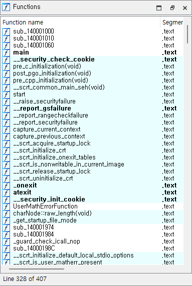

# STAGE 5 Tools

# Tools: IDA

## 1. The Interactive DisAssembler

### IDA

---

- The Interactive Disassembler (IDA)는 Hex-Rays 사에서 제작한 디스어셈블러
    - IDA의 메인 기능은 디스어셈블이지만 이 외에도 여러 환경에서의 디버깅과 다양한 아키텍처 디컴파일과 같이 여러가지 기능을 제공
    - 바이너리를 분석해야 하는 리버스 엔지니어링 업무에는 대다수 IDA를 이용
- IDA에는 다양한 라이센스가 존재하는데 기업에서 보편적으로 사용하는 IDA Pro는 대략 천만원에서 이천만원 사이의 금액대
    - 리버스 엔지니어링을 처음 공부하는 개인 이용자가 지불하기에는 부담이 큰 금액이기 때문에 Hex-Rays 사는 IDA Freeware를 제공
- IDA Freeware는 x64 아키텍처에 한해 디컴파일 기능을 지원하며, 상업적 목적 이외의 교육적 목적으로만 이용 가능
- IDA 설치
    - [IDA Freeware](https://hex-rays.com/ida-free/)

## 2. IDA Window

### Functions window

---



- IDA에서 분석한 프로그램의 함수를 나열
- 해당 창에서 **Ctrl + F** 단축키를 통해 원하는 함수를 찾을 수 있음

### Graph overview

---


- 함수를 그래프화하여 사용자에게 보여줌
- 해당 창을 통해 함수의 흐름을 파악할 수 있음

### Output window

---


- 분석 과정을 메시지로 출력
- 해당 창을 통해 IDA의 분석 과정을 알 수 있음

### View

---


- 디컴파일 결과, Hex-View, 구조체 목록 등의 화면을 표시

## 3. IDA 기능

### 임의 주소 및 레이블 이동

---

- **단축키 G**를 사용해 임의 주소 또는 레이블로 이동할 수 있음

### 함수 및 변수 이름 재설정

---

- **단축키 N**을 사용해 함수 및 변수 이름을 재설정 할 수 있음
- 정의되지 않은 함수 및 변수의 경우 해당 기능을 통해 이름을 설정하여 분석 속도를 향상

### Cross reference (Xref)

---

- 임의의 함수 또는 변수를 클릭하고, **단축키 X**를 사용하면 해당 함수 및 변수가 사용되는 영역을 재참조 할 수 있음

### 함수 및 변수 타입 변경

---

- 임의의 함수 또는 변수를 클릭하고, **단축키 Y**를 사용하면 해당 함수 및 변수의 타입을 지정할 수 있음
- 함수의 경우, 전달되는 매개 변수를 추가하거나, 타입을 변경 가능

### Strings

---

- **단축키 Shift + F12**를 사용해 바이너리에서 사용하는 모든 문자열을 조회할 수 있음
- 함수의 심볼이 존재하지 않거나, 복잡할 경우 문자열을 통해 분석 시간을 크게 단축 가능

### Decompile

---

- IDA에서 제공하는 가장 강력한 기능으로, 어셈블리를 C 언어 형태로 변환하여 보여줌

# Exercise: Helloworld

## 1. 서론

### [HelloWorld.exe](../material/HelloWorld.exe)

---

```cpp
/*
 * Name: hello-world.cpp
 * Build opts:
 * - /MT -> Library Static Linking
 * - /DYNAMICBASE:NO -> Disable ASLR
 * - /od -> Disable Optimization
 */

#include <Windows.h>
#include <stdio.h>

char* str;
int main()
{
	int delay = 1000;
	Sleep(delay);
	str = (char*)"Hello, world!\n";
	printf(str);
	return 0;
}
```

- 1초를 대기하고 `Hello, world!`를 출력하는 프로그램
- 분석을 진행하는 동안은 프로그램에 대해 아는 것이 아무것도 없다고 가정

## 2. 정적 분석

### main 함수 찾기

---

- 정적 분석은 주로 `main` 함수를 찾고, 이를 분석하며 시작
- 바이너리에서 어떤 함수를 찾는 방법은 크게 두 가지
    - 하나는 프로그램의 시작 지점인 **진입점(Entry Point, EP)** 부터 분석을 시작하여 원하는 함수를 찾을 때까지 탐색하는 방법
    - 다른 하나는 대상 함수의 특성이나 프로그램의 여러 외적인 정보를 이용하여 탐색하는 방법
- 전자는 바이너리의 규모가 조금만 커져도 분석에 소요되는 시간이 급증하므로 일반적으로는 적용하기 어려움
    - 일반적으로 `main` 함수는 C계열 언어에서 프로그래머가 작성한 코드 중 가장 먼저 실행되는 함수
        - 운영체제는 바이너리를 실행할 때, 바이너리에 명시된 진입점부터 프로그램을 실행
        - 진입점이 `main` 함수인게 불가능한 것은 아니지만, 일반적으로는 그렇지 않음
    - 진입점과 `main` 함수의 사이를 채우는 것은 컴파일러의 몫
        - 대부분의 컴파일러는 둘 사이에 여러 함수를 삽입하여 바이너리가 실행될 환경을 먼저 구성하고, 그 뒤에 `main` 함수가 호출
        - 편의상 진입점에 위치한 함수 → `start` 함수
    - `main` 함수를 쉽게 찾고 싶다면, 컴파일러가 작성하는 `start` 함수에 익숙해져야 함
        - `start` 함수를 여러 번 분석하다 보면 나중에는 `start` 함수를 보고, `main` 함수가 어디서 호출될 지를 쉽게 찾아낼 수 있음

### 문자열 검색

---


- 프로그램을 정적 분석할 때, 많이 사용되는 정보 중 하나가 프로그램에 포함된 문자열
- 프로그래머는 디버깅 메세지를 출력하거나, 로그 파일을 생성하는 등의 목적으로 여러 문자열을 프로그램에 포함시키는데, 이 문자열들은 특성상 유용한 정보를 제공
    - 예를 들어 프로그램의 로그와 관련된 문자열은 로그를 생성하는 함수의 이름과 인자가 적혀 있기도 함
        - 이 문자열이 어느 함수에서 사용되는지 찾는다면, 원하는 함수를 쉽게 찾을 수도 있고, 함수의 이름과 인자를 통해 기능을 유추할 수도 있음
- *IDA*는 바이너리에 포함된 문자열을 쉽게 찾을 수 있도록 “문자열 탐색” 기능 제공
1. Shift + F12를 누르면 바이너리에 포함된 문자열이 열거된 Strings 창이 나타남
2. '*Hello, world!*' 문자열 찾기
3. 컴파일 과정에서 다양한 문자열이 바이너리에 추가되는데, 이 문자열은 그런 종류가 아니라 프로그래머가 넣었을 것으로 추측 가능
4. 이 문자열을 더블 클릭하여 따라감

### 상호 참조

---


- 정적 분석을 하다가 어떤 수상한 값이나 함수를 찾은 경우 이를 참조하는 함수는 자세한 분석의 대상이 될 수 있음
    - 많은 정적 분석 도구들은 **상호 참조(Cross Reference, XRef)** 라는 기능을 통해 이를 제공
    - 앞에서 찾은 “Hello, world!\n”라는 문자열이 어디서 사용되는지 추적
- “aHelloWorld”를 클릭하고 상호 참조의 단축키 X를 누르면 **xrefs(cross reference)** 창이 나타남
    - 이 창에는 해당 변수를 참조하는 모든 주소가 출력
- 첫 번째 항목을 더블 클릭하여 이를 따라가면 main 함수를 찾을 수 있음

### main 함수 분석

---


- `main` 함수를 찾았으므로, F5를 눌러 디컴파일
- 인자 분석
    - *IDA*는 `argc`, `argv`, `envp`로 3개의 인자를 받는다고 해석
- 동작
    - `Sleep` 함수를 호출하여 1초 대기
    - `qword_14001DBE0`에 “*Hello, world!\n*” 문자열의 주소를 넣음
        - .rdata:000000014001A140 aHelloWorld db 'Hello, world!',0Ah,0
        - .data:000000014001DBE0 qword_14001DBE0 dq ? ; DATA XREF: main+1D↑w
    - `sub_140001060`에 “*Hello, world!\n*”를 인자로 전달하여 호출
    - 0을 반환
- 반환 값
    - 0을 반환

### sub_140001060 함수 분석

---


- `va_start` 함수를 통해 가변 인자를 처리하는 함수임을 알 수 있음
- `__acrt_iob_func` 함수는 스트림을 가져올 때 사용되는 함수
    - 인자로 들어가는 1은 *stdout*을 의미
- 문자열 인자를 받고 `stdout` 스트림을 내부적으로 사용하는 가변 함수임을 알 수 있음
- sub_140001060 함수는 `printf` 함수로 추정 가능

## 3. 동적 분석

### main 함수 진입

---


- **중단점 설정(Break Point, F2) 및 실행(Run, F9)**
    - 대개 전체 프로그램 중 아주 일부분의 동작에만 관심
        - `HelloWorld.exe` 에서는 `main` 함수가 유일한 관심 대상
        - 진입점부터 `main` 함수까지 코드를 한 줄씩 실행시켜서 `main` 함수에 도달해야 한다면, 디버깅은 그렇게 효율적인 분석 방법이 아닐 것
    - 대부분의 디버거에는 원하는 지점까지 프로그램을 실행시킬 수 있는 **중단점**과 **실행**이라는 기능이 존재
        - 중단점을 특정 주소에 설정하고, 실행 명령을 내리면 프로그램은 중단점까지 멈추지 않고 실행됨
        - `main` 함수의 동작이 궁금하므로, 이 기능을 이용하여 `main` 함수로 진입
    1. 디컴파일 이후 `main` 함수에 중단점을 설정, 단축키는 **F2**
    2. 디버깅을 시작하여 `main` 함수까지 실행, 디버깅 시작 단축키는 **F9**
    3. 디버거를 고르라는 창이 나타나면 **Local Windows debugger**를 선택

### 한 단계 실행(Step Over, F8)

---


1. `sub rsp, 38`을 통해 `main` 함수가 사용할 스택 영역을 확보
2. *rsp+0x20*에 4바이트 값인 *0x000003e8*을 저장, rsp + 38h + (-18h)
3. *rsp+0x20*에 저장된 값을 *ecx*에 옮김, 함수의 첫 번째 인자를 설정
4. `Sleep` 함수 호출, ecx가 0x3e8이므로 Sleep(1000)이 실행
5. “Hello, world!\n” 문자열의 주소를 *rax*에 옮김
6. 아래의 메모리 덤프 창을 이용하여 *0x14001a140*의 데이터를 보면 실제로 해당 문자열이 저장되어 있음
7. *rax*의 값을 data세그먼트의 주소인 0x14001dbe0에 저장
8. 0x14001dbe0에 저장된 값을 *rcx*에 옮김, 이는 다음 호출할 함수의 첫 번째 인자로 사용
9. *0x140001060*함수를 호출, 이 함수는 `printf` 함수로 추측
- 프로그램을 확인하면, *Hello, world!*가 출력됨, 정적 분석을 할 때는 함수의 기능을 추측하기 어려웠지만, 동적 분석으로는 문자열을 출력하는 함수라는 사실을 쉽게 알 수 있음
- 시작할 때 확장한 스택 영역을 `add rsp, 38`을 통해 다시 축소하고, `ret`으로 원래 실행 흐름으로 돌아감

### 함수 내부로 진입하기(Step Into, F7)

---


- Step Over는 함수의 내부로 진입하지 않음
- 어떤 함수를 분석하다 보면 그 함수가 호출하는 다른 함수까지 정밀하게 분석해야 할 때가 있음
- 많은 디버거는 그런 상황을 대비하여 **Step Into(F7)** 라는 기능을 지원
- `printf()` 에 중단점을 설정하고, 해당 함수의 내부로 진입
    1. 디버깅을 중단(Ctrl-F2)하고, printf를 호출하는 0x14000110b에 중단점을 설정합니다.
    2. 디버깅을 다시 시작하고, Continue(F9)를 클릭하여, printf 함수에 도달합니다.
    3. F7 단축키를 통해 함수 내부로 들어갑니다. 함수 내부로 RIP가 이동한 것을 확인할 수 있습니다.

### Appendix, 실행 중인 프로세스 조작하기

---


- IDA를 이용하면 실행 중인 프로세스의 메모리를 조작 가능
- **Sleep Forever**
    - 기존 코드는 `Sleep(delay=1000)`을 호출하여 1초 동안 프로세스를 정지
    - `delay`의 값을 1000000으로 조작하여 1000초 동안 프로세스를 정지하도록 조작
    1. `delay`를 `Sleep` 함수의 인자로 전달하는 부분에 중단점을 설정, 프로세스를 재시작
    2. 스택을 보면 `rsp+0x20` 에 *delay*의 값인 0x3e8이 저장되어 있음
    3. 해당 값을 클릭하고, F2를 누른 뒤 0xf4240(=1000000)을 입력 후 다시 F2를 눌러서 값을 저장
    4. F9를 눌러서 Sleep함수를 호출, 1000초는 대략 20분, 20분 정도를 대기해야 프로세스가 재개
- 실제로 어떤 함수의 동작을 모를 때는 인자를 적절히 조작해 봄으로써 함수의 동작과 인자의 역할들을 유추해볼 수 있음

## 4. 마치며

### Summary

---

- BreakPoint(F2) : 중단점을 설정, 프로그램이 해당 지점에 도달하는 순간 정지
- Restart(Ctrl + F2) : 디버깅을 중단
- Run(F9) : 프로그램을 계속 실행, 또는 디버깅을 시작
- Step Into(F7) : 어셈블리 코드를 한 줄 실행, 함수의 호출이라면, 함수 내부로 진입
- Step Over(F8) : 어셈블리 코드를 한 줄 실행, 함수 내부로는 진입하지 않음
