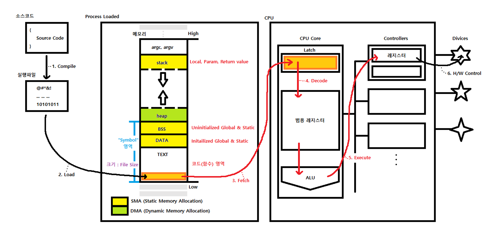

# STAGE 2 Computer Science

---

> Duplicate with reverse engineering course
> 
- [Background: Computer Architecture](../../../reverse_engineering/note/RE03_STAGE_3_Computer_Science.md/#background-computer-architecture)
- [Background: Windows Memory Layout](../../../reverse_engineering/note/RE03_STAGE_3_Computer_Science.md/#background-windows-memory-layout)
- [x86 Assembly](../../../reverse_engineering/note/RE04_STAGE_4_x86_Assembly.md)

---

# Background: Linux Memory Layout

## 1. 서론

### 서론

- 컴퓨터는 크게 CPU와 메모리로 구성
    - CPU는 실행할 명령어와 명령어 처리에 필요한 데이터를 메모리에서 읽고, Instruction Set Architecture(ISA)에 따라 이를 처리, 그리고 연산의 결과를 다시 메모리에 적재
- CPU의 동작과 메모리 사이에는 밀접한 연관이 있음
    - 만약 공격자가 메모리를 악의적으로 조작할 수 있다면 조작된 메모리 값에 의해 CPU도 잘못된 동작을 할 수 있음
        - 이를 메모리가 오염됐다고 표현하며, 이를 유발하는 취약점을 **메모리 오염(Memory Corruption)** 취약점이라고 부름
    - 시스템 해킹에 다양한 공격 기법들이 있지만, 많은 공격 기법이 메모리 오염을 기반으로 하고 있음
- 메모리 오염과 관련된 취약점으로 *Stack Buffer Overflow, Format String Bug, Use After Free, Double Free Bug* 등이 존재

## 2. 리눅스 프로세스의 메모리 구조

### 세그먼트



- 리눅스에서는 프로세스의 메모리를 크게 5가지의 **세그먼트(Segment)** 로 구분
    - 세그먼트란 적재되는 데이터의 용도별로 메모리의 구획을 나눈 것인데, 크게 코드 세그먼트, 데이터 세그먼트, BSS 세그먼트, 힙 세그먼트, 그리고 스택 세그먼트로 구분
- 운영체제가 메모리를 용도별로 나누면, 각 용도에 맞게 적절한 권한을 부여할 수 있다는 장점이 있음
    - 권한은 읽기, 쓰기, 그리고 실행이 존재하며, CPU는 메모리에 대해 권한이 부여된 행위만 할 수 있음
    - 예를 들어, 데이터 세그먼트에는 프로그램이 실행되면서 사용하는 데이터가 적재
        - CPU는 이곳의 데이터를 읽을 수 있어야 하며, 따라서 이 영역에는 읽기 권한이 부여
        - 반면 이 영역의 데이터는 실행 대상이 아니므로 실행 권한은 부여되지 않음

### 코드 세그먼트

- **코드 세그먼트(Code Segment)** 는 실행 가능한 기계 코드가 위치하는 영역
    - **텍스트 세그먼트(Text Segment)** 라고도 불림
- 프로그램이 동작하려면 코드를 실행할 수 있어야 하므로 이 세그먼트에는 읽기 권한과 실행 권한이 부여됨
    - 반면 쓰기 권한이 있으면 공격자가 악의적인 코드를 삽입하기가 쉬워지므로, 대부분의 현대 운영체제는 이 세그먼트에 쓰기 권한을 제거

### 데이터 세그먼트

```c
int data_num = 31337;// data
char data_rwstr[] = "writable_data";// data
const char data_rostr[] = "readonly_data";// rodata
char *str_ptr = "readonly"; // str_ptr은 data, 문자열은 rodata
```

- **데이터 세그먼트(Data Segment)** 에는 컴파일 시점에 값이 정해진 전역 변수 및 전역 상수들이 위치
    - CPU가 이 섹션의 데이터를 읽고 쓸 수 있어야 하므로, 읽기 권한이 부여됨
- 데이터 세그먼트는 쓰기가 가능한 세그먼트와 쓰기가 불가능한 세그먼트로 다시 분류
    - 쓰기가 가능한 세그먼트는 전역 변수와 같이 프로그램이 실행되면서 값이 변할 수 있는 데이터들이 위치
        - **data 세그먼트**라고 부름
    - 쓰기가 불가능한 세그먼트에는 프로그램이 실행되면서 값이 변하면 안되는 데이터들이 위치, 전역으로 선언된 상수가 여기에 포함
        - **rodata(read-only data) 세그먼트**라고 부름
- str_ptr
    - str_ptr은 “readonly”라는 문자열을 가리림
        - 문자열 자체는 상수 문자열로 취급되어 *rodata*에 위치
        - 이를 가리키는 str_ptr은 전역 변수로서 *data*에 위치

### BSS 세그먼트

- **BSS 세그먼트(BSS Segment, Block Started By Symbol Segment)** 는 컴파일 시점에 값이 정해지지 않은 전역 변수가 위치하는 메모리 영역
    - 선언만 하고 초기화하지 않은 전역변수 등이 포함
    - 세그먼트의 메모리 영역은 프로그램이 시작될 때, 모두 0으로 값이 초기화
- 이 세그먼트에는 읽기 권한 및 쓰기 권한이 부여

### 스택 세그먼트

- **스택 세그먼트(Stack Segment)** 는 프로세스의 스택이 위치하는 영역
    - 함수의 인자나 지역 변수와 같은 임시 변수들이 실행 중에 여기에 저장
- 스택 세그먼트는 **스택 프레임(Stack Frame)** 이라는 단위로 사용됨
    - 스택 프레임은 함수가 호출될 때 생성되고, 반환될 때 해제
    - 프로그램의 전체 실행 흐름은 사용자의 입력을 비롯한 여러 요인에 영향을 받음
    - 어떤 프로세스가 실행될 때, 이 프로세스가 얼마 만큼의 스택 프레임을 사용하게 될 지를 미리 계산하는 것은 일반적으로 불가능
        - 운영체제는 프로세스를 시작할 때 작은 크기의 스택 세그먼트를 먼저 할당해주고, 부족해 질 때마다 이를 확장
- 스택은 확장될 때, 기존 주소보다 낮은 주소로 확장됨
- 이 영역에는 CPU가 자유롭게 값을 읽고 쓸 수 있어야 하므로, 읽기와 쓰기 권한이 부여됨

### 힙 세그먼트

- **힙 세그먼트(Heap Segment)** 는 힙 데이터가 위치하는 세그먼트
    - 스택과 마찬가지로 실행 중에 동적으로 할당될 수 있으며, 리눅스에서는 스택 세그먼트와 반대 방향으로 자람
- C 언어에서 malloc(), calloc() 등을 호출해서 할당받는 메모리가 이 세그먼트에 위치
- 권한은 보통은 데이터를 읽고 쓰기만 하기 때문에 읽기/쓰기 권한만을 가지나, 상황에 따라 실행 권한을 가지는 경우도 존재

```c
#include <stdlib.h>

int a = 0xa; // a : data
const char b[] = "d_str"; // b : rodata, "d_str" : rodata
int c; // c : bss

int foo(int arg) // foo : text
{
	int d = 0xd; // d : stack
	return 0;
}

int main(void)
{
	int *e = malloc(sizeof(*e)); // e : heap
	return 0;
}
```
